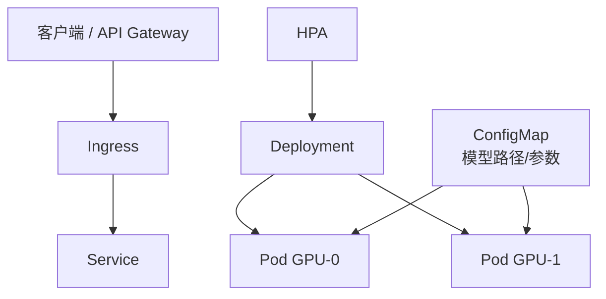

# 推理服务部署概览

## 核心原理

LLM 推理服务在 K8s 上的标准模式：**Deployment（无状态副本）+ Service（负载均衡）+ HPA（弹性）+ ConfigMap/Secret（配置）**，GPU 节点通过 nodeSelector/taint 调度。

> **类比**：推理 Pod 是「翻译官」，Service 是「前台分机」，HPA 根据排队人数增减翻译官数量。

## 推理服务拓扑



## 基础 Deployment 模板

```yaml
apiVersion: apps/v1
kind: Deployment
metadata:
  name: llm-inference
  namespace: k8s-learn
spec:
  replicas: 1
  selector:
    matchLabels:
      app: llm-inference
  template:
    metadata:
      labels:
        app: llm-inference
    spec:
      nodeSelector:
        nvidia.com/gpu.present: "true"
      tolerations:
      - key: nvidia.com/gpu
        operator: Exists
        effect: NoSchedule
      containers:
      - name: inference
        image: vllm/vllm-openai:latest
        args: ["--model", "meta-llama/Llama-3.2-1B-Instruct"]
        ports:
        - containerPort: 8000
        resources:
          limits:
            nvidia.com/gpu: 1
            memory: 16Gi
          requests:
            nvidia.com/gpu: 1
            memory: 8Gi
        livenessProbe:
          httpGet:
            path: /health
            port: 8000
          initialDelaySeconds: 120
          periodSeconds: 30
        readinessProbe:
          httpGet:
            path: /health
            port: 8000
          initialDelaySeconds: 60
          periodSeconds: 10
---
apiVersion: v1
kind: Service
metadata:
  name: llm-inference-svc
  namespace: k8s-learn
spec:
  selector:
    app: llm-inference
  ports:
  - port: 8000
    targetPort: 8000
```

## 关键生产考量

| 维度 | 实践 |
|------|------|
| 健康检查 | `/health` liveness + readiness，LLM 加载慢需长 initialDelaySeconds |
| GPU 调度 | nodeSelector + GPU taint/toleration |
| 配置 | ConfigMap 存模型名、max_tokens；Secret 存 API key |
| 扩缩 | CPU 指标对 GPU 推理不敏感，考虑自定义 QPS/队列深度指标 |
| 存储 | 大模型用 PVC 或 initContainer 预下载 |

详见 [LLM 服务化部署](../../llm-learning-path/05-推理/07-服务化部署.md)。

## HPA 注意

GPU 推理服务 HPA 通常基于**自定义指标**（请求队列长度、TTFT）而非 CPU。简单场景可固定副本 + 手动扩容。

## 动手练习

1. 无 GPU 环境：用 CPU 镜像（如 nginx 模拟）走通 Deployment + Service + Ingress 链路
2. 配置 liveness/readiness，理解 LLM 长启动时间对 Probe 的影响
3. 画出你的推理服务完整拓扑图

## 常见坑

- **GPU 资源名**：`nvidia.com/gpu`，需 NVIDIA Device Plugin
- **OOM**：模型 + KV cache 内存需准确估算 limits
- **单 Pod 多 GPU**：vLLM tensor parallel 需单 Pod 多 GPU，与 HPA 策略不同

## 小结

- 推理服务 = Deployment + Service + Probe + GPU 调度
- HPA 需结合业务指标，不能照搬 Web 服务 CPU 模式
- 配置/密钥分离，模型权重用 PVC 或对象存储 init
