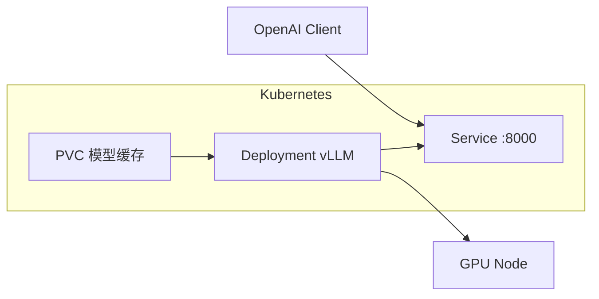
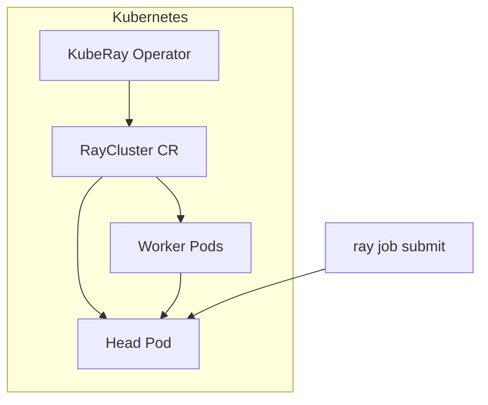
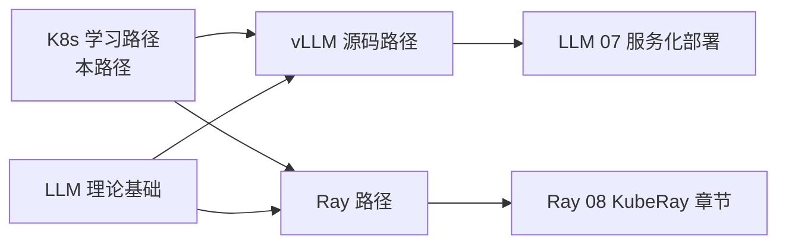

# vLLM 与 KubeRay 案例

## 概述

本章节衔接本仓库 AI 路径，展示两个典型 K8s + AI 场景：**vLLM 推理服务**和 **KubeRay 分布式计算**。

## vLLM on Kubernetes

vLLM 提供 OpenAI 兼容 API，K8s 部署核心是 GPU Pod + 持久化模型存储。



### 部署要点

```yaml
# 关键片段
initContainers:
- name: model-downloader
  image: amazon/aws-cli:2.13
  command: ["aws", "s3", "sync", "s3://models/llama/", "/models/"]
  volumeMounts:
  - name: model-storage
    mountPath: /models
containers:
- name: vllm
  image: vllm/vllm-openai:latest
  args:
  - --model
  - /models/Llama-3.2-1B-Instruct
  - --tensor-parallel-size
  - "1"
  volumeMounts:
  - name: model-storage
    mountPath: /models
volumes:
- name: model-storage
  persistentVolumeClaim:
    claimName: model-pvc
```

深入学习 vLLM 内部机制 → [vLLM 源码学习路径](../../vllm-learning-path/)。

### 与 vLLM 源码的关联

| K8s 概念 | vLLM 对应 |
|----------|-----------|
| Deployment 滚动更新 | 无状态推理，模型版本切换 |
| HPA | 多副本负载均衡，注意 KV cache 不共享 |
| DPLBAsyncMPClient | 数据并行 + 外部 LB，见 [IPC 抽象层](../../vllm-learning-path/02-V1引擎主循环/04-IPC抽象层.md) |

## KubeRay on Kubernetes

KubeRay 是 Ray 的 Operator，用 CRD 管理 Ray 集群生命周期。



### RayCluster 示例

```yaml
apiVersion: ray.io/v1
kind: RayCluster
metadata:
  name: ray-cluster
  namespace: k8s-learn
spec:
  rayVersion: "2.9.0"
  headGroupSpec:
    serviceType: ClusterIP
    template:
      spec:
        containers:
        - name: ray-head
          image: rayproject/ray:2.9.0
          resources:
            limits:
              cpu: "2"
              memory: 4Gi
  workerGroupSpecs:
  - replicas: 2
    minReplicas: 1
    maxReplicas: 5
    groupName: worker
    template:
      spec:
        containers:
        - name: ray-worker
          image: rayproject/ray:2.9.0
          resources:
            limits:
              cpu: "4"
              memory: 8Gi
```

```bash
# 安装 KubeRay Operator 后
kubectl apply -f raycluster.yaml
kubectl port-forward svc/ray-cluster-head-svc 8265:8265 -n k8s-learn
```

**重要**：Ray Worker Pod 由 **Ray Autoscaler** 控制数量，不是 K8s HPA。详见 [KubeRay 与云原生部署](../../ray-learning-path/08-集群与生产/02-KubeRay与云原生部署.md)。

## 选型对比

| 场景 | 推荐方案 | K8s 工作负载 |
|------|----------|--------------|
| LLM 在线推理 | vLLM Deployment | Deployment + Service + Ingress |
| 分布式训练/批处理 | Ray + KubeRay | RayCluster CR |
| 超参搜索 | Ray Tune on KubeRay | RayJob CR |
| 多模型服务 | Ray Serve on KubeRay | RayService CR |

## 学习路径衔接



建议顺序：

1. 完成本 K8s 路径 00-08 阶段
2. **推理方向**：LLM 基础 → vLLM 源码 → 本章节 vLLM 部署
3. **分布式方向**：Ray 路径 → Ray 08 KubeRay → 本章节 KubeRay 案例

## 动手练习

1. 阅读 [KubeRay 与云原生部署](../../ray-learning-path/08-集群与生产/02-KubeRay与云原生部署.md)，对比 Ray Autoscaler vs HPA
2. 阅读 [服务化部署](../../llm-learning-path/05-推理/07-服务化部署.md) 中的 K8s HPA 配置
3. 列出 vLLM 部署所需的 K8s 资源清单（Deployment/Service/PVC/ConfigMap/Secret/Ingress）

## 小结

- vLLM：GPU Deployment + 模型 PVC + OpenAI API Service
- KubeRay：Operator + RayCluster CR，Worker 扩缩由 Ray Autoscaler 管理
- 两条路径分别衔接 [vLLM](../../vllm-learning-path/) 和 [Ray](../../ray-learning-path/) 学习路径
