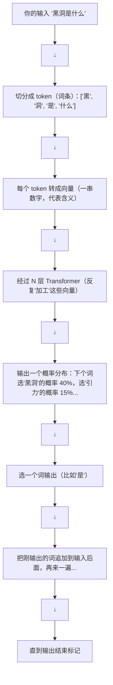

# 大模型是什么：一个直觉入门

> 不需要任何机器学习背景。读完这篇文章，你会知道大模型到底是什么、它为什么能"思考"、以及你学完这条路线后能做什么。

---

## 1. 从一个对话开始

你打开 ChatGPT，敲了一行字：

> "用小学生能听懂的方式解释什么是黑洞"

几秒钟后，屏幕上出现了几段文字，用"宇宙里的超级吸尘器"来比喻，还举了漏水槽的例子。

你可能会想：它到底是怎么做到的？它在"思考"吗？它有一个巨大的数据库在查答案吗？

**都不是。** 它只是在做一件事：**预测下一个词**。

---

## 2. 大模型的本质：一个超级"下一个词预测器"

打个比方。你有一台只能做一件事的机器：

> 输入一段文字 → 输出一个词（这段文字后面最可能接的那个词）

比如：

| 输入 | 输出 |
|------|------|
| "今天天气真" | "好" |
| "1 + 1 =" | "2" |
| "床前明月" | "光" |

这就是大模型的本质。它读了几万亿字的文本（整个互联网的书籍、文章、代码、对话），学会了"在某个上下文后面，什么词最可能接上来"。

**你可能会说**：那不就是接龙吗？这能产生智能？

**还真能。** 想一想：如果你真的非常、非常擅长接龙——看到"给这段代码找 bug"这类开头就能接上"第 42 行少了一个分号"——那从外面看，你就是在"找 bug"。一个足够好的预测下一个词模型，在执行复杂预测任务时，表现得就像在推理。

打个比方：做填空题做多了，就开始理解内容了。大模型就是做了几万亿次"填空题"。

---

## 3. 直观理解整个流程

当你输入"黑洞是什么"，大模型内部发生了什么？



这个过程就像：给你一段钢琴旋律的开头，让你一个音符一个音符地续写。你不需要"理解"音乐理论，但续多了就听起来像懂音乐。

大模型也一样——**它不需要理解"黑洞"是什么，它只需要在万亿级别的文本中学会了"黑洞"后面通常跟着哪些词**。

---

## 4. 为什么这个能产生"智能"

这里有个反直觉的事实：**很多我们以为是"智能"的事情，本质上是模式补全。**

- 翻译："I love you" → 中文最常跟着的模式是什么？"我爱你"
- 写代码：`def fibonacci(n):` 后面最可能的代码模式是什么？
- 做数学：`23 × 17 =` → 训练数据里有类似的算术模式

当你从海量数据中学习到了极其精细的模式，你做出的预测看起来就像"理解"了一样。

**但也要注意**：大模型确实会犯错。它会自信地说出完全错误的事实（这叫"幻觉"），因为它在做预测，不是在查数据库。它能预测"黑洞是宇宙中的..."但可能预测出错的数字。

---

## 5. 学完这条路线你能做什么

这条学习路线从零开始，分成 10 个阶段。学完之后你能：

| 阶段 | 能做什么 |
|------|---------|
| 00-前置知识 | 打好地基，理解所有基本概念 |
| 01-Transformer原理 | 从零手写一个 Transformer（不用库） |
| 02-大模型原理 | 理解 GPT/LLaMA 等模型的设计思路 |
| 03-训练 | 分布式训练 7B 参数模型 |
| 04-微调 | 单卡微调自己的专业模型 |
| 05-推理 | 部署高效推理服务 |
| 06-优化 | 模型量化和加速 |
| 07-案例分析 | 分析 DeepSeek/Qwen/Claude 的技术 |
| 08-进阶 | 搭建 RAG + Agent 应用 |
| 09-高级 | 预训练、安全、GPU 优化 |

---

## 6. 学习心态建议

### 不需要成为数学家

很多人被大模型的数学吓退了——什么矩阵乘法、梯度下降、KL 散度...

**真实情况**：你只需要理解直觉，能"翻译"成大白话就够了。代码框架（PyTorch、Transformers）已经帮你实现了算法。你的核心工作是用这些工具搭积木，而不是从零推导数学定理。

打个比方：你不需要懂发动机的原理也能开车。你要学的是"怎么开"，不是"怎么造发动机"。

### 跟着代码走

每个概念最好都伴随着代码来理解。比如"Softmax 是什么"，一看公式可能晕，但一看代码：

```python
def softmax(x):
    e_x = np.exp(x - np.max(x))  # 变成正数
    return e_x / e_x.sum()        # 变成概率
```

三行代码，一目了然。**大道至简。**

---

## 7. 本章关键概念速查

| 概念 | 一句话解释 |
|------|----------|
| **大模型** | 一个超级"下一个词预测器"，训练了几万亿字的数据 |
| **Transformer** | 大模型的核心计算模块，反复"加工"文本的向量表示 |
| **Token** | 文本的最小处理单位（一个单词或单词的一部分） |
| **预测下一个词** | 大模型训练的唯一目标（也是运行时的唯一任务） |
| **幻觉** | 模型自信地说出错误信息（因为它在"猜"，不是在"查"） |
| **Scaling** | 模型越大、数据越多、算力越多 → 能力越强 |

**记住这个就够了**：大模型就是一个做了几万亿次"填空题"的神经网络。它不"理解"世界，但太擅长补全模式了，表现得很像理解。

---

## 下一步

当你对大模型有了直观的认识后，接下来快速过一遍必备的 Python 知识点（[02-必备Python速通](02-必备Python速通.md)），然后进入数学基础。每一个知识都像"乐高积木"，最终可以拼出一整个 Transformer。
