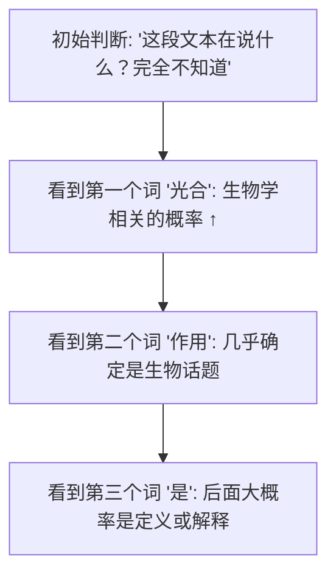

# 概率与统计：机器如何量化不确定性

> 语言模型的核心输出就是一个概率分布——"下个词选 A 的概率 40%，选 B 的概率 15%..."。理解概率才能理解模型在做什么。

---

## 1. 概率是什么：三个硬币的故事

### 不是频率，是信念

教科书常说"概率 = 事件发生的频率"——抛 100 次硬币，正面 50 次，所以正面的概率是 50%。

但还有一种更实用的视角：**概率 = 你对此事的相信程度**。

- 明天下雨的概率 70% → 没法重复实验，这是你的"信念"
- 这是垃圾邮件的概率 90% → 海量证据综合后的判断
- 下一个 token 是 "好" 的概率 35% → 模型根据上下文做出的"判断"

大模型完全在这个框架下工作——**每一步都在量化"基于当前信息，下一个词应该是什么"的不确定性**。

### 概率的三个铁律

1. **每件可能的概率在 0~1 之间**：0 = 绝不可能，1 = 百分之百
2. **所有可能性的概率加起来 = 1**：总有一个会发生
3. **概率越大 → 模型越"自信"**

---

## 2. 条件概率：这比概率本身重要 10 倍

### 这玩意儿干嘛的

语言模型中最重要的不是"这个词的概率"，而是**"在已经说了这些词之后，下一个词的概率"**。

$$
P(\text{光} \mid \text{床前明月}) \approx 0.99
$$

$$
P(\text{香蕉} \mid \text{床前明月}) \approx 0.0001
$$

### 一个生活例子

- P(带伞) = 不好说，取决于天气
- P(带伞 | 天气预报说今天有暴雨) = 接近 100%

条件概率把"上下文"纳入考虑。大模型做的一切都可以写成 `P(下一个词 | 前面所有的词)`。

### 大模型如何用条件概率

```python
# 模型计算
P("天" | "") = 0.001          # 上下文为空时，"天" 出现概率较低
P("天" | "今天") = 0.3        # "今天"后面，"天" 的概率飙升
P("天" | "今天的天气") = 0.05  # "天气"已经包含了"天"，后面再续"天"的概率下降
```

每一步选词都依赖前面所有已生成的词——这由模型的 Attention 机制保证。

---

## 3. 贝叶斯公式：如何用新证据更新信念

### 这玩意儿干嘛的

你有一个初始判断（先验）。然后你看到一个证据。该证据让你调整原有判断，得到一个更新后的判断（后验）。

### 一个医学检测的例子


直觉答案：肯定是 99%！——**错。**

真实答案：约 16.7%。

为什么？因为这种病很罕见（1%），所以绝大多数阳性结果都是假阳。1 万个人中：
- 100 个真的得病，其中 99 个检测阳性
- 9900 个没病，其中 495 个检测阳性
- 总共 594 个阳性，其中真阳只有 99 个 → 99/594 ≈ 16.7%

### 在大模型中的应用

贝叶斯公式的精神存在于大模型的每一层——每看到一个词，模型就更新它对"文本主题"的判断：



**记住这个就够了**：条件概率 = 基于已有信息的概率判断。大模型做的就是反复计算 `P(下一个词 | 前面所有词)`。

---

## 4. 概率分布：把可能性"摊开来"

一个骰子有 6 个面，每个面概率 1/6。这就是一个概率分布——**列出所有可能的结果，每个配一个概率**。

大模型的输出就是一个概率分布——词表中 32000 个词，每个词分配一个概率。这就叫 Categorical 分布。

```
P(词_1 | 上文) = 0.002
P(词_2 | 上文) = 0.015
...
P(词_42 | 上文) = 0.35   ← 最高，很可能选这个词
...
P(词_32000 | 上文) = 0.0001
```

**关键洞察**：模型不输出"这个回答"，而是输出"哪个词都有可能，只是概率不同"。

---

## 5. 期望和方差：两个核心统计量

### 期望

长期平均会得到什么。

- 抛一个公平骰子，期望 = (1+2+3+4+5+6)/6 = 3.5
- 你永远不会抛出 3.5，但平均下来每次抛得的点数接近 3.5

### 方差/标准差

结果有多"散"。方差大意味着结果波动大。

- 骰子结果：方差 ≈ 2.9（在 1 到 6 之间波动）
- 一个数字永远等于 3.5：方差 = 0（完全确定）

### 在大模型中

大模型训练时要最小化"预测分布"和"真实分布"之间的差距。这个差距用一个叫做"交叉熵"的东西来衡量——下一章的主角。

---

## 6. 从分布中采样：从"可能性"到"具体选择"

大模型的最后一步：有了概率分布，要选一个具体词输出。

怎么选？**从一个概率分布中随机采样**。

打个比方：一个不均匀的骰子。面 6 的概率 50%，其他面各 10%。你掷一次，大概率出 6，但偶尔也会出别的。

```python
# 模型输出 logits → Softmax → 概率分布
probs = torch.tensor([0.05, 0.02, 0.40, 0.30, 0.23])  # 5 个词的分布

# 采样：按概率随机选择
next_token = torch.multinomial(probs, num_samples=1)
# 约 40% 概率选第 3 个词，约 30% 概率选第 4 个词...
```

**为什么要有随机性**：如果永远选最可能（Greedy），生成的文字就会死板重复。随机性 = 创造力。

---

## 本章速查

| 概念 | 一句话解释 |
|------|----------|
| **概率** | 对某事的相信程度（0 = 不信，1 = 确信） |
| **条件概率 P(A\|B)** | 已知 B 发生后，A 的概率 |
| **贝叶斯精神** | 用新证据更新旧信念 |
| **概率分布** | 所有可能结果及其概率的清单 |
| **期望** | 长期的平均值 |
| **方差** | 结果的"波动程度" |
| **采样** | 从分布中按概率随机选一个结果 |
| **Categorical 分布** | 多选一分布（掷 N 面骰子）——语言模型输出就是这个 |

**记住这个就够了**：大模型的本质是 `P(下一个词 | 前面所有的词)`。它每一步都在计算一个条件概率，然后从这个概率分布中采样。
