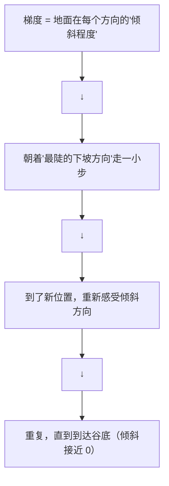

# 机器学习第一步：让参数自己学习

> 大模型本质上是一个神经网络。这一章不讲"具体怎么实现神经网络"，而是讲"让参数自己学习"这个思想的直观理解。你只需要初中数学。

---

## 1. 什么是"学习"

### 一个极简例子：拟合一条直线

你有 5 个数据点：(1, 4), (2, 7), (3, 10), (4, 13), (5, 16)

这些点看起来在一条直线上。我们的目标是找到 `y = ax + b` 中的 a 和 b，让这条线尽量穿过所有点。

手工试：
- a=2, b=0: y=2x, (2,7) → 4，差了 3。不好。
- a=3, b=1: y=3x+1, 第一个点 → 4，正好！第二个点 → 7，正好！
- 找到了！a=3, b=1。完美。

**"学习"就是：自动找到最好的 a 和 b，不需要人手工试。**

那怎么自动找？两件工具：
1. **损失函数**：衡量"当前 a,b 有多差"
2. **梯度下降**：朝着"让损失变小"的方向，每次微调 a,b 一点点

---

## 2. 损失函数：量化"差多少"

### 这玩意儿干嘛的

你跟靶子距离 2 米，和距离 0.1 米——"差的程度"不同。损失函数就是把"差多少"量化为一个数字，越大越差。

### 最常见：MSE（均方误差）

```python
# 对每个数据点计算 (预测值 - 真实值)²，然后取平均值
def mse_loss(a, b, data_points):
    total = 0
    for x, y_true in data_points:
        y_pred = a * x + b
        total += (y_pred - y_true) ** 2
    return total / len(data_points)

# a=2, b=0 时: loss = ((2-4)² + (4-7)² + (6-10)² + ...) / 5 = 大
# a=3, b=1 时: loss = ((4-4)² + (7-7)² + ...) / 5 = 0  几乎完美
```

**为什么用平方**：平方让"大错误"受到更严重的惩罚。差 10 不是差 1 的 10 倍惩罚，而是 100 倍。

### 大模型的损失函数：交叉熵

在分类/预测 token 的问题上不用 MSE（原因在前一章讲了），用交叉熵。但原理完全一样——**越不对，loss 越大**。

---

## 3. 梯度下降：自动走向最低点

### 用爬山来理解

你站在一座山上，四周一片漆黑。你想走到山谷的最低点。你能感觉到脚下地面往哪个方向倾斜。怎么做？

每步踩最陡的下坡方向，一步一步往下走。这就是梯度下降。



### 数学上的直觉

对于 `y = ax + b` 这条直线：
- **∂loss/∂a**："略微改变 a 时，loss 会怎么变？"——告诉你 a 该往哪调
- **∂loss/∂b**："略微改变 b 时，loss 会怎么变？"——告诉你 b 该往哪调

```python
# 伪代码
a = a - 学习率 × (loss 对 a 的梯度)   # 往减少 loss 的方向微调 a
b = b - 学习率 × (loss 对 b 的梯度)   # 往减少 loss 的方向微调 b
```

重复几万次，a 和 b 自动变到了最优值附近。**不需要手动试，梯度自动指引方向。**

---

## 4. 学习率：每步迈多大

### 这里有个坑

| 学习率 | 效果 |
|--------|------|
| 太大 | "冲过头"——跳过最低点，甚至越走越远 |
| 太小 | "走到天黑"——训练太慢，可能永远走不到 |
| 正好 | 平稳下降，收敛到最低点 |

打个比方：你去食堂打饭，学习率就是你每步迈多大。步子太大→冲过打饭窗口→还得往回走→来回震荡。步子太小→食堂快关门了你还没走到。

**实践中**：大模型训练通常用 `1e-4` 左右的学习率，且有各种"自动调整学习率"的策略（学习率调度器）。

---

## 5. 过拟合：背答案 vs 真理解

### 最经典的机器学习陷阱

你在学做数学题。有两种学法：
- **死记硬背**：把练习册所有题目的答案都背下来。→ 做练习册上的题 100% 正确。但考试换个数就不会了。
- **理解原理**：理解解题思路。→ 做练习册上的题可能 95% 正确。但考试换个数照样能做。

**过拟合 = 死记硬背**。模型把所有训练数据的"噪音"和"巧合"也记住了。

### 怎么判断过拟合了

| 现象 | 训练 Loss | 验证 Loss |
|------|----------|----------|
| 正常训练 | 持续下降 | 持续下降 |
| 开始过拟合 | 继续下降 | 拐头上升！ |

验证 loss 拐头上升的那一刻，模型开始在"背题"了。这时应该停止训练（Early Stopping）。

---

## 6. 正则化：逼模型"理解"而非"背诵"

有些约束可以防止过拟合：

- **L2 正则化 (Weight Decay)**："参数别太大"——参数值大会让模型对训练数据的微小波动敏感（过度适应）。大模型中的 AdamW 优化器内置了这个约束。
- **Dropout**："随机关掉一些神经元"——模型不能依赖任何一个特定的"暗记路径"，必须学会鲁棒的模式。
- **数据增强**："把同一个题换个说法"——让模型看到更多的变化，学到的模式更通用。

---

## 7. 三组数据：练习册、模拟考、高考

| 数据集 | 类比 | 用途 |
|--------|------|------|
| **训练集** | 练习册 | 天天做，模型学参数 |
| **验证集** | 模拟考 | 模型没见过，用来判断是否过拟合、调超参数 |
| **测试集** | 高考 | 只测一次，报告最终成绩。绝对不能拿来训练！ |

**为什么需要三个**：如果只有一个集，你怎么知道你学的模式是通用的，还是恰好记住了这组数据的答案？

---

## 8. Batch Size：一次看几道题

### 这玩意儿干嘛的

你不必把 100 万道题全做完了才总结一次经验。可以每做 32 道题就总结一下。

```python
for batch in dataloader:   # 每次取 32 个样本
    loss = compute_loss(model, batch)
    loss.backward()          # 基于这 32 个样本算梯度
    optimizer.step()         # 更新参数
```

| Batch Size | 直觉 |
|-----------|------|
| 大（如 512） | 看得多→梯度更准确→但显存放不下 |
| 小（如 32） | 看得少→梯度有噪声→但显存友好 |
| 梯度累积 = 32×4 | 做 4 次小 batch 的 backward，梯度先累着不更新，最后一起更新→等效于 batch=128，但省显存 |

**梯度累积是大模型训练的基本技巧**——你的 GPU 放不下 batch_size=1024，那就用小 batch 多次累积。

---

## 本章速查

| 概念 | 一句话解释 |
|------|----------|
| **学习** | 自动找最好的参数，让输入→输出尽量贴近目标 |
| **损失函数** | 衡量"当前参数有多差"的尺子 |
| **梯度** | "往哪个方向调参数，loss 会变小"的指引 |
| **梯度下降** | 每次沿最陡下坡走一小步，反复直到山谷 |
| **学习率** | 每步走多大——太大冲过头，太小走太慢 |
| **过拟合** | 背答案——训练集 100 分，考试不及格 |
| **正则化** | 逼模型"理解"而非"背诵"的约束 |
| **训练/验证/测试** | 练习册/模拟考/高考 |
| **Batch Size** | 每步看多少样本 |
| **梯度累积** | 用"多步才更新一次"来模拟大 batch（省显存） |

**记住这个就够了**：机器学习 = 定义损失→算梯度→调参数→重复。大模型只是把这个循环扩到极大（几十亿参数 + 几万亿数据），但核心循环完全一样。
