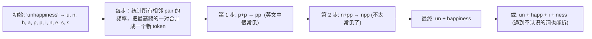
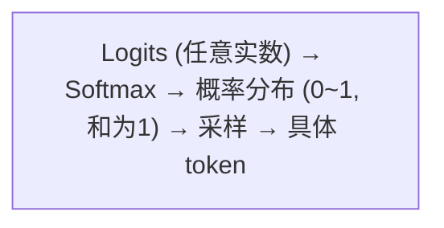

# NLP 基础：让计算机读懂文字

> 计算机只能做数学运算。如何把"你好"变成一串它能算的数字？这一章讲大模型的"输入输出接口"。

---

## 1. Tokenization：把文字切成小块

### 这玩意儿干嘛的

计算机不识汉字，只能算矩阵。你得把任意文本变成一串数字，并且生成文本时还能变回来。

### 为什么不能直接用字符

"hello" → 5 个字符，还行。"antidisestablishmentarianism" → 28 个字符，而且没有语义。中文字符更惨——每个汉字都是独立的，"你好"就两个字符，但 "Benzodiazepine" 这个药物名 15 个字符，作为整体才是一个词。

### 为什么不能直接用词

英语词汇量无限。把所有英语词编入一个"字典"，字典会大到不可接受。而且永远有新词（"rizz"、"skibidi"）进来，字典来不及更新。

### BPE（Byte-Pair Encoding）的聪明解法

**从最基本单元出发，逐步合并高频组合。**



**它解决了一箭三雕**：

1. **字典大小可控**：想要 32K、100K 或 128K 都可以
2. **没有 `<unk>`**：任何词都能被拆成子词（"unhappiness"→"un"+"happiness"）
3. **跨语言通用**：中文和英文用同一套算法

### 这为啥重要

大模型的 Embedding 层大小 = vocab_size × d_model。字典太大 → Embedding 层吃掉太多参数。字典太小 → 每个字符都独立，序列太长。

| 模型 | 词表大小 | 中文编码效率 |
|------|---------|-----------|
| LLaMA 3 | 128K | ~60%（中文差） |
| Qwen 2.5 | 152K | ~85%（中文好） |
| DeepSeek-V3 | 128K | ~80%（中文好） |

同样的中文句子，LLaMA tokenizer 产生的 token 数是 Qwen 的 1.5-2 倍 → Attention 要算更长的序列 → 更慢。

---

## 2. Embedding：给每个词条一个"意义向量"

### 这玩意儿干嘛的

Tokenization 后你得到的是 token ID——`15496`, `11`, `995`。但 11 不比 995 更像 15496，数字大小没有语义。

需要把每个 token 映射到**高维连续空间中的一个点**——语义相近的词在这个空间中距离也相近。

### 怎么做到的

Embedding 层本质上是一个**巨大的查找表**：

```python
# embedding = nn.Embedding(vocab_size=32000, embedding_dim=4096)
# 内部：[32000, 4096] 的参数矩阵，每行是一个 token 的向量

token_42 = embedding(torch.tensor([42]))  # 取第 42 行
# → [0.23, -0.41, 0.87, ...]  一个 4096 维的向量
```

训练开始时，这 32000 个向量是随机的。训练过程中，语义相似的 token 的向量逐渐靠近。

### 词嵌入的神奇属性

训练好后，向量可以做语义运算：

```python
# 这个公式真的能算出来！
vec("国王") - vec("男人") + vec("女人") ≈ vec("王后")
vec("巴黎") - vec("法国") + vec("意大利") ≈ vec("罗马")
```

**为什么能这样**：因为这些向量的"方向"编码了语义特征。"国王-男人"去掉了"男性"这个维度，"+女人"加上"女性"维度，得到"王后"。

---

## 3. 语言模型：猜下一个词的学问

### 核心任务一句话

> 给定前面的所有词，预测下一个词。

```python
P("今天", "天气", "真", "好") = ?
# 链式展开为条件概率
= P("今")          # 第一个词
× P("天"|"今")     # 基于"今"，预测"天"
× P("气"|"今天")   # 基于"今天"，预测"气"
× P("真"|"今天天气")
× P("好"|"今天天气真")
```

### 为什么自回归

语言天然有依赖关系——后面的词取决于前面。不是"选择"，是"语言的本性"。自回归 = 一步一步生成，每步基于前面的所有。

---

## 4. 从 Logits 到具体输出：模型如何"说出口"

大模型的最后一层输出一个 `[vocab_size]` 的向量——每个词的"原始分数"。这个分数可以是任何实数（负数、正数、大、小），不满足概率的要求。

需要经过三道工序：



### Softmax：把分数变成概率

```python
import torch.nn.functional as F

logits = torch.tensor([-1.0, 0.5, 3.0, 1.2])  # 4 个词的原分
probs = F.softmax(logits, dim=-1)
# → [0.015, 0.065, 0.79, 0.13]
# 第 3 个词（分数最高）有 79% 的概率被选中
```

**为什么用指数 $e^x$**：
- 把负数变正数（$e^{-1} ≈ 0.37$，但除以分母后只有约 1.5%）
- 拉大差距（3.0 和 0.5 差距 2.5 倍，但指数后差距 12 倍——让"赢家"更突出）

### 为什么不能永远选最可能的

永远选最大的 = Greedy 策略。

问题：生成的文字会陷入**重复循环**。模型选了 A → A 作为上下文让 B 最可能 → B 作为上下文让 C 最可能 → C 作为上下文又让 A 最可能 → 无限循环。

加上随机性才能打破这种死循环。

### 三种挑词策略

| 策略 | 干什么 | 什么时候用 |
|------|--------|---------|
| **Temperature** | T<1 → 概率更尖（变保守），T>1 → 概率更平（变创意） | 控制"中规中矩 vs 天马行空" |
| **Top-k** | 只在概率最高的 k 个词里面挑 | 防止选到荒谬的冷门词 |
| **Top-p (Nucleus)** | 只在累积概率 ≥ p 的最小集合里挑 | 比 top-k 更灵活，适配不同分布形状 |

```python
# 实际推理时的组合：Temperature + Top-p
logits = logits / temperature          # 调整锐度
probs = F.softmax(logits, dim=-1)      # 变概率
probs = top_p_filter(probs, p=0.9)     # 过滤长尾
next_token = torch.multinomial(probs, 1)  # 按概率采样
```

---

## 5. 上下文学习：不用训练就会新任务

### 这玩意儿干嘛的

你不需要微调模型就能让它做新事——只要在 prompt 里给 2-3 个示例：


**模型参数没有任何变化！** 它只是通过 Attention 机制找到"例子中的模式"并应用。

### 为什么能工作

大模型在训练时见过海量的"模式 → 答案"对。给出几个示例，模型就把这段 prompt 作为"即时上下文"，推断出模式。就像你第一次见到"QED"这种标记——看到文末 QED 旁边没人惊讶，你立刻学会了"这应该是结束标记"。

### 三种使用层次

| 方式 | 示例 | 适用 |
|------|------|------|
| **Zero-shot** | 直接问"翻译: goodbye →" | 常见任务 |
| **Few-shot** | 给 2-5 个例子 | 特定格式/风格 |
| **Many-shot** | 给几十个例子 | 复杂模式 |

---

## 本章速查

| 概念 | 一句话解释 |
|------|----------|
| **Tokenization** | 把文字切成数字序列（BPE：从字符出发，逐步合并高频 pair） |
| **Embedding** | 给每个 token 一个语义向量（训练后语义相似→向量相近） |
| **语言模型** | 逐词预测下一个词的模型 |
| **Softmax** | 把任意实数变成 0~1 概率分布 |
| **Temperature** | 调概率的"锐度"（T<1 变保守，T>1 变创意） |
| **Top-k / Top-p** | 过滤掉低概率的"冷门词" |
| **上下文学习** | 不用训练，给几个例子模型就会模仿 |

**记住这个就够了**：大模型的输入接口是 Tokenizer（文字→数字），输出接口是 Softmax+采样（数字→文字）。语言模型的本质是"猜下一个词"，上下文学会的一切高级能力（推理、翻译、编程）都是这个简单任务的副产品。
