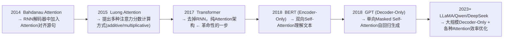

# 从 RNN 到 Attention

理解 Attention 之前，必须先理解它要解决什么问题。所有技术都是为解决前一代技术的根本缺陷而生的。

---

## 1. RNN/LSTM 时代的三个根本困境

### 问题一：无法并行化

**RNN 的机制**：每一步依赖上一步的隐藏状态，形成严格的串行链。

$$h_t = f(W x_t + U h_{t-1})$$

要算 $h_{100}$ 必须先算 $h_{1}$ 到 $h_{99}$。序列 1000 就必须串行走 1000 步。GPU 有数千核心，但全部闲置——90% 的时间在等上一步算完。这不仅是慢的问题，更意味着**无法通过增加算力来提升效率**。

### 问题二：长距离依赖丢失

**梯度在链式传播中指数衰减**。每一步反向传播都要乘一个权重矩阵的导数。如果这个值小于 1（绝大多数情况），传播 100 步后梯度趋近于 0：

$$\frac{\partial L}{\partial h_1} \propto \prod_{t=1}^{100} \frac{\partial h_t}{\partial h_{t-1}} \approx 0.9^{100} \approx 0.000027$$

模型无法学习"第 1 个词影响第 100 个词"的模式。LSTM 用门控机制缓解了这个问题（通过遗忘门/输入门/输出门选择性保留信息），但实际仍只能有效处理约 100-200 步的依赖。

**这意味着**：长文章、多轮对话、代码文件中的跨函数引用——凡是跨越几百个 token 以上的依赖，RNN 都处理不了。

### 问题三：信息瓶颈

整句话的信息被逐步压缩到一个固定大小的向量 $h_t$ 中（通常 256-1024 维）。不管这句话是 5 个词还是 500 个词，都只能"塞"进同一个维度的向量里。对于长文本，这个压缩必然是高度损失的。

---

## 2. Attention 的核心思想

面对这三个问题，Attention 给出的答案是：

> **不要在一个向量里传话，让每个输出位置直接看到所有输入位置。**

类比：
- **RNN** = 电话传话游戏（A→B→C→D...），传到后面信息必然失真
- **Attention** = 圆桌会议，每个人都可以直接查阅原始材料，挑选对自己有用的部分

### 这个思想解决了什么

| 问题 | Attention 如何解决 |
|------|-------------------|
| **串行依赖** | 所有位置同时计算注意力，$O(1)$ 并行步骤 |
| **长距离丢失** | 任意两个位置之间直接连接，信息传递路径长度为 $O(1)$ |
| **信息瓶颈** | 不压缩。每个输出直接加权聚合所有输入的信息 |

---

## 3. Attention 的计算直觉

句子："The cat sat on the mat **because it** was tired."

问题：模型在读到 "it" 时需要知道 "it" 指代什么。

**RNN 的做法**：所有前面的信息（"The cat sat on the mat because it"）被压缩在一次隐藏状态里，指望 LSTM 记住了 "cat" 是动物这个特征。

**Attention 的做法**："it" 主动去问前面每个词："你是代词吗？你是动物吗？你是单数吗？"

- "cat" 回答："我是动物，单数" → 高分 ✓
- "mat" 回答："我是物品，单数" → 中分
- "The" 回答："我是冠词" → 低分

然后用这些分数做加权，"it" 从 "cat" 那里获取大部分信息。

### 关键洞察

Attention 将"记住所有信息"的问题变成了"学会知道找谁要信息"的问题。后者对模型来说更容易学习——因为相关性判断（QK 内积）可以直接从数据中训练出来。

---

## 4. 数学对比

### RNN

$$h_t = \tanh(W x_t + U h_{t-1})$$

- $h_t$ 只直接连接 $h_{t-1}$，间接连接更早位置
- 信息经过 $t$ 步非线性变换和乘法，逐渐衰减

### Self-Attention

$$\text{Output}_i = \sum_{j=1}^{n} \alpha_{ij} V_j$$

- $\text{Output}_i$ 直接聚合所有位置的 V
- $\alpha_{ij}$（注意力权重）由 Q 和 K 的内积决定：$\alpha_{ij} = \frac{\exp(q_i \cdot k_j / \sqrt{d})}{\sum \exp(...)}$
- 路径长度恒为 O(1)

### 代价：从 RNN 到 Attention 不是免费的

RNN 的计算复杂度 $O(n \cdot d^2)$，Attention 是 $O(n^2 \cdot d)$。当 n 很大（长序列），Attention 会变得更贵——这是后来 FlashAttention、稀疏注意力、Mamba 等优化的核心动机。

---

## 5. 发展脉络

Attention 是当前一切大模型的基石。Transformer 就是"Attention + FFN + 残差 + 归一化"的巧妙组合——下面几章逐一拆解。
