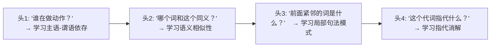

# Multi-Head Attention

Multi-Head Attention 解决的核心问题：**一种注意力模式不够用。一个 token 需要同时从多个不同的角度（句法、语义、位置）来"查看"上下文。**

---

## 1. 单头的局限：为什么一种关系模式不够

### 问题场景

考虑句子："小明把作业交给老师，**他**说**他**明天会批改。"

- 第一个 "他" 指小明（句法：主语）
- 第二个 "他" 指老师（语义：批改→老师）

这两个 "他" 需要关注不同位置，依据不同规则（一个是句法距离，一个是语义相关性）。单头注意力必须将所有规则**混合成一个平均模式**，无法同时准确跟踪两种不同类型的依赖。

### 多头的解决方案

> 运行 h 个独立的注意力机制并行，每个头学习不同的关系类型，最后拼接起来。

每个头可以无干扰地专注于自己的模式，模型整体同时拥有多种"视角"。

---

## 2. 公式与计算流程

$$\text{MultiHead}(Q, K, V) = \text{Concat}(\text{head}_1, ..., \text{head}_h) W^O$$

$$\text{head}_i = \text{Attention}(QW_i^Q, KW_i^K, VW_i^V)$$

### 维度设计

$d_k = d_v = d_{model} / h$。例如 LLaMA-7B：$d_{model}=4096, h=32, d_k=128$。

### 为什么用降维而不是全维

每个头在低维空间运算 → h 个头的总计算量 = $h \times O(n^2 \cdot d_{model}/h) = O(n^2 \cdot d_{model})$，与单头全维完全相同。**在不增加计算量的前提下，获得了 h 种不同的注意力模式。**

### 完整计算流

```mermaid
flowchart LR
  n0["输入 X: [batch, seq_len, 512]  (h=8, d_k=64)"]
  n1["投影 + 分头:"]
  n2["Q: [batch, seq_len, 512] → reshape → [batch, 8, seq_len, 64]"]
  n3["K: [batch, seq_len, 512] → reshape → [batch, 8, seq_len, 64]"]
  n4["V: [batch, seq_len, 512] → reshape → [batch, 8, seq_len, 64]"]
  n5["每个头独立计算 Attention:"]
  n6["head_i = softmax(Q_i @ K_i^T / √64) @ V_i   → [batch, seq_len, 64]"]
  n7["拼接:"]
  n8["Concat(8 × [batch, seq_len, 64]) → [batch, seq_len, 512]"]
  n9["最终投影 (W^O):"]
  n10["[batch, seq_len, 512] → [batch, seq_len, 512]"]
  n0 --> n1
  n1 --> n2
  n2 --> n3
  n3 --> n4
  n4 --> n5
  n5 --> n6
  n6 --> n7
  n7 --> n8
  n8 --> n9
  n9 --> n10
```

$W^O$ 的作用是**融合不同头的输出**——让来自不同"视角"的信息被有机整合，而不是简单拼接。

---

## 3. MHA → MQA → GQA：KV Cache 优化之路

### 问题来源

推理时需要缓存每一层的 K 和 V 矩阵（KV Cache）以避免重复计算。标准 MHA 的 KV Cache 大小 = $2 \times n\_layers \times n\_heads \times seq\_len \times d\_k$。长序列 + 大模型时，这成为显存的绝对瓶颈。

### MQA (Multi-Query Attention)：极致省显存

**所有 Q 头共享同一组 K 和 V**。每个 Q 仍然独立（多头查询），但 K/V 只有一组。

| 效果 | 数值 |
|------|------|
| KV Cache 大小 | 降为 MHA 的 1/h |
| 建模能力 | 略下降 |
| 代表模型 | PaLM |

### GQA (Grouped-Query Attention)：平衡方案

将 Q 头分成 G 组，组内共享 K/V。这是 MHA (G=h) 和 MQA (G=1) 的中间状态。

**解决的问题**：MQA 省显存但损性能，MHA 性能好但费显存。GQA 提供一个可调节的平衡点。

| 模型 | Q 头数 | KV 头数 | 组数 |
|------|--------|---------|------|
| LLaMA 3 8B | 32 | 8 | 4 |
| LLaMA 3 70B | 64 | 8 | 8 |
| Qwen2.5 7B | 28 | 4 | 7 |

LLaMA 2/3 和 Qwen 使用 GQA 后，KV Cache 减少到原来的 1/4 到 1/8，同时几乎不损失模型质量。这是当前大模型的标准选择。

---

## 4. MLA (Multi-head Latent Attention)：DeepSeek 的创新

### 解决的问题

GQA 还需要显式存储 K 和 V，大型 MoE 模型如 DeepSeek-V3（671B 参数）即使使用 GQA 也承受不起 KV Cache 的显存开销。

### MLA 的核心思想

将 K 和 V **压缩到一个低维潜在空间**（latent space），只缓存压缩后的向量。推理时再通过一个小的投影矩阵解压回原始维度。

- 压缩比可达 5-10×
- 解压的计算开销很小（只是一次小矩阵乘法）
- 消融实验表明建模质量略优于标准 MHA

MLA 是 DeepSeek-V3 能用 671B 参数进行高效推理的关键技术之一。

---

## 5. 各模型注意力方案对比

| 模型 | 方案 | 设计动机 |
|------|------|---------|
| Transformer (2017) | MHA | 开创性，未针对推理优化 |
| PaLM | MQA | 极致 KV Cache 优化 |
| LLaMA 2/3 | GQA | 省显存且保质量 |
| Qwen2.5/3 | GQA | 同 LLaMA 路线 |
| DeepSeek-V3 | MLA | MoE 大模型必须极致压缩 KV Cache |
| GPT-4 | 稀疏注意力 + MoE | 长上下文 + 大参数量的权衡 |

GQA 是当前大模型的事实标准，MLA 是效率优化的前沿方向。
