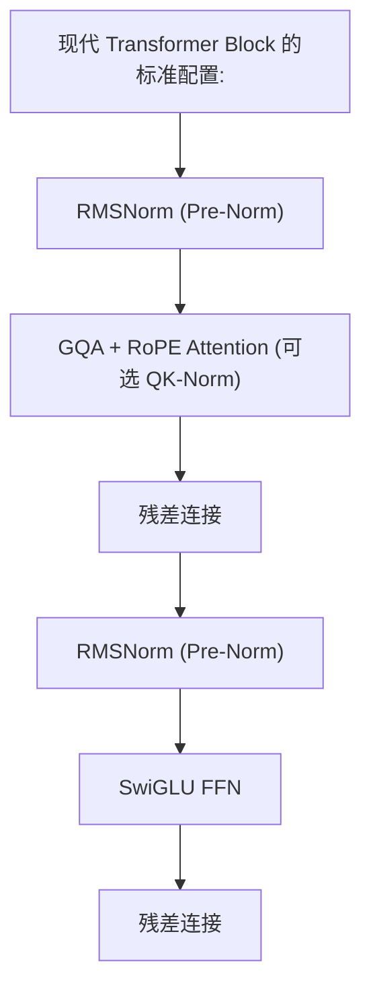

# 残差连接与层归一化

这两个机制不像 Attention 那样"风光"，但它们是大模型能顺利训练到 100+ 层的根本保障。没有它们，深层 Transformer 根本无法收敛。

---

## 1. 残差连接 (Residual Connection)

### 解决的核心问题：梯度消失

深层网络中，反向传播的梯度通过每一层的权重矩阵连乘：

$$\frac{\partial L}{\partial x_0} = \frac{\partial L}{\partial x_N} \cdot \prod_{i=1}^{N} \frac{\partial f_i}{\partial x_{i-1}}$$

N 层连乘后，如果每层的梯度略小于 1（大多数情况），50 层后梯度趋近于 0 → 浅层参数完全不更新 → 模型退化为只有最后几层在学。

对于 Transformer 这种至少 12 层（BERT-base）有时 100+ 层（GPT-3、DeepSeek）的深度架构，梯度消失是致命的。

### 作用机制：梯度高速公路

$$\text{Output} = \text{Sublayer}(x) + x$$

在反向传播时：

$$\frac{\partial}{\partial x} (\text{Sublayer}(x) + x) = \frac{\partial \text{Sublayer}(x)}{\partial x} + 1$$

等式右边的 **+1** 意味着：即使子层的梯度完全消失（$\frac{\partial \text{Sublayer}}{\partial x} \approx 0$），最坏情况下梯度也至少为 1（无损通道），信息仍然可以回传到浅层。

- 数学含义：梯度有一条不经过任何变换的直线通道直达浅层
- 工程意义：Transformer 可以堆到任意深度（原版 6 层 → GPT-3 96 层 → DeepSeek 60+ 层）
- 附带好处：残差连接让每一层只需要学习"当前输出与输入的差异"，而非从头构建整个表示。这降低了每层的学习负担

### 在 Transformer 中的位置

```
x = x + MultiHeadAttention(LayerNorm(x))   # 残差1: Attention
x = x + FeedForward(LayerNorm(x))          # 残差2: FFN
```

每个 Transformer Block 有两个残差连接。信息从输入到输出有 **2 × n_layers** 条无损梯度通道。

---

## 2. 层归一化 (Layer Normalization)

### 解决的核心问题：内部协变量偏移

神经网络训练中，浅层参数的更新会改变深层接收到的输入的分布。深层必须不断重新适应新的输入分布，这是训练不稳定的根源之一。

### 为什么 NLP 场景不用 BatchNorm

| | BatchNorm | LayerNorm |
|---|---|---|
| **归一化方向** | 跨batch，同一特征维度 | 跨特征维度，同一样本 |
| **对 batch size 敏感** | 是（batch 太小则统计不准） | 否（每个样本独立归一化） |
| **训练 vs 推理** | 不一致（需 running mean/var） | 完全一致 |
| **序列长度不一致** | padding 破坏跨位置的统计 | 每个 token 独立归一化 |

NLP 序列中每个 token 独立处理的需求（padding 的 token 不应该混入正常 token 的统计），以及推理时无 batch 的场景，让 LayerNorm 天然更适合。

### 计算

$$\mu = \frac{1}{d} \sum_{j=1}^{d} x_j, \quad \sigma^2 = \frac{1}{d} \sum_{j=1}^{d} (x_j - \mu)^2$$

$$y = \gamma \cdot \frac{x - \mu}{\sqrt{\sigma^2 + \epsilon}} + \beta$$

- 减均值除标准差：将数值范围稳定在合理区间
- $\gamma, \beta$（可学习）：恢复被归一化消除的表达能力——如果对模型来说"大值"很重要，它可以通过 $\gamma > 1$ 重新放大

### RMSNorm：LayerNorm 的瘦身版

$$\text{RMSNorm}(x) = \gamma \cdot \frac{x}{\sqrt{\frac{1}{d} \sum x_i^2 + \epsilon}}$$

去掉了减去均值的步骤（只用均方根缩放）。**为何有效**：减去均值（中心化）在实际中对 Transformer 训练影响很小，因为残差连接和 Pre-Norm 已经提供了足够的数值稳定性。省掉这一步减少约 5-10% 的计算开销。

LLaMA、Qwen、DeepSeek、Mistral 全部使用 RMSNorm。

---

## 3. Pre-Norm vs Post-Norm：决定训练成败的设计

### 归一化放在何处

| 方案 | 结构 | 梯度路径 |
|------|------|----------|
| **Post-Norm** | `x = LN(MHA(x) + x)` | 残差路径经过 LayerNorm → 梯度被压缩 |
| **Pre-Norm** | `x = x + MHA(LN(x))` | 残差路径不经过 LayerNorm → 梯度通畅 |

### Post-Norm 的问题（原版 Transformer）

LayerNorm 的导数会乘以残差分支上的梯度。对于深层模型，多层归一化的导数连乘会严重压缩梯度 → 需要精细的学习率 warmup：从极小学习率开始，逐步增大，防止训练初期梯度异常导致发散。这个 warmup 策略对超参数极度敏感。

### Pre-Norm 的解决方案（现代大模型默认）

将归一化放在子层**之前**，残差路径上不再有归一化层的导数：
- 训练更稳定 → warmup 可以缩短甚至去掉
- 深层模型更容易收敛 → 支持 100+ 层
- 对学习率更鲁棒

当前所有主流大模型（GPT-3+、LLaMA、Qwen、DeepSeek）默认使用 Pre-Norm。

---

## 4. QK-Norm：进一步稳定 Attention

在 Attention 内部对 Q 和 K 额外做一次归一化：

$$Q_{\text{norm}} = \text{RMSNorm}(Q), \quad K_{\text{norm}} = \text{RMSNorm}(K)$$

**解决的问题**：Q 和 K 投影后的向量范数可能差异很大，导致内积值异常大 → softmax 饱和 → 梯度消失 + 注意力分布退化（变成 one-hot）。QK-Norm 强制两者在归一化后做内积，避免了这个问题。

代表：OLMo 2、Gemma 3 的部分层。虽然增加了少量计算，但对大模型的训练稳定性有显著帮助。

---

## 5. 实际配置建议


