# Transformer 变体与演进

2017 年 Transformer 提出以来，核心架构没有根本性变化，但在效率、长序列处理等方面出现了重要变体。

---

## 1. FlashAttention：$O(n^2)$ 计算的工程优化

### 解决什么问题

Attention 的理论复杂度 $O(n^2)$ 在算法层面无法降低（每个 token 必须和所有 token 比较）。但**实际的瓶颈不是计算量，而是显存带宽**。

传统 Attention 的问题：
1. 计算完整的 `n × n` 注意力矩阵并写入 HBM（高带宽显存）
2. Softmax 需要来回读两次（先读一次算 max/exp，再读一次算 sum/除）
3. GPU 的计算单元在"等数据"而非"算数据"

### FlashAttention 的 IO 感知优化

**核心理念**：不一次性算出整个注意力矩阵，而是**分块（tiling）计算 + 在线 softmax**。

- 每次只加载一个小块（tile）的数据到 SRAM（片上缓存，带宽比 HBM 高 10-20 倍）
- 在 SRAM 内完成这个 tile 的所有计算
- 只把最终结果写回 HBM

**效果**：
- 显存读写量降低为原来的 1/20
- 实际 Wall-Clock 加速 2-4 倍（虽然计算量相同）
- 支持更长的序列训练（显存中不用存完整的 `n × n` 矩阵）

### FlashAttention-2 和 FlashAttention-3

- **FA-2**：优化了计算任务的并行分配策略（序列长度维度并行 → head 维度并行 + 更好的 warp 调度），另外 2 倍加速
- **FA-3**：针对 Hopper 架构 (H100) 的异步计算优化，利用 TMA (Tensor Memory Accelerator) 硬件特性

FlashAttention 现在是 PyTorch 内置功能 (`F.scaled_dot_product_attention` 自动选择 FA 后端)。

---

## 2. Mamba / SSM (State Space Models)：挑战 Attention 的统治

### 解决什么问题

Attention 的 $O(n^2)$ 计算和 $O(n)$ 的 KV Cache 在极长序列（百万 token）上仍然很贵。是否有一种序列建模方式，保持 Attention 的好处（并行训练、长距离依赖），同时有 $O(n)$ 的复杂度？

### SSM 的核心思想

用一个**状态空间模型**来建模序列：

$$h_t = A h_{t-1} + B x_t$$
$$y_t = C h_t$$

- $h_t$ 是隐藏状态（类似 RNN），但 $A$ 是**输入依赖的**（根据当前 token 决定记忆/遗忘什么）
- 训练时可以并行化（通过卷积展开），推理时可以像 RNN 一样 $O(1)$ 步骤生成

### Mamba 的关键创新：选择性 SSM

传统 SSM 的 $A, B, C$ 是固定的，Mamba 让它们依赖于输入 $x_t$：
- $A(x_t)$：根据当前 token 决定"保留多少过去的记忆"
- $B(x_t)$：根据当前 token 决定"吸收多少新信息"
- 这让模型学会了**选择性记忆**：遇到重要信息时保留，不重要的自然遗忘

### Mamba vs Transformer

| | Transformer | Mamba/SSM |
|---|---|---|
| 复杂度 | $O(n^2)$ | $O(n)$ |
| 训练并行 | 好 | 好（通过卷积展开） |
| 推理速度 | 需要 KV Cache | 像 RNN，状态更新很快 |
| 长序列 | 受 $O(n^2)$ 限制 | 天然擅长 |
| 上下文召回 | 精确（Attention 直接查找） | 可能遗忘（压缩到状态） |
| 生态成熟度 | 极成熟 | 较新 |

### 混合方案：2025 年的趋势

实践发现，纯 Mamba 在某些任务中不如 Transformer（尤其是需要精确上下文召回的场合）。2025 年的趋势是**混合架构**：

- **Qwen3-Next**：3:1 比例混合 Gated DeltaNet（SSM 变体）与全注意力
- **Kimi K2**：MLA 层 + Delta Attention 层的交替
- 思想：大部分 token 用线性注意力快速处理，关键位置用全注意力精确处理

---

## 3. 线性注意力

### 核心公式变换

将标准 Attention 的 softmax 替换为核函数分解：

$$\text{Attention}(Q,K,V) = \frac{QK^T}{\sum} V \approx \frac{\phi(Q)(\phi(K)^T V)}{\phi(Q)\sum \phi(K)^T}$$

通过改变计算顺序（先算 $K^T V$ 再算 $Q(K^T V)$），复杂度从 $O(n^2 d)$ 降为 $O(n d^2)$。

### 问题与现状

- 理论优美，但实际建模能力不如标准 Attention
- MiniMax-M1 尝试线性注意力但 MiniMax-M2 又回归传统 Attention
- Kimi K2 的 Delta Attention 用通道级门控改进了 SSM
- 结论：线性注意力是目前最有希望的 Attention 替代方案，但尚未完全成熟

---

## 4. Multi-Token Prediction (MTP)

### 解决什么问题

传统自回归每次预测一个 token。MTP 同时预测下 k 个 token：
- 训练信号更丰富（每个位置收到 k 个监督信号）
- 推理时可用 speculative decoding 加速
- 样本效率提升

DeepSeek-V3 使用 MTP 进行训练，是 2025 年的重要技术方向。

---

## 5. 演进时间线

```mermaid
flowchart LR
  n0["2017  Transformer                → 标准架构确立"]
  n1["2019  Transformer-XL             → 处理长序列（片段级递归）"]
  n2["2021  BigBird/Longformer         → 稀疏注意力（O(n log n)）"]
  n3["2022  FlashAttention             → IO感知优化（不改变复杂度，实际加速2-4×）"]
  n4["2023  Mamba                      → SSM 挑战 Attention"]
  n5["2023  GQA (LLaMA 2)              → KV Cache 优化"]
  n6["2024  MoE (DeepSeek-V3, Qwen3)   → 稀疏激活"]
  n7["2024  MLA (DeepSeek-V2/V3)       → KV Cache 极致压缩"]
  n8["2024  MTP (DeepSeek-V3)          → 多 token 预测"]
  n9["2025  FlashAttention-3            → H100 专用优化"]
  n10["2025  混合注意力/SSM              → Qwen3-Next, Kimi K2"]
  n0 --> n1
  n1 --> n2
  n2 --> n3
  n3 --> n4
  n4 --> n5
  n5 --> n6
  n6 --> n7
  n7 --> n8
  n8 --> n9
  n9 --> n10
```

