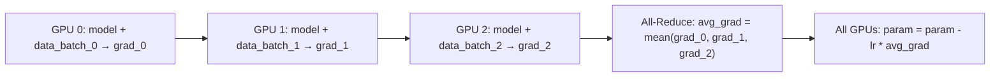

# 分布式训练原理

一个 70B 参数的模型 FP16 精度需要约 140GB 显存——远超单张 A100 (80GB)。分布式训练是让大模型训练成为可能的关键技术。

---

## 1. 显存去哪了：训练一个 7B 模型的显存账本

### 解决什么问题

先理解"单卡放不下"的根本原因。以 LLaMA-7B (FP16) 为例：

| 项目 | 公式 | 大小 |
|------|------|------|
| **模型参数** | 7B × 2 bytes | 14 GB |
| **梯度** | 7B × 2 bytes | 14 GB |
| **优化器状态 (AdamW)** | 7B × 12 bytes (fp32 param + momentum + variance) | 84 GB |
| **激活值** | 取决于 batch_size × seq_len | ~10-50 GB |
| **总计** | | **122-162 GB** |

一张 A100 只有 80GB。即使是最小的 7B 模型，全参数训练也需要至少 2 张 A100。

---

## 2. 数据并行 (Data Parallelism, DP)

### 解决什么问题

单卡的 batch size 太小（可能只能放 1-2 个样本）→ 梯度估计不稳定 → 训练收敛慢或根本不收敛。

### 作用机制

每张 GPU 持有完整的模型副本。不同 GPU 处理不同的数据 mini-batch。计算完梯度后，所有 GPU 对梯度求平均，用平均梯度更新各自的参数。



### 局限

每张 GPU 需要存完整模型（参数+梯度+优化器状态）→ 无法解决"单卡装不下模型"的问题。数据并行只解决了"增加 batch size"，没有解决"装下大模型"。

---

## 3. 模型并行 (Model Parallelism)

### 解决什么问题

模型本身太大，一张卡装不下。需要把模型**切开**分布到多张卡上。

### 张量并行 (Tensor Parallelism, TP)

将**单个矩阵乘法**切分到多张 GPU 上。

例如 $Y = XW$：
```
方案1 (列切分):  W = [W_1 | W_2],  GPU0 算 XW_1, GPU1 算 XW_2, 拼起来得到 Y
方案2 (行切分):  X = [X_1 | X_2],  各GPU算各自的部分，最后加起来
```

- **优点**：精细，单个层就能分布
- **缺点**：每层计算后需要通信（all-reduce），GPU 间需要高速互联（NVLink）

### 流水线并行 (Pipeline Parallelism, PP)

将**不同层**分配到不同 GPU 上。

```
GPU 0: Layer 1-8
GPU 1: Layer 9-16
GPU 2: Layer 17-24
GPU 3: Layer 25-32
```

数据像流水线一样流动：GPU 0 处理完一个 micro-batch → 传给 GPU 1 → ...

- **问题**：GPU 利用率低——大部分时间 GPU 在等上游传数据（"气泡" bubble）
- **解决方案**：Micro-batching——将大 batch 拆成多个小 batch，流水线填满

---

## 4. ZeRO (DeepSpeed)：革命性的优化器状态分片

### 解决什么问题

数据并行虽然通信效率高，但每张卡要存完整的优化器状态（Adam 的 FP32 参数副本+momentum+variance = 12 bytes/param = 7B 模型 ~84GB）。这比模型本身还大。

ZeRO 的洞察：**数据并行时每张卡上的优化器状态是相同的（因为大家都用同一个平均梯度更新），这是 84GB 的冗余存储。**

### ZeRO 的三个阶段

| 阶段 | 分片内容 | 显存节省 | 通信开销 |
|------|----------|----------|----------|
| **ZeRO-1** | 优化器状态 (optimizer states) | 4× | 低 |
| **ZeRO-2** | ZeRO-1 + 梯度 (gradients) | 8× | 中 |
| **ZeRO-3** | ZeRO-2 + 模型参数 (parameters) | N×（N=GPU数） | 高 |

**ZeRO-3 的极致分片**：没有任何一张 GPU 有完整模型。每层只在需要计算时从其他 GPU 收集参数，算完立刻释放。

```python
# ZeRO-3 下的训练 (伪代码)
for layer in model.layers:
    all_gather(layer.params)     # 从各GPU收集这一层的参数
    output = layer(input)        # 计算
    free(layer.params)           # 释放
    all_gather(layer.params)     # 反向传播时再收集一次
    grad = layer.backward()
    reduce_scatter(grad)         # 梯度分片到各GPU
```

### 效果

- ZeRO-3 + 8 张 A100：可训练 70B 模型（原本需要 128+ 张卡的数据并行）
- 通信开销增加约 1.5-2 倍（但 GPU 数量增加更多）

---

## 5. 3D 并行：实际大模型训练的标配

将三种并行策略组合使用：

```
数据并行 × 张量并行 × 流水线并行 × ZeRO

例如 Llama 3 405B 训练:
  数据并行: 16 组
  张量并行: 4 卡 (模型宽度切分)
  流水线并行: 8 卡 (层切分)
  ZeRO-3: 组内使用
  总 GPU: 16 × 4 × 8 = 512 张 H100
```

### 选择策略

| 条件 | 推荐 |
|------|------|
| 模型能放进单卡 (≤~7B) | 纯数据并行 |
| 模型放不下但优化器状态能放下 | 数据并行 + ZeRO-1/2 |
| 模型参数放不下 | ZeRO-3 |
| 超大规模 (>70B) | 3D 并行 (TP+PP+DP+ZeRO) |
| 显存极度紧张 | ZeRO-Offload（部分状态 offload 到 CPU 内存） |
