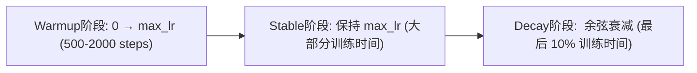

# 训练稳定性与调优

大模型训练不是"设置超参数→运行→收敛"。Loss Spike（损失突然爆炸）、梯度爆炸、发散是常态。本章覆盖保持训练稳定的关键技术。

---

## 1. 梯度裁剪 (Gradient Clipping)

### 解决的问题

训练过程中偶然遇到一个"坏" batch（超长文本、极端数值、异常分布），导致梯度值突然变得极大。一次大梯度更新就能把模型参数推到一个"再也回不来"的区域，从那一刻起 loss → NaN，几百 GPU 小时的训练白费。

### 作用机制

$$g_{\text{clipped}} = g \cdot \min\!\left(1, \frac{\text{max\_norm}}{\|g\|_2}\right)$$

- 计算所有参数梯度的 L2 范数 $\|g\|_2$
- 如果 $\|g\|_2 > \text{max\_norm}$，按比例缩小所有梯度，使其范数刚好等于 max_norm
- 如果 $\|g\|_2 \leq \text{max\_norm}$，不做任何操作
- max_norm 通常设为 1.0

**梯度裁剪不改变梯度方向，只限制步长**。这是一道"安全防护网"，不应该被频繁触发（否则说明学习率太大或模型有问题）。

---

## 2. 学习率调度 (LR Schedule)

### 解决的问题

训练不同阶段需要不同的学习率：
- **初期**：随机初始化的模型，需要小而稳的步长（避免发散）
- **中期**：模型已经稳定，可以大步学习
- **后期**：接近收敛，需要精细调整

### Warmup（预热）

从极小学习率（如 0）线性增加到目标学习率：

```python
lr = target_lr * min(step / warmup_steps, 1.0)
```

**解决的问题**：训练刚开始时，模型参数是随机初始化的，梯度方向不稳定，大的学习率会导致早期发散。Warmup 给予模型一个"缓冲期"来建立稳定的梯度方向。

### Cosine Decay

$$lr(step) = lr_{min} + 0.5(lr_{max} - lr_{min})(1 + \cos(\pi \cdot step / total\_steps))$$

- 从 max_lr 余弦式平滑衰减到 min_lr
- 比线性衰减收敛更好
- 是现代大模型训练的标准选择

### WSD (Warmup-Stable-Decay)

新近提出的"三段式"调度：



**解决的修正**：Cosine Decay 在中后期学习率已经降到很低，但此时模型可能还在学习——浪费了训练效率。WSD 让模型在最大学习率下训练更久，只在最后迅速衰减到最小值。DeepSeek 使用。

---

## 3. Loss Spike 处理

### 问题现象

```
Step 10000: loss = 2.35
Step 10001: loss = 2.34
Step 10002: loss = 18.7  ← Spike！突然爆炸
Step 10003: loss = NaN   ← 参数已经损坏
```

### 检测与回滚

```python
if loss > loss_ema * threshold:  # 通常 threshold = 3-5
    # 检测到 spike →
    # 1. 不执行 optimizer.step()
    # 2. 从最近的 checkpoint 恢复参数
    # 3. 跳过这个 batch，继续训练
    continue
```

### Spike 的常见原因

| 原因 | 表现 | 解决方案 |
|------|------|---------|
| 坏样本 | 某条数据极端异常 | 数据过滤、回滚跳过 |
| 学习率太大 | 频繁 spike | 降低 lr |
| QK 内积爆炸 | Attention 输出过大 | QK-Norm |
| Softmax 饱和 | 梯度接近 0 后突然恢复 | QK-Norm + 梯度裁剪 |
| 混合精度溢出 | FP16 范围不够 | 换 BF16 |

---

## 4. 优化器选择

### AdamW：大模型训练的标配

AdamW 解决了标准 Adam 的一个设计缺陷：**权重衰减（L2 正则化）被自适应学习率削弱**。

- 标准 Adam：L2 正则化与梯度一起被自适应学习率缩放 → 实际正则化强度不均匀
- AdamW：权重衰减从自适应中解耦，在每个 step 直接做 `param = param * (1 - lr * weight_decay)` → 正则化强度一致

```python
optimizer = torch.optim.AdamW(
    model.parameters(),
    lr=3e-4,
    betas=(0.9, 0.95),    # β₂ 从默认 0.999 降低
    eps=1e-8,
    weight_decay=0.1       # 比传统值 0.01 大
)
```

### β₂ 的选择

- 传统 Adam: β₂=0.999（约 1000 步的指数平滑窗口）
- 大模型: β₂=0.95（约 20 步的窗口）
- **原因**：大模型训练中梯度变化快，太长的平滑窗口会让模型"反应迟钝"——还在纠正 1000 步前的梯度方向

---

## 5. Dropout 的位置

### 解决的问题

正则化，防止过拟合。但大模型的 Dropout 使用策略有讲究：

| 位置 | 建议 |
|------|------|
| Attention weights 后 | 加 Dropout（提升泛化） |
| FFN 激活后 | 加 Dropout |
| Residual 连接 | **不加** Dropout（会阻碍梯度回流） |
| Embedding 层 | **不加** Dropout（token embedding 需要完整语义） |

现代大模型（LLaMA、Qwen）通常用较低 dropout (0.1) 或完全不用——数据量大了过拟合不是问题。

---

## 6. 训练稳定性的检查清单

```
□ 梯度裁剪 max_norm=1.0
□ Warmup 至少 500 步
□ BF16 而非 FP16（避免溢出）
□ Pre-Norm 而非 Post-Norm
□ AdamW β₂=0.95
□ QK-Norm（大模型推荐）
□ Loss spike 检测 + 回滚
□ 定期保存 checkpoint（至少每 1000 步）
□ 训练日志（loss、grad norm、lr、perplexity）
```
