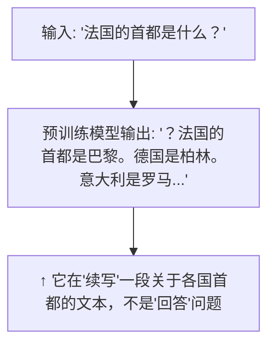

# SFT 监督微调

SFT (Supervised Fine-Tuning) 是将预训练模型转化为"助手"的关键步骤。预训练模型只会补全文本，SFT 教会它"执行指令"。

---

## 1. 预训练模型 vs 对话模型

### 问题

预训练模型的行为模式是"文本补全"：



你想问一个问题，模型以为自己在写一篇关于首都的文章。这是根本的行为错位。

### SFT 解决什么

> 通过"指令→回答"的示例对，重新训练模型的行为模式，使其从"补全文本"转变为"执行指令+生成回答"。

```
SFT 训练数据格式:
{"instruction": "法国的首都是什么？", "output": "法国的首都是巴黎。"}
{"instruction": "写一首关于春天的诗", "output": "春风轻拂面，万物复苏时..."}
{"instruction": "解释什么是机器学习", "output": "机器学习是..."}
```

---

## 2. SFT 的训练格式

### 对话模型的输入构造

```python
def format_sft_sample(instruction, output, tokenizer):
    text = f"""<|im_start|>user
{instruction}<|im_end|>
<|im_start|>assistant
{output}<|im_end|>"""
    return tokenizer.encode(text)
```

### 关键设计：只计算 assistant 部分的损失

```python
# 构造 labels：user 部分设为 -100 (忽略), assistant 部分保留
labels = input_ids.clone()
user_start = find_token_position(input_ids, "<|im_start|>user")
assistant_start = find_token_position(input_ids, "<|im_start|>assistant")

# user 指令部分不参与 loss 计算
labels[:, user_start:assistant_start] = -100

# 损失只计算在 assistant 的输出上
loss = F.cross_entropy(logits.view(-1, vocab_size), labels.view(-1), ignore_index=-100)
```

**为什么只计算 assistant 部分**：我们希望模型学会"看到指令→生成回答"，而不是学会"生成指令"。如果整个序列都参与 loss，模型会浪费能力去学习如何写用户指令。

---

## 3. SFT 数据质量的核心地位

### LIMA 论文的关键发现

> 用 1000 条**精心挑选**的高质量 SFT 数据，效果接近甚至超过用 52000 条普通数据的模型。

| 数据策略 | 效果 | 代价 |
|----------|------|------|
| 1000 条高质量手写数据 | 接近 SOTA | 人工标注成本高 |
| 52000 条 Alpaca 数据 (GPT生成) | 不错 | 几乎免费 |
| 100K+ 条低质量爬取数据 | 差（学到坏模式） | 数据处理成本高 |

### 高质量 SFT 数据的标准

1. **多样性**：覆盖推理、写作、编程、翻译、问答等不同类型
2. **一致性**：同一类问题用相似的风格回答
3. **事实准确**：不包含幻觉或错误信息（会教会模型编造）
4. **安全对齐**：拒绝有害请求的示例必须包含

---

## 4. SFT 训练配置

### 标准配置

```python
sft_config = {
    "learning_rate": 2e-5,        # 比预训练小一个数量级
    "batch_size": 128,
    "epochs": 3,                  # SFT 一般 1-3 epoch，多了过拟合
    "warmup_ratio": 0.03,
    "weight_decay": 0.0,         # SFT 通常不用 weight decay
    "max_seq_length": 2048,
    "packing": True,              # 多条数据拼成一条，提高效率
}
```

### 为什么要用 packing

大多数 SFT 数据很短（一问一答可能 200 tokens），但 GPU 每次处理固定长度的序列。packing 把多条短数据拼成一条长序列，用 EOS token 分隔，提高 GPU 利用率。

```python
# 不使用 packing: 每条数据独立，但 GPU 大部分时间在算 padding
# 使用 packing: 数据拼接
"<|im_start|>user\nQ1<|im_end|><|im_start|>assistant\nA1<|im_end|><|im_start|>user\nQ2<|im_end|>..."
# 序列利用率接近 100%
```

---

## 5. SFT 的局限：为什么不能只靠 SFT

SFT 教会模型"模仿"但不一定"优化"：

| SFT 能做到 | SFT 做不到 |
|-----------|-----------|
| 按指令格式生成回答 | 区分"好答案"和"更好的答案" |
| 模仿训练数据的风格 | 拒绝有害请求（除非在训练数据中有示例） |
| 输出看起来合理的回答 | 保证事实准确（可能编造看起来合理的假信息） |
| 覆盖常见任务 | 处理训练数据中未出现的边界情况 |

这引出了下一步：RLHF/DPO 偏好对齐——它解决 SFT 的"只会模仿，不会优化"问题。
