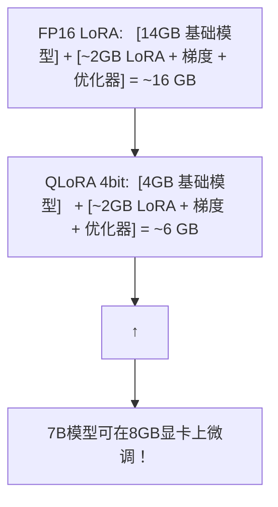

# QLoRA 与量化微调

> 消费级显卡微调 7B 甚至 13B 模型的唯一可行方案。

---

## 1. LoRA 够用了，为什么还需要 QLoRA？

### 问题

LoRA 只更新 ~0.1% 的参数，计算量确实小了，但**基础模型本身仍然需要占满显存**。7B 模型的 FP16 权重 = 14GB，加上梯度和激活值 → 单张 16GB 显卡跑不了 7B LoRA。

### QLoRA 的答案

> 把基础模型量化到 4-bit（精度降低），给可训练的 LoRA adapter 腾出显存空间。



---

## 2. QLoRA 的三大核心技术

### Double Quantization（双重量化）

标准 4-bit 量化后，每个量化参数还需要一个 FP32 的缩放因子。100M 参数 → ~1M 个缩放因子 → 又占 ~4MB。双重量化将这个缩放因子也量化了——$4MB → $0.5MB。积少成多，在大模型上省 GB 级的显存。

### NormalFloat4 (NF4)

标准量化是均匀划分数值范围，但神经网络的权重是**近似正态分布**的——大部分值集中在 0 附近，极少数值很大。NF4 按分布密度划分区间：峰值附近区间窄（精度高），尾部区间宽。这比均匀量化保留更多有效信息。

### Paged Optimizers

当显存不够时，自动将优化器状态 offload 到 CPU 内存（通过统一内存管理）。类似操作系统中的分页机制——当前不用的页放到慢存储，需要时再换入。

---

## 3. 实战配置

```python
import torch
from transformers import BitsAndBytesConfig
from peft import LoraConfig, get_peft_model, prepare_model_for_kbit_training

# 4-bit 量化配置
bnb_config = BitsAndBytesConfig(
    load_in_4bit=True,
    bnb_4bit_quant_type="nf4",              # NormalFloat4
    bnb_4bit_compute_dtype=torch.bfloat16,  # 计算时反量化为 BF16
    bnb_4bit_use_double_quant=True,         # 双重量化
)

# 加载量化模型
model = AutoModelForCausalLM.from_pretrained(
    "meta-llama/Llama-3-8B",
    quantization_config=bnb_config,
    device_map="auto",         # 自动分配到可用 GPU
)

# 准备模型进行 k-bit 训练
model = prepare_model_for_kbit_training(model)

# LoRA 配置 (与标准 LoRA 完全相同)
lora_config = LoraConfig(
    r=8,
    lora_alpha=16,
    target_modules=["q_proj", "v_proj"],
    lora_dropout=0.1,
    task_type="CAUSAL_LM",
)

model = get_peft_model(model, lora_config)

# 正常训练...
```

---

## 4. 量化精度 vs 微调效果

### 经验性结论

| 精度 | 微调效果 | 显存需求 (7B) | 推荐场景 |
|------|---------|--------------|---------|
| FP32 | 100% (基线) | ~90 GB | 有足够硬件时的最佳选择 |
| FP16/BF16 | ~99.5% | ~50 GB | 全量微调标准精度 |
| INT8 (LoRA) | ~99% | ~20 GB | 单张 24GB 卡 |
| **NF4 (QLoRA)** | **~98-99%** | **~8 GB** | 单张 RTX 3070/4070 |
| NF4 双重量化 | ~98% | ~6 GB | 极致省显存 |

**QLoRA 用不到 10% 的性能代价换来了 90% 的显存节省**——对个人开发者来说，这是唯一实际的方案。

---

## 5. 训练效率对比

| 方案 | 7B 微调时间 | 所需硬件 |
|------|-----------|---------|
| 全参数微调 | ~4 小时 | 2×A100 80G (~$4/hr 云) |
| LoRA (BF16) | ~6 小时 | 1×A100 80G (~$2/hr) |
| QLoRA (NF4) | ~8 小时 | 1×RTX 4090 24G (~$0/hr 自有) |

时间差距主要来自：QLoRA 每次计算需要反量化（NF4→BF16）和量化（BF16→NF4），这个 overhead 约 10-20%。但这与免去云 GPU 租金相比，完全可以接受。
