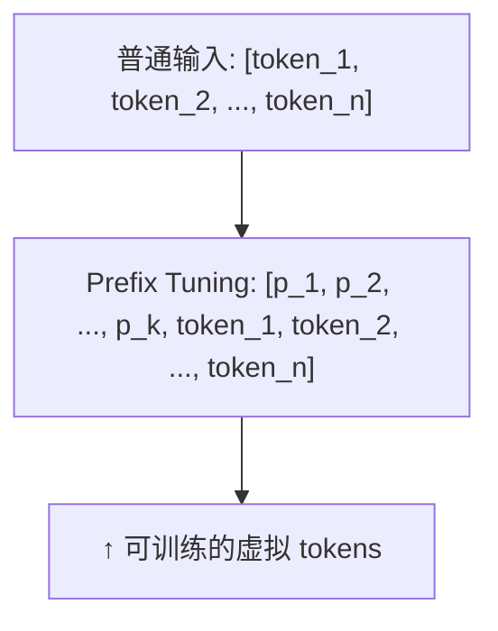

# 其他 PEFT 方法

LoRA 虽然强势，但并非唯一选择。不同的 PEFT 方法适用于不同的约束条件。

---

## 1. Adapter Tuning

### 解决什么问题

在预训练模型的层之间**插入小型可训练网络模块**，而不是修改原有权重。

### 结构

```
Transformer Block + Adapter:
    x = Attention(x)
    x = Adapter(x)          ← 新增，一个 bottleneck 结构
    x = x + FFN(x)
    x = Adapter(x)          ← 新增
```

Adapter 是一个降维-激活-升维的结构：
$$\text{Adapter}(x) = x + W_{up} \cdot \sigma(W_{down} \cdot x)$$

### 与 LoRA 的对比

| | Adapter | LoRA |
|---|---|---|
| **位置** | 串行，插在层之间 | 并行，加在权重旁 |
| **推理开销** | 增加推理延迟（多了一层计算） | 可以 merge 到权重，零额外开销 |
| **多任务** | 可切换不同 adapter | 可切换不同 lora |

Adapter 的致命问题是**增加了推理延迟**——每次 forward 都要经过额外的 adapter 层。而 LoRA 可以在推理时合并回权重（merge），完全无额外开销。这也是 LoRA 更流行的主要原因。

---

## 2. Prefix Tuning

### 解决什么问题

不修改模型参数，而是在输入**前面加一些可训练的"虚拟 token"（prefix）**，这些 token 的 embedding 是学习出来的，可以引导模型的行为。

### 工作机制



这些 prefix tokens 在每一层都会被 Attention 看到，起到"soft prompt"的作用。KV Cache 中 prefix 部分的 K/V 来自可训练的参数而非实际输入。

### 适用场景

- **生成任务**：摘要、翻译——prefix 引导模型的输出风格
- **不适用对话**：对话的动态性强，固定的 prefix 不够灵活

---

## 3. P-Tuning v2

### 解决 Prefix Tuning 的问题

Prefix Tuning 只在输入层加 prefix。对于深层模型，浅层的 prefix 信号在深层被稀释了。

P-Tuning v2 在**每一层**都加入可训练的 prefix tokens：

```
Layer 1: [p_1, ..., p_k, hidden_1, ..., hidden_n]
Layer 2: [p_1, ..., p_k, hidden_1, ..., hidden_n]
...
```

每一层都有独立的可训练 prefix——深层也能收到直接的引导信号。效果更好，但参数略多。

---

## 4. IA³ (Infused Adapter by Inhibiting and Amplifying)

### 核心思想

不添加新矩阵，而是学习三个**缩放向量**，分别缩放 Attention 的 K、V 和 FFN 的激活值：

$$K_{new} = l_k \odot K, \quad V_{new} = l_v \odot V, \quad FFN_{act} = l_{ff} \odot \text{Activation}$$

$l_k, l_v, l_{ff}$ 是与对应维度等长的向量，元素级乘法。

### 极致参数效率

对于 7B 模型，IA³ 的可训练参数仅约 0.01%（~70 万参数），同时保持接近全参数微调的效果。是 PEFT 中参数量最小的方案。

---

## 5. 方法选择指南

| 场景 | 推荐 | 原因 |
|------|------|------|
| **通用微调** | LoRA / QLoRA | 效果好，生态成熟，可 merge |
| **极致显存紧张** | QLoRA (NF4+双重量化) | 7B 模型仅需 6GB |
| **多任务切换** | LoRA (多个 adapter) | 动态加载/卸载 adapter |
| **极致参数效率** | IA³ | 仅 0.01% 参数 |
| **生成风格控制** | Prefix Tuning | Soft prompt 天然适合 |
| **推理零开销** | LoRA (merge 后) | Adapter 有推理延迟 |
