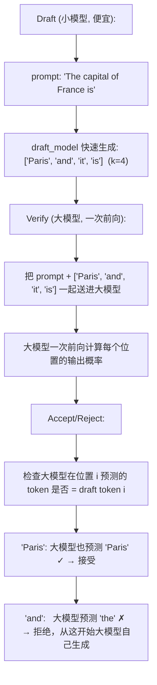
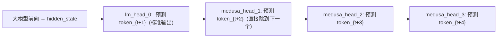

# Speculative Decoding

Speculative Decoding 解决一个核心矛盾：**推理是内存受限的（而非计算受限），但每个 step 只能生成一个 token**。

---

## 1. 推理的瓶颈在哪里

### 不是算力，是显存带宽

单 token 推理的 FLOPs 很小（0.5-2% GPU 利用率），但每次要从 HBM 读取整个模型的权重 + KV Cache。GPU 的计算单元大量时间在"等数据"。

这意味着：**推理速度被显存带宽限制**——读取权重的速度决定了生成 token 的速度。

### 如果每次能生成多个 token

如果能一次读取权重、一次前向生成 k 个 token，读权重的开销就被 k 个 token 分摊了。但因为自回归的性质（下一个 token 依赖上一个），这看似不可能。

**Speculative Decoding 绕过了这个限制。**

---

## 2. Speculative Decoding 的"Draft-then-Verify"

### 核心理念

> 用一个**极小的模型**快速生成 k 个"猜测 token"，然后用**大模型**一次性验证这 k 个 token 是否合理。通过的保留，不通过的由大模型重新生成。

### 为什么能加速

- 大模型一次前向验证了 4 个 token → 节省了 3 次前向
- 即使只接受了 2 个 token，也省了 1 次前向
- 只要小模型和大模型的一致性高（通常是 70-85%），平均加速 2-3×

---

## 3. 小模型（Draft Model）的选择

### 要求

- 与目标模型相同的 tokenizer（否则 token 不兼容）
- 足够小（比大模型小 100-1000×，生成成本可忽略）
- 与大模型在多数 token 上预测一致

### 常用方案

| 方案 | 做法 | 优缺点 |
|------|------|------|
| 同系列小模型 | LLaMA-160M 做 70B 的 draft | 一致性好，但需要训练 |
| 剪枝版本 | 从大模型剪枝出小模型 | 需要额外工作 |
| 自推测 (Self-Speculative) | 大模型的一部分层做 draft | 不需要额外模型 |

---

## 4. Medusa 与 EAGLE：多头并行推测

### Medusa

在模型最后一层加**多个额外的分类头**，每个头预测不同位置 offset 的 token：

一次前向直接得到 4 个候选的下几个 token。不用 draft model！只需要训练几个小的 MLP 头。

### EAGLE

利用"特征级"而非"token级"的推测。通过历史 hidden states 预测未来的 hidden states，从 predicted hidden state 生成 draft tokens。比 Medusa 更准确。

---

## 5. 实际加速效果

| 方法 | 平均加速 | 附加成本 |
|------|---------|---------|
| Speculative Decoding (小模型) | 2-3× | 需要训练/选择 draft model |
| Medusa | 2-2.5× | 训练几个小 MLP 头 |
| EAGLE | 2.5-3.5× | 略复杂的额外训练 |
| 纯自回归 | 1× | 无 |

注意：这些方法在**低 batch size** 时效果最好（1-8 并发）。在高并发时（batch > 32），continuous batching 已经填满了 GPU 算力，推测解码的增益会减少。
