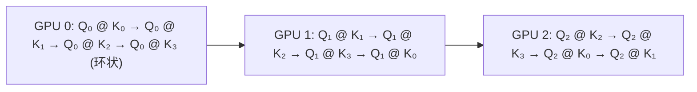
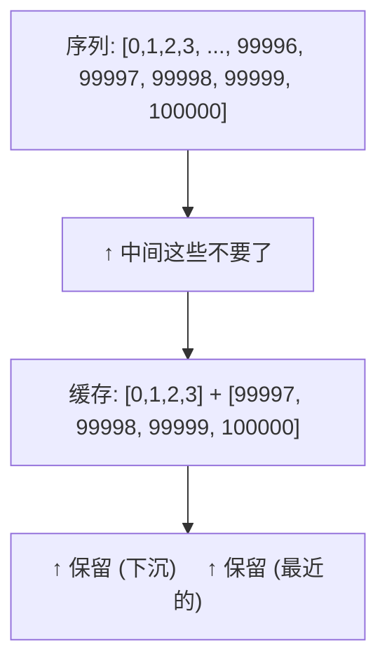

# 长文本推理优化

当上下文超过 32K token，KV Cache 和 Attention 计算量成为推理的绝对瓶颈。本章覆盖针对长文本的特殊优化。

---

## 1. 长文本推理的三个瓶颈

| 瓶颈 | 来源 | 表现 |
|------|------|------|
| **KV Cache 显存** | 每 token 的 K/V 都要存 | 128K 序列 → 64+ GB KV Cache |
| **Attention 计算量** | O(n²)，每步都要与所有历史 token 算注意力 | 长序列时 step 时间越来越长 |
| **Prefill 延迟** | 第一次处理整个 prompt 要 O(n²) | 输入一本小说要等几十秒才出第一个 token |

---

## 2. RingAttention：分布式长文本

### 解决的场景

单张 GPU 的显存放不下全序列的 KV Cache（比如 128K），需要多张 GPU 协同。

### 原理

将序列切分成多段，每张 GPU 负责一段的 Q。K 和 V 在 GPU 之间**环形传输**——每张 GPU 计算自己负责的 Q 与当前 K/V → 将 K/V 传给下一张 GPU → 接收上一张传来的 K/V → 继续计算。



每张 GPU 在计算时，K/V 在 GPU 间流动。最终每个 Q 与所有 K/V 都计算了内积。

---

## 3. StreamingLLM：注意力下沉的发现

### 核心发现

长序列推理时，Attention 会自然形成几个**"注意力下沉"（Attention Sink）**——前几个 token（尤其是 BOS）的注意力权重异常高，即使它们与当前生成完全不相关。

### 利用这个现象

保存前 4 个"下沉 token"的 KV + 最近的 1024 个 token 的 KV → 丢弃中间所有 token。



**解决的问题**：KV Cache 从 O(n) 降为 O(1)（固定窗口大小），代价是丢失中间的细节信息。但对于无尽对话（如 100K+ token），这是保持恒定延迟的唯一可行方案。

---

## 4. KV Cache 压缩

### H2O (Heavy-Hitter Oracle)

观察发现：Attention 权重的分布极度不均匀——少数 token 占据了绝大多数注意力权重。H2O 只保留注意力得分最高的那些 token 的 KV，丢弃其余：

```python
# 每个 head 独立计算
# 保留累积注意力得分 top-20% 的 token
attention_score = attn_weights.sum()  # token 在所有步骤被关注的总量
keep_indices = topk(attention_score, k=int(seq_len * 0.2))
kv_cache = kv_cache[keep_indices]  # 丢掉 80% 的 KV
```

### SnapKV

更细粒度的 KV 选择：考虑每个 token 对所有后续 token 的"影响力"。影响力低的 token 的 KV 可以直接丢弃。

---

## 5. 长文本推理的方案选择

| 场景 | 推荐方案 | KV Cache 节省 |
|------|---------|-------------|
| 无需精确回顾所有细节 | StreamingLLM | 80-95% |
| 需要保留重要信息 | H2O / SnapKV | 60-80% |
| 多 GPU 集群，需要完整上下文 | RingAttention | 0%（分布式存储） |
| 单卡 64K 以内 | vLLM PagedAttention + 量化 | 通过量化节省 |

### 实际建议

对于大多数应用场景（RAG、对话），32K-64K 上下文足够，vLLM + GQA 模型（如 LLaMA 3）即可。超过 128K 的极端长文本才需要考虑 StreamingLLM 或 KV Cache 压缩。
