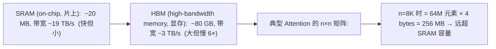
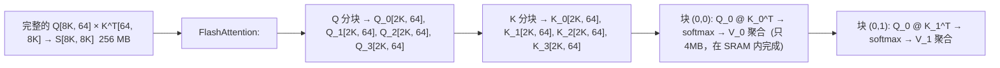

# FlashAttention 原理

FlashAttention 不改变 Attention 的数学，只改变**计算的执行方式**。它解决了 GPU 架构中一个隐藏的矛盾：**算力过剩，带宽不足**。

---

## 1. GPU 存储层次



### 传统 Attention 的问题

计算 `softmax(QK^T / √d_k) V` 需要：
1. 从 HBM 读取 Q、K 到 SRAM → 计算 `S = QK^T` → 将 S 写回 HBM
2. 从 HBM 读取 S → 计算 softmax → 写回 HBM
3. 从 HBM 读取 softmax(S)、V → 计算输出 → 写回 HBM

每一步都在 HBM ↔ SRAM 之间搬运数据。**90% 的功耗和时间花在数据传输上，只有 10% 花在计算上。**

---

## 2. FlashAttention 的解决方案

### Tiling (分块计算)

不一次性生成整个 `n × n` 注意力矩阵，而是分成多个小块：



### Online Softmax

Softmax 需要全序列的值才能归一化。FlashAttention 用 **"在线 softmax"**解决分块后的归一化问题：

```python
# 在线维护 softmax 的 max 和 sum，边加载边更新
for K_block, V_block in blocks(K, V):
    scores = Q @ K_block^T / sqrt(d_k)
    new_max = max(old_max, max(scores))
    # 根据新的 max 重新缩放旧结果
    output = output * exp(old_max - new_max)
    output += exp(scores - new_max) @ V_block
    old_max = new_max
# 最后除以分母
output = output / sum(exp(normalized_scores))
```

**解决了什么**：不需要完整 `n×n` 矩阵就能正确计算 softmax。每次只有一个块在 SRAM 中，算完就丢弃。

---

## 3. 效果

| 指标 | 标准 Attention | FlashAttention | 改善 |
|------|---------------|----------------|------|
| HBM 读写量 | $\Theta(n^2 \cdot d)$ | $\Theta(n \cdot d^2)$ | 减少为原来的 d/n |
| 实际速度 | 1× | 2-4× | — |
| 显存使用 | $O(n^2)$ | $O(n)$ | 极大减轻 |
| 是否改变结果 | — | 数值上等价（除浮点舍入） | — |

**关键后果**：因为不需要在 HBM 中存储完整的 $n \times n$ 注意力矩阵，FlashAttention 使得**长序列训练成为可能**。在它之前，4K 序列训练就很吃力，之后 32K+ 成为常态。

---

## 4. FA-2 和 FA-3 的改进

| 版本 | 改进 | 额外加速 |
|------|------|---------|
| **FA-1** | Tiling + Online Softmax | 2-4× |
| **FA-2** | 更好的并行策略（head 维度并行 + warp 调度） | 额外 2× |
| **FA-3** | Hopper (H100) 硬件特殊优化：TMA + FP8 支持 | 额外 1.5-2× |

PyTorch 2.0+ 的 `F.scaled_dot_product_attention` 会自动检测并使用 FA 后端。大多数时候你甚至不需要知道它是什么——它在透明地加速。
