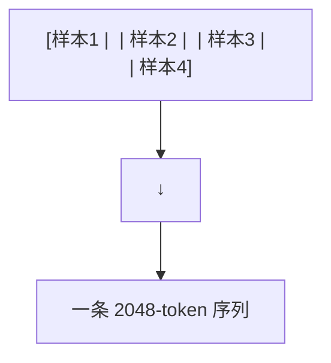

# 训练优化技巧合集

本章覆盖前面章节未详细展开的训练优化技巧，按"显存→速度→精度"三个维度组织。

---

## 1. 显存优化

### Gradient Checkpointing (Activation Checkpointing)

**解决问题**：训练时每个中间层的激活值都要保存（反向传播需要），32 层 × 大批量 = 几十 GB 显存。

**解决方案**：不保存所有中间激活，只在反向传播需要时重新计算（recompute）。

```python
# PyTorch 一行开启
model.gradient_checkpointing_enable()

# 效果: 激活值显存降低 ~70%，训练速度降低 ~20% (重新计算的代价)
```

本质是**用时间换显存**——在显存紧张时极为有效。

### 梯度累积

**解决问题**：显存放不下足够大的 batch，但小 batch 的梯度估计不稳定。

**解决方案**：多个 micro-batch 的梯度求和后再更新参数。

```python
for i, micro_batch in enumerate(dataloader):
    loss = model(micro_batch) / accumulation_steps
    loss.backward()           # 梯度自动累积
    if (i+1) % accumulation_steps == 0:
        optimizer.step()      # 累积够了，更新
        optimizer.zero_grad()
```

效果：GPU 需要的最小显存减少 $N$ 倍（$N$ = 累积步数），训练时间基本不变。

---

## 2. 速度优化

### Fused Kernels

将多个连续的 PyTorch 算子"融合"为单个 CUDA kernel，减少 GPU kernel launch 开销和数据搬运：

```python
# 非融合: 4 个 kernel launches
x = layer_norm(x)
q = linear_q(x)
k = linear_k(x)
v = linear_v(x)

# 融合: 1 个 kernel launch (QKV 一起算)
qkv = fused_qkv_linear(layer_norm(x))  # 一个 kernel 完成所有
```

### Liger Kernel (LinkedIn 开源)

提供 FlashAttention + Fused Cross Entropy + Fused Linear 等预封装优化，微调时训练速度 15-30% 提升：

```python
from liger_kernel.transformers import apply_liger_kernel
apply_liger_kernel(model)  # 自动替换为融合 kernel
```

### torch.compile

PyTorch 2.0+ 的图编译优化，自动融合算子 + 消除 Python 解释器开销：

```python
model = torch.compile(model, mode="reduce-overhead")
# 训练加速 10-30%，无任何代码修改
```

---

## 3. 精度提升

### Unsloth

通过自定义 Triton kernel 优化 LLaMA/Qwen/Mistral 等模型微调：
- 重写 RoPE 实现（避免不必要的 reshape/transpose）
- 重写 SwiGLU 和 RMSNorm（融合操作）
- 手动优化反向传播的内存访问模式

```python
from unsloth import FastLanguageModel
model, tokenizer = FastLanguageModel.from_pretrained("unsloth/Llama-3-8B")
model = FastLanguageModel.get_peft_model(model, lora_config)
# 训练速度 2×，显存降低 50%
```

### Sample Packing

**解决的问题**：NLP 数据通常较短（100-200 tokens），但序列长度固定（2048）。大量 padding 浪费 GPU 算力。

**解决方案**：多条短数据拼成一条长序列，用 EOS 分隔：



序列利用率从 ~30% 提升到接近 100%，训练吞吐量提升 3×。

---

## 4. 通信优化

### Gradient Compression

分布式训练时，梯度同步是通信瓶颈。压缩梯度可以减少通信量：

| 方法 | 压缩比 | 精度影响 |
|------|--------|---------|
| FP16 传输 | 2× | 无 |
| Top-k 稀疏化 | 100-1000× | 中等 |
| 8-bit 量化 | 4× | 低 |
| PowerSGD | 10-100× | 低 |

```python
# DeepSpeed 配置
"compression_training": {
    "weight_quantization": {
        "shared_parameters": {},
        "different_groups": {}
    },
    "activation_quantization": {}
}
```

---

## 5. 技巧组合推荐

| 场景 | 推荐配置 |
|------|---------|
| 单卡微调 7B | QLoRA + Gradient Checkpointing + Gradient Accumulation |
| 多卡微调 70B | DeepSpeed ZeRO-3 + QLoRA + Fused Kernels |
| 预训练 7B | torch.compile + FlashAttention + BF16 |
| 预训练 70B+ | 3D Parallelism + ZeRO-3 + BF16 + torch.compile |
