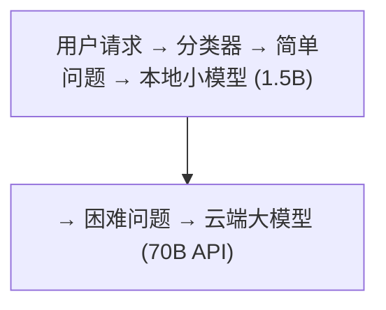
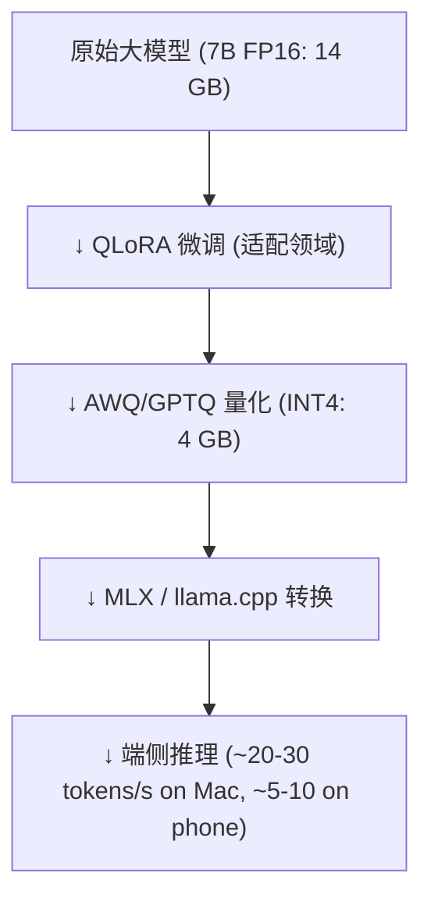

# 端侧部署

将大模型部署到手机、笔记本电脑、IoT 设备上。核心挑战：**算力有限、内存有限、功耗有限**。

---

## 1. 端侧部署的特殊挑战

| 约束 | 服务器 | 端侧 (手机/笔记本) |
|------|--------|-------------------|
| 可用内存 | 80+ GB HBM | 4-16 GB 共享内存 |
| 算力 | 312 TFLOPS (A100) | 2-5 TFLOPS (手机 NPU) |
| 功耗 | 300W+ | 5-15W |
| 网络依赖 | 有 | 需要离线运行 |
| 模型大小限制 | 不限 | 必须 < 4 GB (手机) |

---

## 2. 端侧推理框架

### MLX (Apple Silicon)

Apple 官方机器学习框架，专门优化 M1/M2/M3/M4 系列芯片：

```python
import mlx.core as mx
from mlx_lm import load, generate

# 自动利用 Apple Neural Engine + GPU
model, tokenizer = load("mlx-community/Llama-3-8B-4bit")
response = generate(model, tokenizer, prompt="Hello!")
```

**优势**：
- 共享内存架构（CPU/GPU/ANE 使用同一块内存，无需拷贝）
- 推理速度远超 llama.cpp 在 Mac 上的表现
- 支持 LoRA adapter 热加载

### llama.cpp + Metal

利用 Apple Metal API 将部分层卸载到 GPU：

```bash
./llama-cli -m model.Q4_K_M.gguf -ngl 33 -p "Hello"
# -ngl 33: 将 33 层 offload 到 GPU (Metal)
```

### MNN / ExecuTorch (手机端)

大厂的移动端推理引擎：

- **MNN** (阿里巴巴)：Android/iOS，针对高通/联发科 NPU 优化
- **ExecuTorch** (Meta/PyTorch)：PyTorch 模型 → 移动端格式
- **MediaPipe** (Google)：Gemma 2B 在 Android 上运行

---

## 3. 端侧适配策略

### 模型选择

| 模型 | 大小 (Q4) | 能力 | 可运行于 |
|------|----------|------|---------|
| Qwen3-0.6B | ~0.4 GB | 基础对话 | 几乎所有手机 |
| SmolLM3-3B | ~2 GB | 中等能力 | 中端手机 (6GB+) |
| Phi-3 mini (3.8B) | ~2.5 GB | 较好 | 高端手机 (8GB+) |
| Llama-3-8B | ~4.5 GB | 好 | 旗舰手机 (12GB+) / 笔记本 |
| Qwen3-7B | ~4.5 GB | 好 | 笔记本 (16GB+) |

### 切分为小模型 + 任务路由

部署一个小模型（如 1.5B）处理大部分简单问题，仅在必要时切换到更大的模型（云端或本地大模型）：



---

## 4. 端侧部署的优化链



### 实际表现 (MacBook Pro M3, 36GB, Llama-3-8B Q4_K_M)

| 操作 | 速度 |
|------|------|
| TTFT (首 token 延迟) | ~500ms |
| 生成速度 | ~25-30 tokens/s |
| 内存占用 | ~5.5 GB |
| 电池消耗 | ~8W (轻微) |

移动端的 7B 模型推理已从"不可能"变为"可用"，但还不是"流畅"——3B-4B 的小模型是 2025 年手机端的主流选择。
