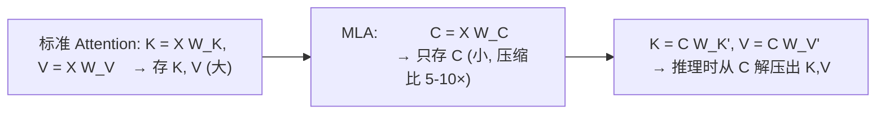

# DeepSeek 技术解密

DeepSeek 从 V2 到 V3 的技术路线代表了 2024-2025 最具创新性的大模型工程实践。每个创新都对应一个明确的效率瓶颈。

---

## 1. MLA (Multi-head Latent Attention)：KV Cache 的革命性压缩

### 问题

DeepSeek-V3 有 671B 参数，60+ 层，如果使用标准 MHA 或 GQA，KV Cache 的显存开销将吃掉所有 GPU 显存。即使 GQA 把 KV 头从 64 降到 8，也是不可接受的开销。

### MLA 的核心思想

> 不在显存中存储完整的 K 和 V，而是存储它们在一个低维潜在空间的压缩表示。推理时再通过轻量的投影矩阵"解压"。



### 为什么压缩是可行的

多头注意力的 K 和 V 各 head 包含大量冗余信息（不同 head 的 K 在某些特征上高度相关）。MLA 去掉这种冗余——只保留跨 head 共享的核心信息，每个 head 特定的部分用轻量投影重建。

### 成本

- 解压需要一次额外的小矩阵乘法（可忽略 vs 省下的显存）
- 消融实验显示 MLA 的建模能力**略优于**标准 MHA（可能是压缩起到了正则化效果）

---

## 2. DeepSeekMoE：极端稀疏的专家设计

### 设计的独特之处

| 设计 | DeepSeek-V3 | 业界常见 |
|------|-------------|---------|
| 专家总数 | 256 (FFN) + 1 (共享专家) | 8-128 |
| 每 token 激活 | 9 (1共享+8路由) | 2-8 |
| 活跃参数占比 | 5.5% (37B/671B) | 10-30% |
| 细粒度专家 | 专家 hidden dim 仅为传统的 1/4 | 标准 FFN 大小 |

### 为什么用 256 个小专家而不用 8 个大专家

- **更灵活的路由**：路由可以从 256 个选择中精确匹配 token 的需求
- **更精细的知识分离**：不同领域的知识可以被分配到不同专家，互不干扰
- **负载均衡更容易**：小专家意味着即使是"冷门"专家也能被充分激活

### 共享专家的作用

保留 1 个所有 token 都经过的共享专家 → 学习通用的语言能力（语法、常识）。路由专家专注于领域特化。这避免了所有知识都通过路由的"纯 MoE"可能出现的通用能力退化。

---

## 3. Multi-Token Prediction (MTP)：预测未来

### 解决的问题

传统自回归每次只预测下一个 token → 训练信号稀疏（每 N 个 token 只有 N 个监督信号）→ 样本效率低。

### MTP 的做法

在每个位置不仅预测 token_{t+1}，还预测 token_{t+2}, token_{t+3}, ..., token_{t+k}：

```python
# 标准: hidden → lm_head → P(tok_{t+1})
# MTP:   hidden → lm_head_1 → P(tok_{t+1})
#               → lm_head_2 → P(tok_{t+2})  (额外的预测头)
#               → lm_head_3 → P(tok_{t+3})
#               → lm_head_4 → P(tok_{t+4})
```

每个位置收到 k 个监督信号 → 训练效率提升 → 同等 tokens 下模型质量更高。

### MTP 与 Speculative Decoding 的关系

MTP 训练出的额外预测头可以直接用于推理时的推测解码——不需要单独训练 draft model！DeepSeek-V3 用的就是 Self-Speculative Decoding。

---

## 4. GRPO：简化强化学习对齐

### 解决的问题

传统 RLHF 需要 4 个模型（Policy + Reference + Reward + Value）。Value Model 和 Policy Model 一样大（多头占用一张 GPU），训练不稳定。

### GRPO 的简化

用**组内相对比较**替代 Value Model：

```python
# 每个 prompt 生成 k 个回答
responses = [policy.generate(prompt) for _ in range(k)]
rewards = [reward_model(r) for r in responses]

# 组内归一化：减去均值，除以标准差
advantages = [(r - mean(rewards)) / std(rewards) for r in rewards]

# advantage > 0: 这个回答比组平均好 → 增加概率
# advantage < 0: 比组平均差 → 降低概率
```

**不需要 Value Model，不需要估计"状态价值"。** 这省下了一个大型模型的计算和调参成本。

---

## 5. 技术栈总结

| 技术 | 解决的问题 | 效果 |
|------|-----------|------|
| MLA | KV Cache 太大 | 压缩 5-10× |
| DeepSeekMoE | 参数 vs 推理成本 | 671B 仅 37B 激活 |
| MTP | 训练信号稀疏 | 样本效率提升 |
| GRPO | RLHF 太复杂 | 去掉 Value Model |
| Aux-Loss-free 负载均衡 | MoE 专家不平衡 | 无需手动调节均衡 loss |
| FP8 训练 | 训练显存 | H100 上利用 FP8 TensorCore |

DeepSeek 的技术路线展示了**工程创新可以媲美理论创新**——MLA 和 DeepSeekMoE 都不是 "新算法"，而是对已知方法的极致工程优化。
