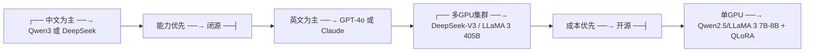

# 开源 vs 闭源大模型全景

2025 年，开源模型的能力已经追近闭源模型。本章从技术、成本和生态角度给出选择框架。

---

## 1. 能力对比 (2025 年 5 月)

### 通用能力 (MMLU, 多领域知识)

| 模型 | MMLU | 开源 |
|------|------|------|
| GPT-4o | ~89% | 否 |
| Claude 3.5 / 4 | ~88% | 否 |
| DeepSeek-V3 | ~85% | 是 |
| Qwen3-235B | ~84% | 是 |
| LLaMA 3 405B | ~86% | 是 |
| Qwen2.5-72B | ~85% | 是 |
| LLaMA 3 70B | ~82% | 是 |

**差距**：顶级开源模型已经达到闭源模型 90-95% 的能力水平。

### 中文能力

| 模型 | 中文能力 | 开源 |
|------|---------|------|
| Qwen3 | 最强 | 是 |
| DeepSeek-V3 | 最强 | 是 |
| GPT-4o | 强 | 否 |
| Claude 3.5 | 强 | 否 |
| LLaMA 3 | 中等 | 是 |

中文场景开源模型已经全面领先。

### 代码生成 (HumanEval)

| 模型 | Pass@1 | 开源 |
|------|--------|------|
| GPT-4o | ~90% | 否 |
| Claude 3.5 | ~88% | 否 |
| DeepSeek-V3 | ~85% | 是 |
| Qwen3 | ~83% | 是 |

---

## 2. 成本对比

### API 调用成本 (每 1M tokens, 2025 年 5 月)

| 模型 | 输入 | 输出 | 来源 |
|------|------|------|------|
| GPT-4o | $2.50 | $10.00 | OpenAI API |
| Claude 3.5 | $3.00 | $15.00 | Anthropic API |
| DeepSeek-V3 | $0.27 | $1.10 | DeepSeek API |
| Qwen3-235B | $0.50 | $2.00 | 阿里云 |
| LLaMA 3 70B | $0.59 | $0.79 | Groq / Together |

**开源 API 的价格是闭源的 1/5 到 1/10。**

### 自部署成本 (月成本估算, 7B 模型)

| 方案 | 硬件 | 月成本 | 吞吐 |
|------|------|--------|------|
| 自建 RTX 4090 | 1× 4090 | ~$360 | 中等 |
| 自建 A100 | 1× A100 | ~$1800 | 高 |
| 云 GPU (按需) | 1× A100 | ~$1800 | 高 |
| 云 GPU (预留) | 1× A100 | ~$1100 | 高 |
| Serverless API | — | 按量 | — |

**高吞吐场景自建显著更便宜；低吞吐场景 API 更方便。**

---

## 3. 选型决策框架

### 按场景

| 场景 | 推荐 | 原因 |
|------|------|------|
| **追求极致能力（不差钱）** | GPT-4o / Claude 4 | 闭源仍领先 5-10% |
| **中文优先** | Qwen3 / DeepSeek-V3 | 中文最强 + 开源可控 |
| **性价比最高** | DeepSeek-V3 API | 能力顶级，价格极低 |
| **私有化部署（多GPU）** | LLaMA 3 70B / DeepSeek-V3 | MoE 高并发优势 |
| **私有化部署（单GPU）** | Qwen2.5-7B / LLaMA 3 8B | 消费卡可跑 |
| **本地/离线** | Qwen3-4B GGUF / SmolLM3 | CPU 可运行 |
| **代码生成** | DeepSeek-V3 / Qwen3-Coder | 代码专项训练 |

### 按优先级

---

## 4. 2025 年的趋势

### 闭源的优势在缩小

- 2023: GPT-4 遥遥领先所有开源模型 20%+
- 2024: LLaMA 3 405B 追到差距 5-10%
- 2025: DeepSeek-V3 / Qwen3 在通用能力上接近闭源，中文和代码领域反超

### 开源的优势在扩大

- **透明度**：可以审查架构和训练数据（安全合规）
- **可定制**：微调、量化、私有化部署
- **无供应商锁定**：不依赖单一 API 提供商

### 未来判断

- **前沿能力**：闭源仍将短暂领先（训练成本数百亿美元，开源团队难以持续追平）
- **领域适配**：开源将全面超越（法律、医疗、金融等垂直场景需要私有数据微调）
- **成本敏感**：开源是唯一选择（自建推理的成本是 API 的 1/10）

---

## 5. 你的选择

如果你今天需要选择一个大模型用于生产：

1. **做 API 产品** → DeepSeek-V3 API（能力顶级 + 成本极低）
2. **做私有化部署** → Qwen3-235B（中文最强可部署）或 LLaMA 3 70B（英文生态最强）
3. **做微调项目** → Qwen2.5-7B / LLaMA 3 8B + QLoRA（单卡可控）
4. **做研究** → OLMo 2 / SmolLM3（训练数据和代码完全开放）
5. **不差钱求最好** → GPT-4o（通用能力仍第一）
