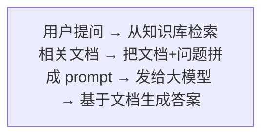
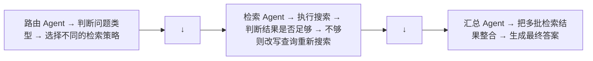

# RAG 全栈实战

RAG (Retrieval-Augmented Generation) 是大模型应用中最成熟、最实用的模式。它解决了大模型的两大死穴：知识截止日期和幻觉。

---

## 1. RAG 解决什么问题

### 问题 1：大模型的知识固定在训练截止日期

GPT-4/Claude/DeepSeek 的训练数据有截止日期。问"今天有什么新闻"→ 它不知道。

### 问题 2：幻觉 (Hallucination)

大模型在不确定时会"编造"事实——而且编得非常自信。在医疗、法律、金融等场景中，这是致命缺陷。

### RAG 的核心思路

> 不要让模型凭记忆回答。先检索相关文档，把文档和问题一起输给模型，让它基于文档回答。



为什么要检索：模型参数量存储的知识有限（几十亿参数存几千亿 token 的知识，压缩比太高，不可能无失真）。

---

## 2. Naive RAG 的完整流水线

### 步骤 1：建索引（前置工作，做一次）

```python
# 1. 切分：把长文档切成小块 (chunks)
documents = load_documents("knowledge_base/")
chunks = split_text(documents, chunk_size=500, chunk_overlap=50)

# 2. 向量化：每个 chunk 转成一个向量
embeddings = embedding_model.encode(chunks)  # → [num_chunks, 768]

# 3. 存储：向量存入向量数据库
vector_db = Chroma()
vector_db.add(chunks, embeddings)
```

### 步骤 2：问答（每次查询）

```python
def rag_query(question):
    # 1. 把问题转成向量
    q_embedding = embedding_model.encode(question)

    # 2. 检索最相似的 k 个 chunk
    retrieved = vector_db.search(q_embedding, top_k=5)

    # 3. 拼接 prompt
    context = "\n".join(retrieved)
    prompt = f"根据以下资料回答问题：\n{context}\n\n问题：{question}\n回答："

    # 4. 调用大模型
    answer = llm.generate(prompt)
    return answer
```

### Naive RAG 的 3 个主要失效模式

| 失效模式 | 症状 | 原因 |
|----------|------|------|
| **检索遗漏** | 答案不在检索结果中 | 向量相似度不是语义理解的银弹 |
| **检索冗余** | top-5 中有 3 条不相关 | 纯向量检索的精度不足 |
| **上下文过长** | 拼接后超出模型限制 | chunk 策略不合理 |

---

## 3. Advanced RAG：解决问题

### 改进 1：混合检索 (Hybrid Search)

向量检索擅长语义匹配但不擅长关键词匹配。BM25（一种基于词频的传统算法）刚好相反。两者结合：

```python
def hybrid_search(question, top_k=10):
    # 向量检索
    vector_results = vector_db.search(question, top_k=top_k * 2)
    # BM25 检索
    bm25_results = bm25_index.search(question, top_k=top_k * 2)

    # 融合（将两种检索结果的分数叠加，再重新排序）
    return reciprocal_rank_fusion(vector_results, bm25_results)[:top_k]
```

### 改进 2：重排序 (Rerank)

检索的 top-k 只是粗略筛选。用一个专门的重排模型对 k 个候选精细排序：

```python
# 初筛：用便宜的向量检索取 top-20
candidates = vector_db.search(question, top_k=20)

# 精排：用 reranker 模型逐个判断相关性
from sentence_transformers import CrossEncoder
reranker = CrossEncoder('BAAI/bge-reranker-large')
scores = reranker.predict([(question, doc) for doc in candidates])

# 最终取 top-3
final_docs = sort_and_take_top_k(candidates, scores, k=3)
```

### 改进 3：查询改写

用户的原始问题经常表达不清。在检索前用 LLM 改写问题：

```python
# 原始: "那个什么东西来着"
# 改写: "用户想知道之前讨论的某个具体技术术语是什么"
rewritten = llm.generate(f"把以下问题改得更清晰：{question}")
```

### 改进 4：分块策略优化

| 策略 | 适用场景 |
|------|---------|
| 固定大小 (500 tokens, overlap 50) | 通用，最简单 |
| 按段落切分 | 文档结构清晰时 |
| 语义切分 | 用相似度断点确定自然边界 |
| 多级检索 | 小 chunk 检索 + 大 chunk 作为上下文 |

---

## 4. Agentic RAG：让 Agent 控制检索

### 解决的问题

复杂问题可能涉及多个子问题，或者需要多步检索才能拼出完整答案。固定流水线的 RAG 无法应对。

### 核心模式



### 一个 Agentic RAG 的流程

```python
# 问题: "DeepSeek-V3 和 LLaMA 4 使用哪种 Attention 机制？"

# 技术点1：Agent 拆解问题
sub_questions = [
    "DeepSeek-V3 用的什么 Attention？",
    "LLaMA 4 用的什么 Attention？"
]

# 技术点2：分别检索并评估结果质量
for sq in sub_questions:
    docs = retrieve(sq)
    if is_sufficient(docs):    # Agent 判断
        answers.append(generate(sq, docs))
    else:
        # 不够则改写查询再搜
        rewritten = rewrite_query(sq)
        docs = retrieve(rewritten)
        answers.append(generate(sq, docs))

# 技术点3：整合多个答案
final = synthesize(question, answers)  # Agent 汇总
```

---

## 5. 评估 RAG 系统

| 指标 | 衡量什么 | 怎么算 |
|------|---------|--------|
| **检索召回率** | 相关文档是否被找到 | 相关文档中被检索出的比例 |
| **检索精确率** | 检索结果是否相关 | 检索结果中相关的比例 |
| **答案忠实度** | 回答是否基于文档（不编造） | LLM-as-Judge 判断 |
| **答案相关性** | 回答是否真的回答了问题 | 人工或 LLM 评估 |
| **端到端延迟** | 用户等多久 | 检索时间 + LLM 生成时间 |

**RAGAS**（`pip install ragas`）是评估 RAG 系统的标准框架，一行代码测上面所有指标。

---

## 6. 生产级 RAG 的关键考虑

- **文档更新**：知识库变了怎么办 → 增量索引 + 版本管理
- **缓存**：热门问题缓存答案，减少 LLM 调用成本
- **降级**：检索超时或 LLM 不可用时 → 返回传统搜索结果
- **引用溯源**：答案里的每句话来自哪个文档哪一段

---

## 本章速查

| 层级 | 核心 |
|------|------|
| **Naive RAG** | 向量检索 + Prompt 拼接 |
| **Advanced RAG** | 混合检索 + Rerank + 查询改写 |
| **Corrective RAG** | 检索后评估文档质量，质量不足时纠正检索 |
| **Agentic RAG** | Agent 拆解问题 + 评估检索质量 + 多步推理 |
| **Self-RAG** | 模型自主判断检索需求 + 自我批判 + 按需修正 |
| **Graph RAG** | 知识图谱构建 + 社区检测 + 分层摘要 |
| **核心框架** | LangChain、LlamaIndex、RAGAS（评估） |
