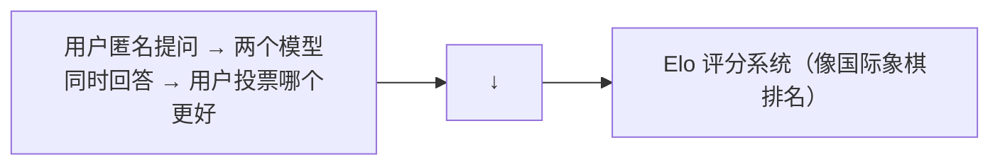

# LLM 评估体系设计

"模型好不好"这个问题比看起来复杂得多。单一 benchmark 分数不够，你需要一个多维度的评估体系。

---

## 1. 评估的元问题

### 基准测试的问题

- **数据污染**：模型在训练时可能见过 benchmark 题目（GPT-4 的 MMLU 分数是否真实反映能力？）
- **饱和效应**：MMLU 所有模型都 >85% 后区分度消失
- **单一维度**：MMLU 只测知识，不测推理、创意、安全性

### 评估体系设计的核心原则

> **不用一个分数概括"好"，用多个维度的分数剖面图。**

---

## 2. 多维评估框架

```python
evaluation_profile = {
    # 知识维度
    "knowledge": {
        "mmlu": ...,        # 多领域知识
        "gpqa": ...,        # 研究生级科学问题
        "arc_challenge": ..., # 科学推理
    },
    # 推理维度
    "reasoning": {
        "gsm8k": ...,       # 小学数学
        "math": ...,        # 竞赛数学 (MATH)
        "bbh": ...,         # BIG-Bench Hard
    },
    # 代码维度
    "coding": {
        "humaneval": ...,   # 代码生成
        "mbpp": ...,        # 代码补全
        "swe_bench": ...,   # 软件工程（修 bug）
    },
    # 语言维度
    "language": {
        "cmmlu": ...,       # 中文知识
        "ceval": ...,       # 中文推理
        "belebele": ...,    # 多语言阅读理解
    },
    # 对齐维度
    "alignment": {
        "truthfulqa": ...,  # 真实性
        "toxigen": ...,     # 毒性
        "bbq": ...,         # 偏见
    },
    # 长文本维度
    "long_context": {
        "needle_in_haystack": ...,  # 大海捞针
        "ruler": ...,               # 多任务长文本
    }
}
```

---

## 3. LLM-as-Judge：用 LLM 评估 LLM

### 解决的问题

有些质量维度无法用选择题或自动评分衡量——"这个回答写得好不好"、"这两段总结哪段更好"。

### MT-Bench 的做法

```python
def mt_bench_eval(model):
    # 80 个高质量的多轮对话 prompt
    prompts = load_mt_bench_prompts()
    
    answers = [model.chat(p) for p in prompts]
    
    # 用 GPT-4 作为裁判，对每个回答打分（1-10）
    scores = []
    for answer, reference in zip(answers, prompts):
        score = gpt4_judge(answer, reference)
        scores.append(score)
    
    return mean(scores)
```

### LLM-as-Judge 的陷阱

| 陷阱 | 表现 | 对策 |
|------|------|------|
| **位置偏差** | Judge 偏好先看到的回答 | 双向评估（AB 和 BA 都测） |
| **长度偏差** | 回答越长分数越高 | 控制长度或使用长度矫正 |
| **自我偏好** | LLM 偏好自己风格的输出 | 使用多个不同家族的 Judge |
| **格式偏差** | Markdown 比纯文本分数高 | 统一输出格式 |

### AlpacaEval 2.0

MT-Bench 需要 GPT-4 做裁判。AlpacaEval 用"长度控制"方法解决了长度偏差问题，让比较更公平。

---

## 4. 动态 Benchmark

### 静态 Benchmark 的问题

题目公开 → 模型训练时可能见过 → MMLU 95% 不代表真实能力。

### 动态评估方案

| 方案 | 原理 | 代表 |
|------|------|------|
| **定期更新题目** | 每月出新题 | MMLU-Pro |
| **对抗生成题目** | 用 LLM 生成"能难住模型"的新题 | — |
| **人机对抗** | 人类不断出更难的问题直到模型做不到 | Chatbot Arena |
| **环境式评估** | 模型在一个持续变化的环境中接受测试 | SWE-bench |

### Chatbot Arena (LMSYS)



这是目前最被认可的"真实能力"评估——盲测 + 大量用户 + 持续更新。

---

## 5. 生产级评估体系设计

### 四层评估金字塔

```
第 4 层：A/B 测试（用户留存、满意度、收入）        ← 最终真理
第 3 层：领域专家评估（人工 review 输出质量）      ← 最准确但最贵
第 2 层：LLM-as-Judge（自动化质量评估）            ← 平衡成本与准确
第 1 层：Benchmark 自动评分（MMLU, HumanEval...）  ← 最便宜但可能不准
```

### 持续评估

评估不是"训练完测一次"就结束的。

```python
# 训练过程中持续评估
for train_step in range(total_steps):
    train(...)
    
    if train_step % eval_every == 0:
        # 跑 benchmark
        scores = run_mini_benchmark(model)  # 子集，快速
        
        # 如果某项能力开始退化 → 触发告警
        if scores['mmlu'] < best_mmlu * 0.95:
            alert("MMLU 退化 5%，检查数据配比")
```

---

## 6. 评估不等于真相

记住：**所有 benchmark 都是代理指标（proxy），不是用户的真实体验。**

- MMLU 90% 的模型可能在实际对话中表现糟糕
- 一个对你产品有帮助的指标，胜过 10 个学术 benchmark

**评估的核心**：你的模型在**你的任务**上表现如何？用你的用户数据来回答这个问题，而非通用 benchmark。

---

## 本章速查

| 概念 | 核心 |
|------|------|
| **多维度评估** | 知识、推理、代码、语言、对齐、长文本六个维度 |
| **LLM-as-Judge** | 用强模型评估弱模型（注意位置和长度偏差） |
| **Chatbot Arena** | 用户盲测投票 → Elo 排名（当前最真实的能力评估） |
| **四层金字塔** | Benchmark → LLM Judge → 专家 → A/B |
| **持续评估** | 训练中定期跑 benchmark，检测能力退化 |
