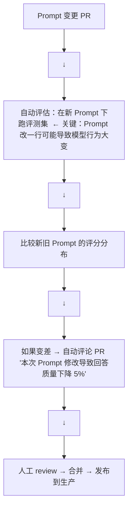

# 生产级 MLOps for LLMs

LLM 应用的运维与传统 ML 有根本差异：非确定性输出、prompt 即代码、多模型编排、成本跟踪复杂。这一章讲怎么在工程上治理 LLM 应用。

---

## 1. LLMOps vs 传统 MLOps

| 维度 | 传统 ML | LLM |
|------|---------|-----|
| **输出** | 确定（给定模型版本） | 不确定（采样随机性） |
| **"代码"** | Python 脚本 | Prompt + Python 脚本 |
| **版本控制** | 模型 + 代码 | 模型 + 代码 + Prompt + 工具定义 |
| **评估** | 离线 AUC/F1 等 | 需要 LLM-as-Judge |
| **成本模型** | 固定（GPU 推理） | 按 token 计费 + 延迟 |
| **数据依赖** | 固定测试集 | Prompt + RAG 检索结果都在变 |

**核心差异**：LLM 应用的"代码"不只是 Python，Prompt 是业务逻辑的一部分，需要版本控制和测试。

---

## 2. Prompt 版本管理与 CI/CD

### Prompt 即代码

```yaml
# prompts/chat_assistant/v1.3.yml
version: "1.3"
model: "deepseek-v3"
system_prompt: |
  你是一个友好的技术客服...

templates:
  greeting: "你好！我是{bot_name}，有什么可以帮你？"
  fallback: "抱歉，我不确定。要不要转人工客服？"

tools:
  - search_docs
  - create_ticket

parameters:
  temperature: 0.7
  max_tokens: 1024
```

### Prompt CI/CD 流水线



---

## 3. 监控与告警

### 需要监控什么

```python
monitoring_metrics = {
    # 质量指标
    "quality": {
        "llm_judge_score": ...,      # LLM-as-Judge 综合质量分
        "user_rating": ...,           # 用户点赞/踩
        "hallucination_rate": ...,    # 幻觉率（引用错误/编造事实）
    },
    # 性能指标
    "performance": {
        "p50_latency": ...,           # 50% 用户等待时间
        "p99_latency": ...,           # 99% 用户等待时间
        "time_to_first_token": ...,   # 流式首 token 延迟
        "tokens_per_second": ...,     # 生成速度
    },
    # 成本指标
    "cost": {
        "cost_per_request": ...,      # 单次请求成本
        "cost_per_day": ...,          # 每日成本
        "cache_hit_rate": ...,        # 缓存命中率
    },
    # 安全指标
    "safety": {
        "guard_trigger_rate": ...,    # 安全护栏触发率
        "pii_leak_events": ...,       # PII 泄露事件数
        "jailbreak_attempts": ...,    # 越狱尝试次数
    }
}
```

### 告警规则

```python
def check_alerts(metrics):
    if metrics['p99_latency'] > 10_000:     # P99 > 10 秒
        alert("延迟严重超标")
    
    if metrics['cost_per_day'] > budget * 1.2:
        alert(f"每日成本超标 20%: \${metrics['cost_per_day']} > \${budget}")
    
    if metrics['guard_trigger_rate'] > 0.05:  # 5%+ 的请求触发护栏
        alert("安全护栏触发率异常升高")
    
    if metrics['hallucination_rate'] > 0.1:
        alert("幻觉率超过 10%，紧急排查")
```

---

## 4. A/B 测试 LLM 应用

### 不同于传统 A/B

传统 Web A/B：改一个按钮颜色，观察点击率。

LLM A/B：改模型、Prompt、或检索策略。一旦回答变化，衡量标准也必须变化——不能只看"用户有没有点"，还要看"回答有没有用"。

### LLM A/B 的指标

```python
ab_test_metrics = {
    "engagement": {
        "thumbs_up_rate": ...,    # 点赞率
        "thumbs_down_rate": ...,  # 点踩率
        "copy_answer_rate": ...,  # 复制回答的比例（高 = 有用）
        "regeneration_rate": ..., # 要求重新生成的比例（高 = 不好）
    },
    "business": {
        "task_completion_rate": ..., # 任务是否完成（退款/注册/查询）
        "conversation_length": ...,  # 完成任务需要的轮次
        "escalation_rate": ...,      # 转人工的比例
    },
    "cost": {
        "avg_tokens_per_session": ...,
        "avg_cost_per_session": ...,
    }
}
```

---

## 5. 成本治理

### 成本组成

```
总成本 = 模型 API 费用
       + 推理 GPU 费用（如果自部署）
       + Embedding 费用（RAG 场景）
       + 向量数据库费用
       + 安全/Guard 模型费用
```

### 降本策略

```python
cost_optimization = {
    "routing": "简单问题走小模型，复杂问题走大模型",
    "caching": "语义缓存热门问题，减少重复调用",
    "prompt_compression": "用 LLMLingua 压缩 prompt，减少输入 token",
    "speculative_decoding": "小模型预测 + 大模型验证",
    "quantization": "INT8/INT4 量化部署，降低 GPU 成本",
    "batching": "动态批处理提升 GPU 利用率",
}
```

效益估算：单纯加上路由 + 缓存，通常可以减少 40-60% 的 LLM 调用成本。

---

## 6. 完整技术栈

| 层次 | 工具 |
|------|------|
| **开发** | LangChain, LangGraph, LlamaIndex |
| **Prompt 管理** | LangSmith, PromptLayer, 自建 Git 仓库 |
| **评估** | RAGAS, DeepEval, MT-Bench |
| **监控** | LangFuse, LangSmith, Weights & Biases |
| **部署** | vLLM, TGI, Ray Serve |
| **安全** | NeMo Guardrails, LLM Guard |
| **实验** | 自建 A/B 框架, LaunchDarkly |

---

## 本章速查

| 概念 | 核心 |
|------|------|
| **Prompt 版本管理** | Prompt 是代码的一部分，需要 CI/CD |
| **监控四维** | 质量 + 性能 + 成本 + 安全 |
| **A/B 指标** | 用户行为（点赞/复制）+ 任务完成率 |
| **降本策略** | 路由 + 缓存 + Prompt 压缩 + 量化 |
| **核心平台** | LangSmith/LangFuse（监控）, RAGAS（评估） |
