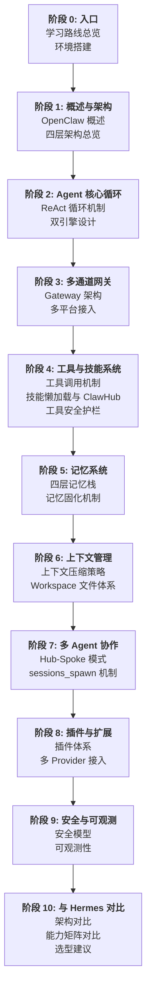

# 学习路线总览

## 目标

本学习路径帮助你系统掌握 OpenClaw 开源 AI Agent 框架的完整架构——从多通道网关、Agent 核心循环、工具/技能系统、记忆系统到多 Agent 协作与安全防护。完成学习后，你将能独立部署和定制自己的 OpenClaw Agent。

## 前置要求

- Node.js 18+ / TypeScript 基础
- 基础 LLM 概念（Prompt、Token、Tool Calling）
- 了解 ReAct/Agent 循环的基本思想
- 熟悉 Docker 基本使用（沙箱部分需要）

## 10 阶段学习路线



## 建议学习周期（8-10 周）

| 周次 | 阶段 | 内容 | 预计时间 |
|------|------|------|----------|
| 1 | 入口 | 学习路线总览、环境搭建 | 1-2h |
| 2 | 概述与架构 | OpenClaw 起源与设计哲学、四层架构 | 2-3h |
| 3 | Agent 核心循环 | ReAct 循环、双引擎（规划+执行） | 3-5h |
| 4 | 多通道网关 | Gateway 单写入者路由、Lane Queue、10+ 平台接入 | 3-5h |
| 5 | 工具与技能 | 工具调用、ClawHub 技能市场、安全护栏 | 4-6h |
| 6 | 记忆系统 | 四层记忆栈、记忆固化、语义检索 | 3-5h |
| 7 | 上下文管理 + 多 Agent | 上下文压缩、Hub-Spoke 协作、子 Agent 隔离 | 4-6h |
| 8 | 插件 + 安全 | 插件体系、多 Provider、沙箱安全、可观测性 | 4-6h |
| 9 | 与 Hermes 对比 | 架构对比、能力矩阵、选型建议 | 2-3h |

## 学习建议

1. **先跑起来再深挖**：阶段 0 环境搭建后，先用 `openclaw setup` 跑通默认配置，感受 Agent 的实际行为，再逐层剖析源码
2. **对比学习**：每个阶段与 Hermes Agent 的对应机制做横向对比（阶段 10 汇总），理解不同设计选择的 trade-off
3. **动手定制**：每个核心模块（Gateway、Skill、Memory、Plugin）都支持配置和扩展，尝试为自己的场景做定制
4. **关注安全边界**：OpenClaw 因开源爆发式增长，安全生态仍在完善中，学习过程中务必关注沙箱隔离和权限控制

## 核心环境依赖

```bash
# Node.js 18+
node --version

# 全局安装 OpenClaw
npm install -g openclaw

# 初始化配置
openclaw setup

# 可选：Docker（沙箱子Agent需要）
docker --version
```
