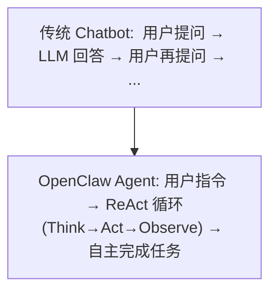
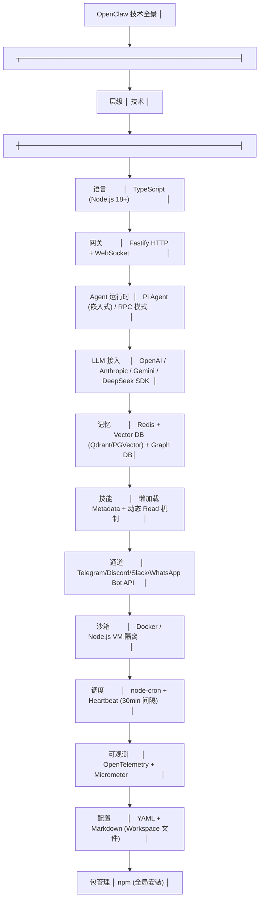

# OpenClaw 概述

## OpenClaw 是什么？

OpenClaw 是一个**开源（MIT）、本地优先的 AI Agent 框架**，由奥地利开发者 Peter Steinberger（@steipete）于 2025 年 11 月创建。它让大语言模型从"对话工具"进化为"自主执行者"——能够操作文件、执行终端命令、浏览网页、管理邮件，并通过你日常使用的消息应用（Telegram、WhatsApp、Discord 等）与你交互。

**核心理念：从 Chat 到 Action。**

## 发展历程

| 时间 | 里程碑 |
|------|--------|
| 2025.11 | Peter Steinberger 发布 **Clawdbot** 初始版本 |
| 2026.01 | 更名为 **OpenClaw**；腾讯云、阿里云推出专用部署方案 |
| 2026.02 | GitHub 趋势榜第一，~200K Stars；v2026.2.17 支持 Anthropic 模型 |
| 2026.03 | v3.7/v3.8 发布，可插拔上下文引擎；~250K Stars，成为史上增长最快的开源 AI 项目 |
| 2026.04+ | 各大厂商推出"Claw 式"产品（智谱 AutoClaw、Nvidia NemoClaw 等） |

## 设计哲学

### 1. 本地优先，隐私至上

数据默认不离开用户设备。Agent 运行在本地，LLM 调用可选用本地模型（Ollama）或自选 API 提供商。

### 2. "无新 App"体验

不强制安装新的客户端 App。通过已有的消息应用（Telegram、WhatsApp、iMessage 等）即可与 Agent 交互。

### 3. 持久化跨平台上下文

记忆系统跨会话、跨设备保持。你在手机上通过 Telegram 告诉 Agent 的事，在电脑上的 Discord 会话中它依然记得。

### 4. 模块化可插拔

Channel、Gateway、Agent Runtime、Skills、Memory、Plugin 六层各自独立，可替换或扩展。

### 5. Workspace 即为 Agent

每个 Agent 对应一个 Workspace 目录，目录中的 Markdown 文件（AGENTS.md、IDENTITY.md、MEMORY.md 等）既是配置也是状态。Agent 的行为由这些文件定义。

## 与 Chatbot 的本质区别

| 维度 | Chatbot（如 ChatGPT） | OpenClaw Agent |
|------|----------------------|----------------|
| 交互模式 | 单轮问答 | 多轮自主执行 |
| 工具使用 | 有限的插件 | 50+ 工具 + Shell/浏览器/文件系统 |
| 记忆 | 会话内上下文 | 四层持久记忆（会话→日志→长时→向量） |
| 主动性 | 被动响应 | 定时任务 + Heartbeat 主动发起 |
| 多平台 | 单一 Web/App | 10-20+ 消息平台统一接入 |
| 多 Agent | 不支持 | Hub-Spoke + Docker 沙箱子 Agent |
| 部署 | 云端 SaaS | 本地 + 云端均可 |
| 扩展性 | 封闭生态 | 开源 + 插件市场（ClawHub 5700+ 技能） |

## 生态影响

OpenClaw 被业界称为"AI Agent 的 DeepSeek 时刻"——它像 DeepSeek 在 LLM 领域做的那样，通过开源 + 本地优先的策略引爆了 Agent 框架的大众化浪潮。2026 年初，全球主要云厂商和 AI 公司纷纷推出与之兼容或对标的产品，形成了"Claw 生态"。

## 技术全景

