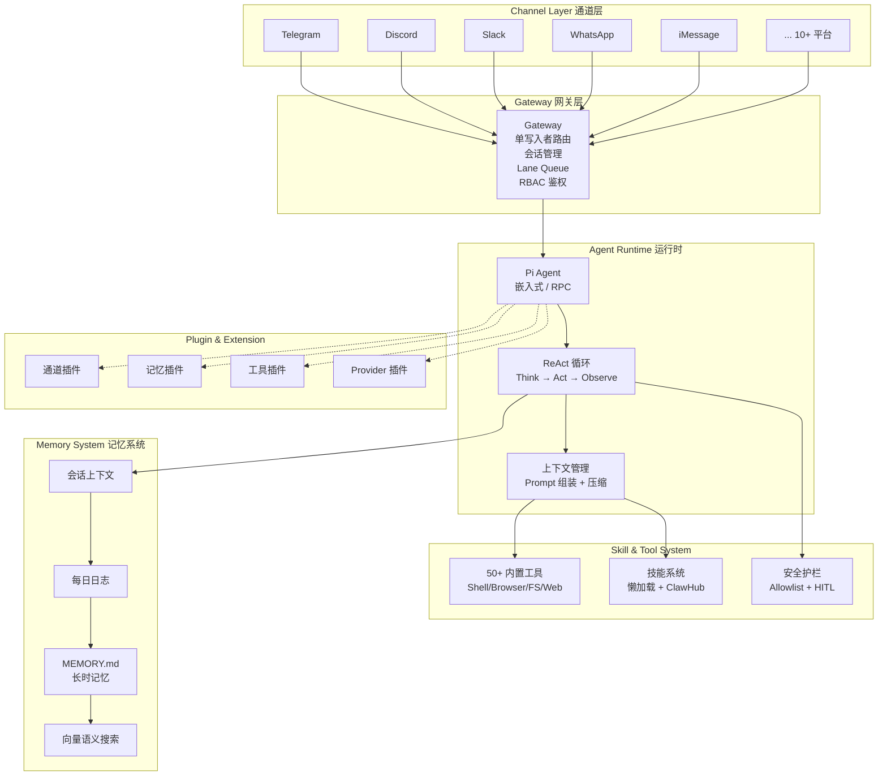

# 四层架构总览

OpenClaw 采用**六层模块化架构**，从用户交互到最终执行经过清晰的管道式处理。

## 架构全景图



## 各层职责

### 1. Channel Layer（通道层）

负责与外部消息平台对接。每个平台有独立的 Adapter，将平台特定协议转换为统一的内部消息格式。

关键特性：
- **协议翻译**：将 Telegram Bot API、Discord Gateway、Slack Events API 等异构协议映射为统一的 `Message` 类型
- **消息归一化**：文本、图片、文件、语音等附件统一处理
- **双向流控**：上行（用户→Agent）和下行（Agent→用户）的消息流管理

### 2. Gateway（网关层）

系统的**中央控制面**，是所有消息的唯一入口和出口。

关键机制：
- **单写入者（Single-Writer）**：每个会话同时只有一条消息被处理，保证状态一致性
- **Lane Queue**：按会话维度隔离的并发队列，不同会话可并行处理
- **会话管理**：跨平台会话关联（同一个用户在 Telegram 和 Discord 上属于同一 Agent 会话）
- **RBAC 鉴权**：基于角色的访问控制，区分 Admin/User/Guest 权限
- **消息路由**：根据消息内容将请求路由到正确的 Agent 实例

### 3. Agent Runtime（Agent 运行时）

系统的**大脑**，负责思考、决策和调度。核心是 Pi Agent 嵌入式运行时。

详细内容见[阶段 2: Agent 核心循环](../02-Agent核心循环/)。

### 4. Skill & Tool System（工具与技能系统）

Agent 的**手脚**，提供执行能力。分为三层：
- **内置工具**：Shell、文件系统、浏览器自动化、Web 搜索/抓取、Docker 等
- **技能系统**：懒加载的能力扩展，仅注入元数据到 Prompt，全量规格按需读取
- **安全护栏**：Allowlist 命令白名单、人工审批（HITL）、设备配对

详细内容见[阶段 4: 工具与技能系统](../04-工具与技能系统/)。

### 5. Memory System（记忆系统）

Agent 的**海马体**，提供跨会话、跨设备的持久记忆。

四层结构：
```
第 1 层: Session Context   → 当前会话的完整上下文（最近 N 轮对话）
第 2 层: Daily Logs        → 每日会话摘要日志（自动生成）
第 3 层: MEMORY.md         → Agent 主动筛选的长期记忆（结构化 Markdown）
第 4 层: Vector Search     → 语义向量检索（混合 Redis + Vector DB + Graph DB）
```

详细内容见[阶段 5: 记忆系统](../05-记忆系统/)。

### 6. Plugin & Extension（插件与扩展）

系统的**可插拔组件**，支持四类插件：
- **Channel 插件**：接入新的消息平台
- **Memory 插件**：替换/扩展记忆存储后端
- **Tool 插件**：添加自定义工具
- **Provider 插件**：接入新的 LLM 提供商

详细内容见[阶段 8: 插件与扩展](../08-插件与扩展/)。

## 请求处理流水线

一条完整的用户消息处理流程：

```
用户消息（Telegram）
  → Channel Adapter 协议翻译
    → Gateway 鉴权 + 会话关联
      → Pi Agent Runtime 接收
        → Memory 注入相关记忆到上下文
          → System Prompt 组装
            → LLM Provider API 调用
              → 响应解析
                → 工具调用? ──Yes──→ Tool Execution ──→ 结果注入循环
                │                   (沙箱/Shell/Browser)
                └──No──→ 响应格式化 → Channel Adapter → 用户收到回复

同时触发:
  → Daily Log 写入
  → 记忆筛选与固化
  → Heartbeat 检查（是否有定时任务待执行）
```

## 与 Hermes 架构的初步对比

| 维度 | OpenClaw | Hermes Agent |
|------|----------|--------------|
| 语言与运行时 | Node.js / TypeScript | Python 3.11+ |
| 架构模式 | 六层模块化 + Pi Agent 嵌入式 | 管道式 + 单体 Agent 核心 |
| 网关设计 | 独立 Gateway 进程，单写入者 + Lane Queue | Gateway 作为模块内组件 |
| 记忆存储 | Redis + Vector DB + Graph DB | SQLite (WAL) + FTS5 |
| 技能系统 | 懒加载 Metadata + ClawHub 市场 | 自进化技能 + 27 分类内置库 |
| 扩展机制 | Channel/Memory/Tool/Provider 四类插件 | Plugin 系统 + Gateway 适配器 |
| 多 Agent | Hub-Spoke + sessions_spawn (Docker 隔离) | delegate_task + Kanban 调度 |

> 详细对比见[阶段 10: 与 Hermes 对比](../10-与Hermes对比/)
