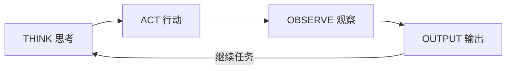
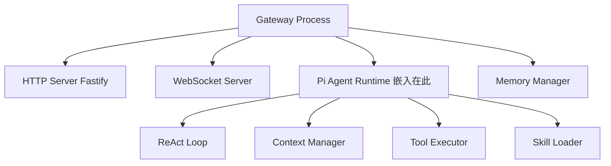
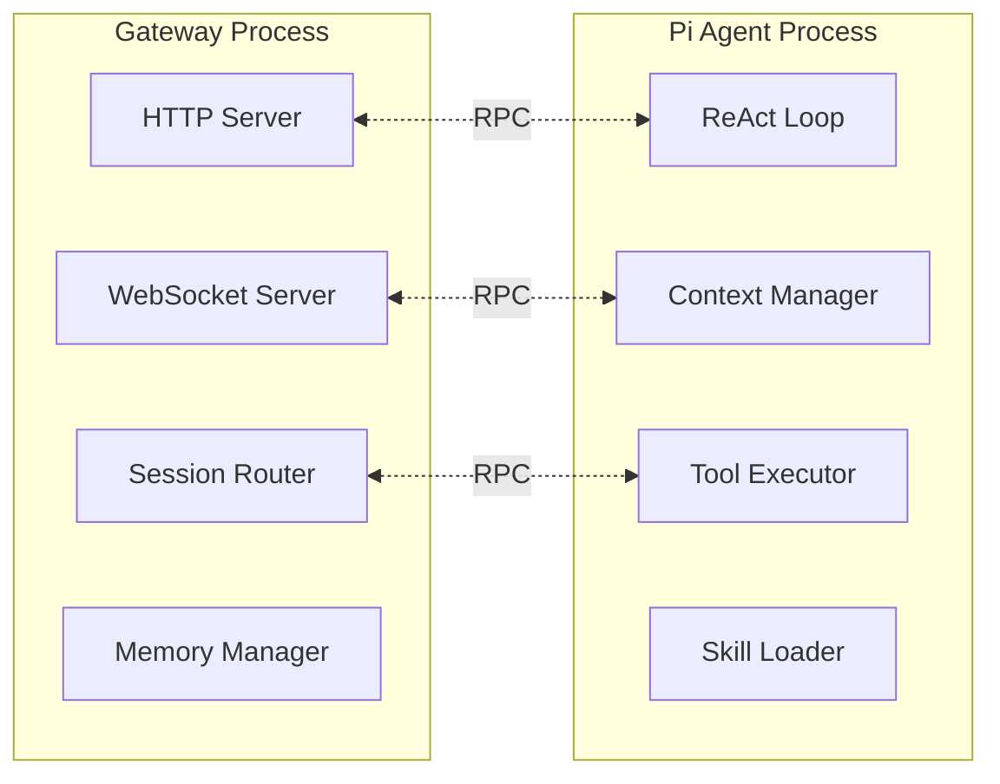

# ReAct 循环机制

OpenClaw 的 Agent 运行时采用 **ReAct（Reasoning + Acting）** 范式，这是目前 AI Agent 框架中最主流的决策循环模式。

## ReAct 循环原理



终止条件：任务完成 / 超时 / 用户中断。

### 四阶段详解

#### Think（思考）

Agent 分析当前状态，决定下一步行动：

1. **上下文感知**：读取当前会话历史 + 注入的相关记忆 + Workspace 文件
2. **任务分解**：如果是复杂任务，规划引擎用 PDDL 风格做子任务分解
3. **工具选择**：根据当前目标从可用工具中选出最合适的
4. **参数推理**：为选定的工具生成正确的调用参数

#### Act（行动）

执行选定的工具调用：

- **Shell/CLI**：在沙箱中执行命令
- **文件操作**：读写编辑 Workspace 中的文件
- **浏览器**：通过 CDP 协议控制浏览器
- **Web 请求**：搜索和抓取网页
- **子 Agent 调用**：通过 `sessions_spawn` 委托子 Agent

#### Observe（观察）

收集行动结果：

- 工具执行的 stdout/stderr
- 文件操作的结果状态
- 网页内容或搜索结果
- 子 Agent 返回的报告
- 错误信息和异常

#### 循环判断

根据观察结果决定：
- **继续循环**：结果不足以完成任务 → 回到 Think
- **任务完成**：汇总结果，生成最终输出
- **需要澄清**：向用户提问，暂停循环等待回复
- **异常终止**：超时/权限不足/沙箱限制 → 返回错误报告

## Pi Agent 运行时

Pi Agent 是 OpenClaw 的嵌入式 Agent 运行时，有两种工作模式：

### 1. 嵌入式模式（默认）

Pi Agent 直接运行在 Gateway 进程中，适合单用户/轻量场景：



### 2. RPC 模式

Pi Agent 作为独立进程运行，Gateway 通过 RPC 与之通信，适合多用户/生产场景：



## 上下文构建（每次 ReAct 迭代）

在每次 Think 阶段之前，Pi Agent 会构建完整的上下文：

```
[System Prompt]          ← 由 AGENTS.md + IDENTITY.md + SOUL.md + TOOLS.md 拼装
[注入的记忆]             ← 从四层记忆栈按相关性检索
[当前会话历史]           ← 最近 N 轮对话 + 工具调用结果
[当前迭代状态]           ← 本次 ReAct 循环已执行的操作和观察结果
[可用工具元数据]         ← 工具名称 + 描述 + 参数 schema（不含完整文档）
```

## 终止条件

ReAct 循环在以下条件之一满足时终止：

| 条件 | 触发方式 |
|------|---------|
| 任务完成 | Agent 输出最终结果，不包含新的 tool_call |
| 最大迭代次数 | 默认 50 轮，可通过 `agent.max_iterations` 配置 |
| 超时 | 默认 300 秒，可通过 `agent.timeout` 配置 |
| Token 预算耗尽 | 上下文接近模型限制时触发压缩或终止 |
| 用户中断 | 用户发送 `/stop` 或关闭会话 |
| 安全阻断 | 安全护栏检测到违规操作，强制终止 |

## 代码层面的循环结构（伪代码）

```typescript
async function reactLoop(session: Session, userMessage: Message): Promise<Response> {
  let context = await buildContext(session, userMessage);
  let iterations = 0;

  while (iterations < MAX_ITERATIONS) {
    iterations++;

    // THINK: 调用 LLM
    const response = await llmProvider.chat(context);

    // 检查是否需要工具调用
    if (response.hasToolCalls()) {
      // ACT: 执行工具
      for (const toolCall of response.toolCalls) {
        // 安全检查
        if (!guardrails.allow(toolCall)) {
          context.addObservation({ error: "Tool blocked by guardrails" });
          continue;
        }
        // 执行
        const result = await toolExecutor.execute(toolCall);
        // OBSERVE: 记录结果
        context.addObservation(result);
      }
      // 继续循环
      continue;
    }

    // 没有工具调用 → 最终输出
    await memoryManager.consolidate(session, context);
    return response.text;
  }

  throw new Error("Max iterations exceeded");
}
```

## 与 Hermes 的 ReAct 对比

| 维度 | OpenClaw Pi Agent | Hermes run_agent.py |
|------|-------------------|---------------------|
| 循环实现 | TypeScript while 循环 | Python while 循环（15075 行核心文件） |
| 上下文注入 | 四层记忆栈检索 | System Prompt 组装 + 记忆注入 |
| 工具调度 | Tool Executor 统一调度 | model_tools.py 调度层 |
| 迭代控制 | max_iterations + timeout + token 预算 | 类似的循环控制机制 |
| 可中断性 | 用户 /stop + 安全阻断 | 类似的用户中断机制 |
| 轨迹记录 | OpenTelemetry 追踪 | JSONL 轨迹记录 |

> 两者的 ReAct 循环在概念层面几乎一致，差异主要在实现语言和周边模块的耦合方式上。
