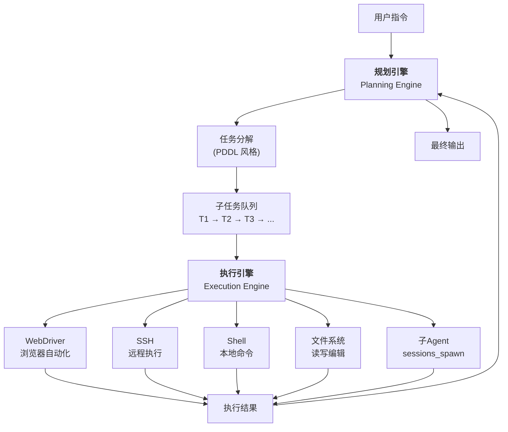
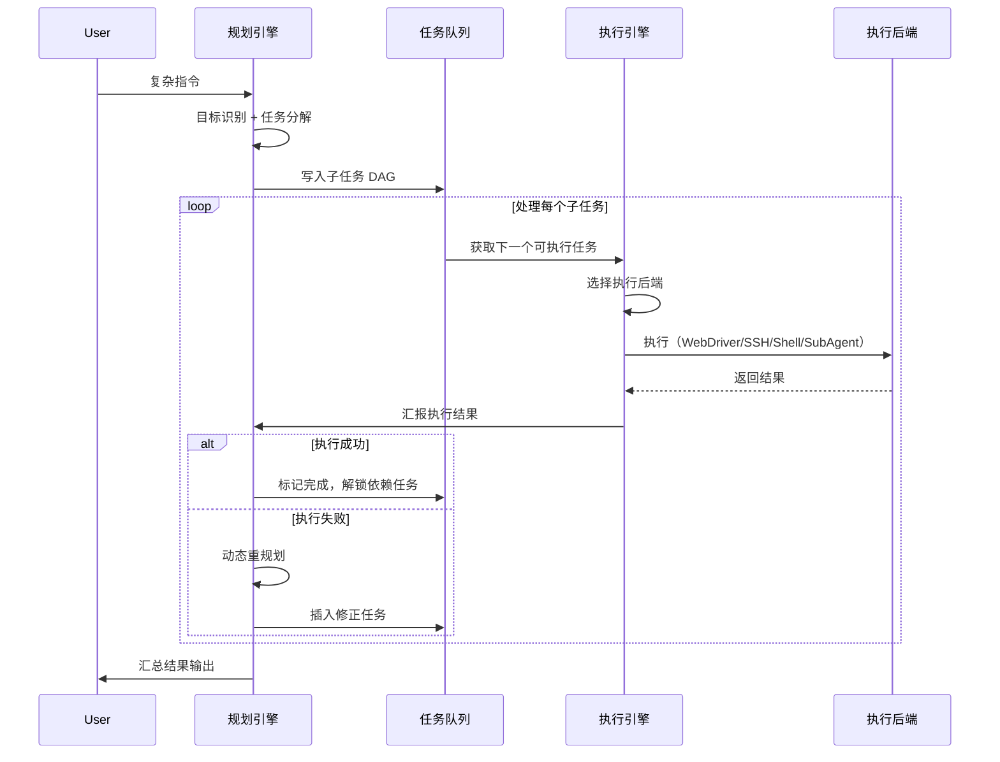

# 双引擎设计

OpenClaw 的 Agent 运行时内部采用**双引擎架构**：规划引擎负责"想清楚做什么"，执行引擎负责"把事做成"。

## 双引擎架构图



## 规划引擎（Planning Engine）

### 原理

规划引擎负责**任务分解**——将一个复杂的用户指令拆解为可执行的子任务序列。它借鉴了经典 AI 规划中的 **PDDL（Planning Domain Definition Language）** 思想，但使用 LLM 而非符号化规划器。

### 工作流程

1. **指令解析**：接收用户的自然语言指令
2. **目标识别**：识别用户真正想达成的目标（区分显性和隐性需求）
3. **任务分解**：将目标拆解为子任务的有向无环图（DAG）
4. **依赖排序**：按依赖关系排列子任务执行顺序
5. **资源评估**：估算每个子任务所需的工具和权限
6. **动态重规划**：执行过程中遇到异常时，重新规划剩余子任务

### 任务分解示例

用户指令：「帮我分析这个 GitHub 仓库的代码质量，并生成一份报告发到我的邮箱」

```
规划引擎分解:

T1: git clone <repo-url>                    [工具: Shell]
T2: 统计代码行数和文件结构                    [工具: Shell]
T3: 运行 lint 工具检查代码规范                [工具: Shell]
T4: 分析依赖关系和过期包                      [工具: Shell]
T5: 搜索已知漏洞                            [工具: WebSearch + WebFetch]
    ↓ (依赖 T2, T3, T4, T5)
T6: 汇总分析结果，生成 Markdown 报告           [工具: FileWrite]
    ↓ (依赖 T6)
T7: 发送邮件到 user@example.com             [工具: Email/SendGrid]

执行顺序: T1 → [T2, T3, T4, T5]并行 → T6 → T7
```

### PDDL 风格的规划提示

规划引擎在 prompt 中使用结构化的规划指令：

```
You are a planning agent. Given a user request, decompose it into
a step-by-step plan.

Output format:
{
  "goal": "user's ultimate goal",
  "steps": [
    {
      "id": "step-1",
      "description": "...",
      "tool": "shell|browser|fs|web|subagent",
      "depends_on": [],
      "expected_output": "..."
    },
    ...
  ]
}
```

## 执行引擎（Execution Engine）

### 原理

执行引擎负责**具体执行**每一个子任务。它管理多种执行后端的统一调用接口，并提供沙箱隔离、错误重试和超时控制。

### 四类执行后端

#### 1. WebDriver（浏览器自动化）

通过 CDP（Chrome DevTools Protocol）控制无头浏览器：

```
能力:
- 页面导航和等待
- 元素定位和交互（点击、输入、滚动）
- 截图和 PDF 生成
- 网络请求拦截和修改
- JavaScript 注入和执行

用途:
- Web 应用测试
- 数据抓取（需要渲染的 SPA 页面）
- 表单自动填写
- Web 端自动化工作流
```

#### 2. SSH（远程执行）

通过 SSH 连接到远程服务器执行命令：

```
能力:
- 远程命令执行
- SFTP 文件传输
- 隧道建立
- 多跳连接

用途:
- 服务器运维自动化
- 远程部署
- 日志分析和告警
```

#### 3. Shell（本地命令）

在本地沙箱中执行 Shell 命令：

```
能力:
- bash/zsh 命令执行
- 管道和重定向
- 环境变量管理
- 进程管理（启动/监控/终止）

安全限制:
- Docker 沙箱隔离（推荐）
- 命令白名单过滤
- 网络访问控制
- 文件系统只读挂载（可配置）
```

#### 4. 子 Agent 调用

通过 `sessions_spawn` 委托子 Agent 执行复杂子任务：

```
能力:
- Docker 隔离的子 Agent 实例
- 独立 Workspace 和权限
- 父 Agent 等待结果或并行执行
- 子 Agent 间通过文件系统交换数据

详细内容见[阶段 7: 多 Agent 协作]
```

### 执行控制

| 控制维度 | 机制 |
|---------|------|
| 超时 | 每个子任务独立超时（默认 120s） |
| 重试 | 指数退避重试（可配置次数） |
| 并行 | 无依赖的子任务并行执行 |
| 沙箱 | Docker 容器隔离（可选启用） |
| 清理 | 执行完成后自动清理临时文件/容器 |

## 双引擎协同



## 与 Hermes 对比

| 维度 | OpenClaw 双引擎 | Hermes |
|------|----------------|--------|
| 规划方式 | PDDL 风格的 LLM 任务分解 | ReAct 循环内的隐式规划 |
| 执行后端 | WebDriver / SSH / Shell / SubAgent 四类 | Shell / Browser / Docker / Modal 等 |
| 并行执行 | 无依赖子任务自动并行 | Kanban 看板调度 + fan-out/fan-in |
| 动态重规划 | 执行失败时自动触发 | 通过错误分类和故障转移处理 |
| 隔离机制 | Docker 沙箱（推荐默认开启） | Docker / Modal / Daytona / SSH / Singularity 多种沙箱 |
