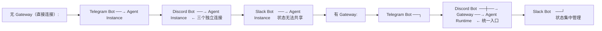
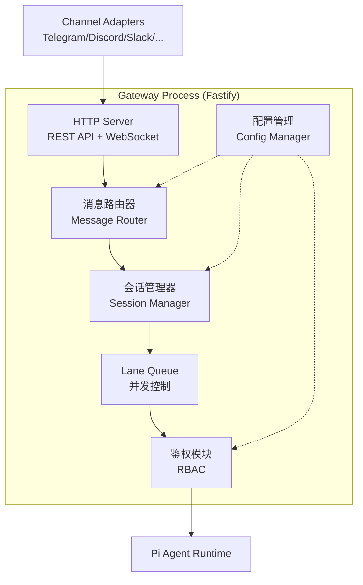
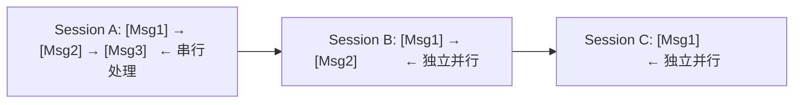
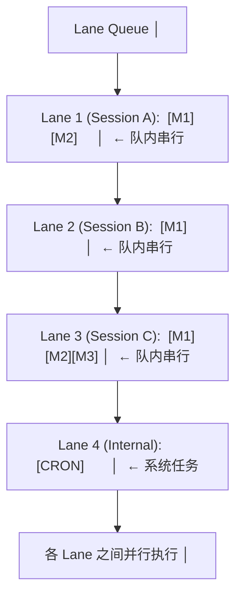
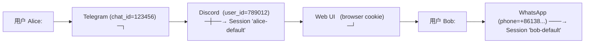

# Gateway 架构

Gateway 是 OpenClaw 的**中央控制面**，它是所有消息的唯一入口和出口，负责消息路由、会话管理、并发控制和访问鉴权。

## 为什么需要独立的 Gateway？



独立的 Gateway 层提供了：
- **状态一致性**：所有通道共享同一份会话状态和记忆
- **并发安全**：单写入者模型避免状态竞争
- **运维简化**：统一鉴权、限流、监控
- **扩展灵活**：增加新通道无需改动 Agent 核心

## Gateway 架构



## 核心机制

### 1. 单写入者（Single-Writer）消息路由

每个会话（Session）在任意时刻**只有一条消息被处理**。这保证了：

- 同一会话内的操作顺序严格一致
- 不会出现两个并发操作同时修改同一个文件
- 记忆状态不会因并发写入而损坏



### 2. Lane Queue（泳道队列）

Lane Queue 是 OpenClaw 特有的并发控制机制：



关键特性：
- **按会话隔离**：每个 Session 一个 Lane，不同 Lane 可并行
- **队内串行**：同一 Lane 内的消息严格按顺序处理
- **系统 Lane**：内部定时任务和 Heartbeat 有独立 Lane
- **背压控制**：Lane 满时返回 429（Too Many Requests）

### 3. 会话管理

跨平台会话关联——同一个用户在不同平台上拥有同一份 Agent 状态：



会话生命周期：

| 阶段 | 说明 |
|------|------|
| 创建 | 首次消息到达时自动创建 |
| 活跃 | 有消息交互的状态，Lane Queue 处理中 |
| 空闲 | 超时无交互（默认 30min），上下文写入记忆后挂起 |
| 销毁 | 长期不活跃（默认 30 天），数据归档后清理 |

### 4. RBAC 鉴权

基于角色的访问控制 (Role-Based Access Control)：

| 角色 | 权限 |
|------|------|
| **Admin** | 完全控制：修改配置、管理 Agent、查看所有会话 |
| **User** | 正常使用：与 Agent 对话、管理自己的 Workspace |
| **Guest** | 受限使用：只读查询、不可修改文件或执行命令 |
| **System** | 内部角色：定时任务、Heartbeat、系统维护 |

设备配对（Device Pairing）增加了额外的安全层——新设备首次接入时需要已有设备确认。

## 配置示例

```yaml
gateway:
  port: 18789
  bind: 127.0.0.1           # 仅本地监听（安全起见）
  cors:
    origins:
      - http://localhost:18789

  lanes:
    max_per_session: 10     # 每 Lane 最大排队消息
    default_timeout: 300    # 默认处理超时（秒）

  sessions:
    idle_timeout: 1800      # 空闲超时（秒）
    destroy_after: 2592000  # 销毁时间（30 天）

  auth:
    rbac: true
    device_pairing: true
    admin_users:
      - alice
```

## 监控端点

Gateway 暴露以下 HTTP 端点供监控：

| 端点 | 说明 |
|------|------|
| `GET /health` | 健康检查 |
| `GET /metrics` | OpenTelemetry 指标 |
| `GET /api/sessions` | 活跃会话列表 (Admin only) |
| `GET /api/lanes` | Lane Queue 状态 (Admin only) |
| `GET /api/config` | 当前配置摘要 (Admin only) |

## 与 Hermes Gateway 对比

| 维度 | OpenClaw Gateway | Hermes Gateway |
|------|-----------------|----------------|
| 进程模型 | 独立 Gateway 进程 | 模块内的 gateway/ 目录 |
| 并发模型 | Lane Queue（按会话隔离） | 平台特定的并发处理 |
| 存储 | Redis + 内存 | SQLite + 文件系统 |
| 平台适配 | Channel Adapter 插件 | 18+ 平台内置适配器 |
| 鉴权 | RBAC + 设备配对 | Gateway 鉴权模块 |
| Web 界面 | Dashboard (127.0.0.1:18789) | CLI/TUI (prompt_toolkit) |
