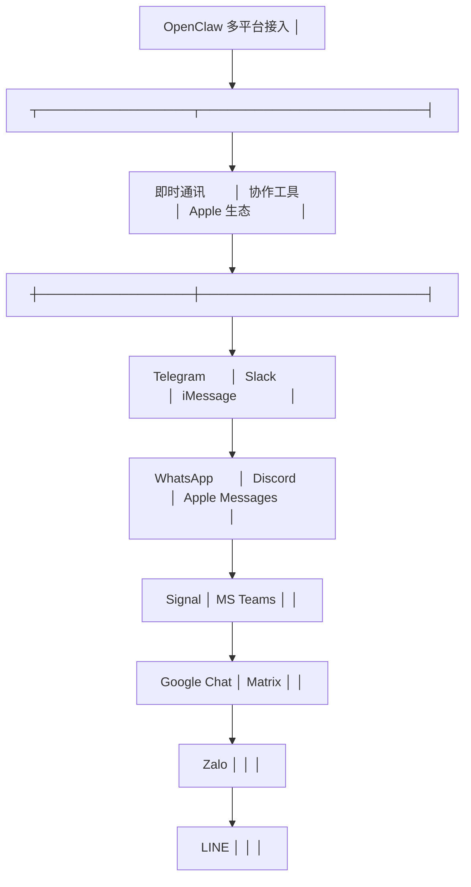

# 多平台接入

OpenClaw 的核心理念之一是**"无新 App"**——用户通过已有的消息应用与 Agent 交互，无需安装额外客户端。

## 支持的平台



## Channel Adapter 接口

每个平台通过实现统一的 `ChannelAdapter` 接口接入：

```typescript
interface ChannelAdapter {
  // 平台标识
  name: string;

  // 启动/停止
  start(): Promise<void>;
  stop(): Promise<void>;

  // 消息接收（平台 → Gateway）
  onMessage(handler: (msg: NormalizedMessage) => Promise<void>): void;

  // 消息发送（Gateway → 平台）
  sendMessage(target: ChannelTarget, content: MessageContent): Promise<void>;

  // 平台特有的能力
  capabilities: {
    text: boolean;
    image: boolean;
    file: boolean;
    voice: boolean;
    video: boolean;
    markdown: boolean;
    interactive: boolean;  // 按钮/卡片等交互组件
  };
}
```

## 消息归一化

不同类型平台的消息被统一转换为 `NormalizedMessage`：

```typescript
interface NormalizedMessage {
  id: string;                    // 全局唯一 ID
  sessionId: string;             // 所属会话
  channel: string;               // 来源平台（telegram/discord/...）
  sender: {
    id: string;                  // 发送者 ID（跨平台唯一）
    name: string;                // 显示名称
    role: "admin" | "user" | "guest";
  };
  content: {
    type: "text" | "image" | "file" | "voice" | "mixed";
    text?: string;               // 纯文本内容
    media?: MediaAttachment[];   // 媒体附件
    replyTo?: string;            // 回复的消息 ID
  };
  timestamp: number;
}
```

## 典型平台接入详解

### Telegram

```yaml
# config.yaml
channels:
  telegram:
    enabled: true
    token: ${TELEGRAM_BOT_TOKEN}
    options:
      polling: true              # 长轮询模式（无需公网 IP）
      webhook: false             # 或使用 Webhook（需要 HTTPS）
      parse_mode: "Markdown"     # 消息格式
      allow_list:                # 用户白名单
        - 123456789
```

接入流程：
1. 通过 [@BotFather](https://t.me/BotFather) 创建 Bot，获取 Token
2. 在 config.yaml 中填入 Token
3. 设置 allow_list 限制可用的 Telegram 用户
4. Gateway 自动处理消息的收发转换

### Discord

```yaml
channels:
  discord:
    enabled: true
    token: ${DISCORD_BOT_TOKEN}
    options:
      intents:                   # Gateway Intents
        - GuildMessages
        - MessageContent
        - DirectMessages
      guild_allow_list:          # 服务器白名单
        - "123456789012345678"
```

### WhatsApp

```yaml
channels:
  whatsapp:
    enabled: true
    provider: "baileys"          # 开源 WhatsApp Web API
    options:
      auth_dir: "~/.openclaw/whatsapp_auth"
      qr_timeout: 60             # QR 码登录超时（秒）
```

### Slack

```yaml
channels:
  slack:
    enabled: true
    token: ${SLACK_BOT_TOKEN}
    signing_secret: ${SLACK_SIGNING_SECRET}
    options:
      socket_mode: true          # Socket Mode（无需公网端点）
      app_token: ${SLACK_APP_TOKEN}
```

## 下行消息适配

Agent 的通用响应需要适配各平台的能力差异：

| 能力 | Telegram | Discord | Slack | WhatsApp | iMessage |
|------|----------|---------|-------|----------|----------|
| Markdown | ✅ | ✅ | ✅ | ✅(部分) | ❌ 纯文本 |
| 代码块 | ✅ | ✅ | ✅ | ❌ | ❌ |
| 图片 | ✅ | ✅ | ✅ | ✅ | ✅ |
| 按钮/交互 | ✅ Inline KB | ✅ Components | ✅ Blocks | ❌ | ❌ |
| 长文本分页 | 4096 字截断 | 2000 字截断 | 40000 字 | 4096 字 | 无限制 |

Adapter 层负责处理这些差异——Agent 核心不感知平台特性。

## 用户身份跨平台关联

同一个用户在多个平台上的身份通过 `USER.md` 中的 `identities` 字段关联：

```markdown
# USER.md

## identities
- channel: telegram, id: 123456789
- channel: discord, id: 789012345
- channel: whatsapp, id: +8613800138000
```

Gateway 根据消息中的平台 ID 查找对应的统一用户身份，然后关联到正确的 Session。

## 实践练习

1. 创建一个 Telegram Bot，配置到 OpenClaw
2. 在手机 Telegram 上给 Bot 发消息，观察 Gateway 日志
3. 同时配置 Discord Bot，验证同一 Session 在两个平台间的记忆共享
4. 测试平台能力差异——在 Telegram 和 iMessage 上发同样的指令，观察响应的格式适配
