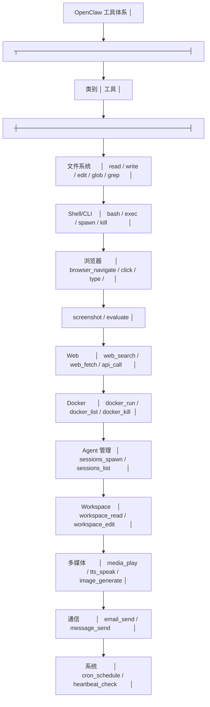
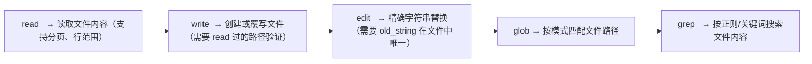
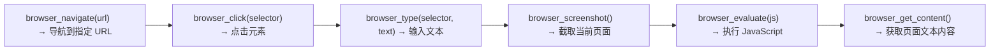
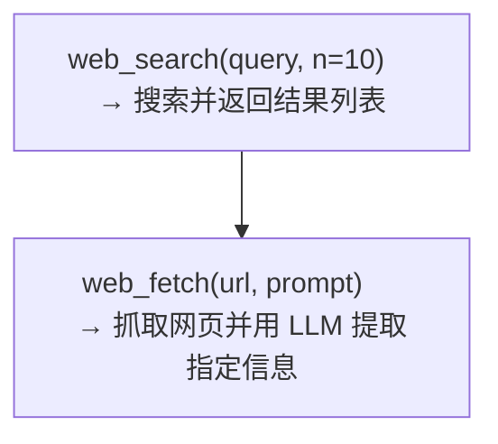
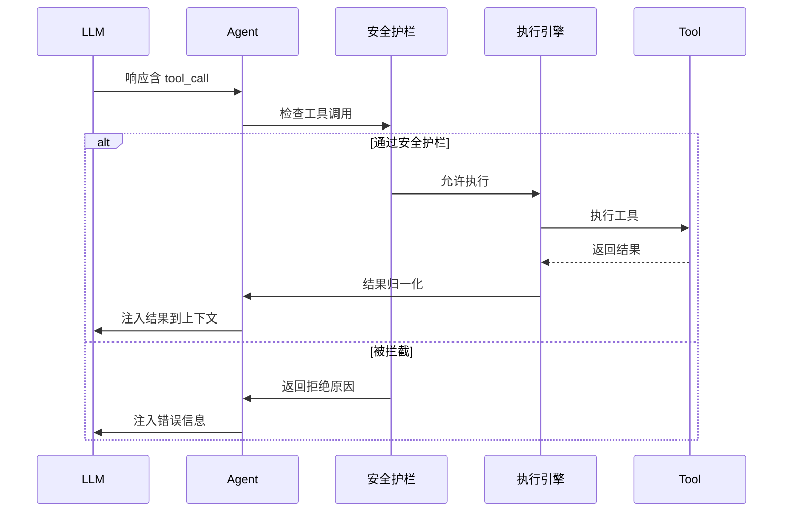

# 工具调用机制

OpenClaw 内置了 50+ 工具，覆盖 Agent 自主执行所需的各类操作。

## 工具分类总览



## 核心工具详解

### 1. 文件系统工具

OpenClaw 的文件操作遵循"先读后写"原则——Agent 必须先 Read 文件才能 Edit 或 Write。



安全限制：
- 所有操作限于 Workspace 目录内（chroot 式沙箱）
- 禁止访问 `~/.openclaw/config.yaml` 等敏感文件
- 文件大小限制（默认 10MB）

### 2. Shell 工具

```bash
# Agent 调用 Shell 的典型场景
bash("git log --oneline -10")                    # 代码仓库操作
bash("npm test -- --coverage")                   # 运行测试
bash("python analyze.py --input data.csv")       # 数据分析脚本
bash("curl -s https://api.example.com/status")   # API 调用（受限网络）
```

安全限制：
- 命令白名单（allowlist）过滤
- 网络访问默认关闭（需显式配置允许的域名/IP）
- 禁止 `rm -rf /`、`sudo`、`chmod 777` 等危险操作
- Docker 沙箱模式下文件系统为只读 + tmpfs 写入层

### 3. 浏览器工具

通过 CDP（Chrome DevTools Protocol）控制无头 Chromium：



### 4. Web 工具



## 工具调用流程



## 工具定义格式

每个工具使用结构化的 `ToolDef` 定义：

```typescript
interface ToolDef {
  name: string;              // 工具名称（LLM 可见）
  description: string;       // 功能描述
  parameters: {              // JSON Schema 参数定义
    type: "object";
    properties: Record<string, {
      type: string;
      description: string;
      required?: boolean;
      enum?: string[];
    }>;
    required: string[];
  };
  execute: (params: any, ctx: ToolContext) => Promise<ToolResult>;
}
```

示例——`web_search` 工具：

```typescript
{
  name: "web_search",
  description: "Search the web using a search engine",
  parameters: {
    type: "object",
    properties: {
      query: {
        type: "string",
        description: "The search query"
      },
      n: {
        type: "number",
        description: "Number of results to return (max 10)"
      }
    },
    required: ["query"]
  },
  execute: async (params, ctx) => {
    const results = await searchEngine.search(params.query, params.n || 5);
    return { content: formatResults(results), metadata: { count: results.length } };
  }
}
```

## 实践练习

1. 通过 OpenClaw CLI 让 Agent 执行 `bash("ls -la")`，观察工具调用日志
2. 让 Agent 读取本地文件并修改，验证"先读后写"机制
3. 测试工具安全护栏：尝试让 Agent 执行 `rm -rf /`，观察被拦截的行为
4. 创建自定义工具（参考[阶段 8: 插件与扩展]），注册到 Workspace 的 TOOLS.md
