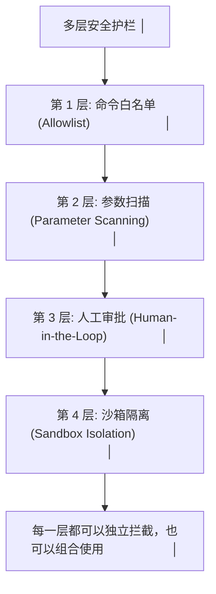
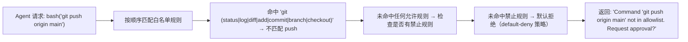
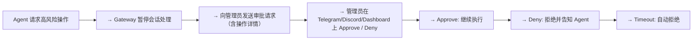

# 工具安全护栏

工具赋予 Agent 强大的执行能力，但也引入了重大安全风险。OpenClaw 通过多层护栏来平衡能力与安全。

## 安全护栏架构



## 第 1 层：命令白名单 (Allowlist)

Agent 不是想执行什么命令都可以。所有 Shell 命令必须通过白名单验证。

### 默认白名单

```yaml
# ~/.openclaw/guardrails.yaml
command_allowlist:
  # 文件操作（允许）
  - pattern: "^ls( -.*)?$"
    risk: low
  - pattern: "^cat [a-zA-Z0-9_/.-]+$"
    risk: low
  - pattern: "^head -n [0-9]+ [a-zA-Z0-9_/.-]+$"
    risk: low
  - pattern: "^find \\..*"
    risk: low
  - pattern: "^git (status|log|diff|add|commit|branch|checkout) .*"
    risk: medium

  # 包管理（需审批）
  - pattern: "^npm (install|test|run) .*"
    risk: medium
    require_approval: true
  - pattern: "^pip install .*"
    risk: high
    require_approval: true

  # 显式禁止
  - pattern: "^rm -rf /"
    action: deny
  - pattern: "^sudo .*"
    action: deny
  - pattern: "^chmod 777 .*"
    action: deny
```

### 白名单匹配逻辑



### 风险等级

| 风险等级 | 策略 | 示例 |
|---------|------|------|
| **low** | 自动允许 | ls, cat, head, find |
| **medium** | 允许但记录日志 | git, npm test, grep |
| **high** | 需要人工审批 | npm install, pip install, curl |
| **critical** | 永久禁止 | rm -rf /, sudo, chmod |

## 第 2 层：参数扫描

不仅仅是命令名称，参数本身也要接受检查：

```typescript
// 参数扫描检查
function scanParameters(toolCall: ToolCall): ScanResult {
  // 检查路径注入
  if (containsPathTraversal(toolCall.params)) {
    return deny("Path traversal detected");
  }
  // 检查命令注入
  if (containsCommandInjection(toolCall.params)) {
    return deny("Command injection detected");
  }
  // 检查是否引用敏感文件
  if (referencesSensitiveFiles(toolCall.params)) {
    return { allow: false, requireApproval: true };
  }
  return allow();
}
```

检测模式：
- `../` 路径遍历
- `` ` `` 或 `$()` 命令注入
- `|` 管道到敏感命令
- `/etc/passwd`, `~/.ssh/`, `~/.openclaw/config.yaml` 等敏感路径
- 特殊权限文件（/dev/mem, /proc/kcore 等）

## 第 3 层：人工审批 (HITL)

高风险操作可以配置为需要人工确认：

```yaml
guardrails:
  human_in_the_loop:
    enabled: true
    require_for:
      - risk_level: high
      - risk_level: critical       # critical 实际已被 deny，但保留配置项
      - tool: sessions_spawn       # 子 Agent 创建总是需要审批
      - tool: email_send            # 发邮件需要审批

    approval_channels:
      - telegram                   # 通过 Telegram 审批
      - discord                    # 通过 Discord 审批
      - dashboard                  # 通过 Web Dashboard 审批

    timeout: 300                   # 审批超时（秒），超时自动拒绝
```

审批流程：



## 第 4 层：沙箱隔离

详见[阶段 9: 安全模型](../09-安全与可观测/01-安全模型.md)。

## 安全护栏配置完整示例

```yaml
# ~/.openclaw/guardrails.yaml
guardrails:
  # 命令白名单
  command_allowlist:
    - pattern: "^(ls|cat|head|find|grep|wc|sort|uniq) .*"
      risk: low
    - pattern: "^git (status|log|diff|show) .*"
      risk: low
    - pattern: "^git (add|commit|branch|checkout|merge|stash) .*"
      risk: medium
    - pattern: "^git (push|pull|fetch) .*"
      risk: high
      require_approval: true
    - pattern: "^(npm|yarn|pnpm) (test|run|start|build) .*"
      risk: medium
    - pattern: "^(npm|yarn|pnpm) install .*"
      risk: high
      require_approval: true
    - pattern: "^curl .*"
      risk: medium
    - pattern: "^rm .*"
      risk: high
      require_approval: true
    - pattern: "^(sudo|chmod|chown) .*"
      action: deny

  # 敏感路径
  sensitive_paths:
    - "/etc/*"
    - "~/.ssh/*"
    - "~/.openclaw/config.yaml"
    - "~/.openclaw/guardrails.yaml"
    - "*.env"
    - "*.pem"

  # 网络访问控制
  network:
    default: deny
    allowed_domains:
      - "api.github.com"
      - "registry.npmjs.org"
      - "pypi.org"

  # 人工审批
  human_in_the_loop:
    enabled: true
    timeout: 300
```

## 实践练习

1. 查看 `~/.openclaw/guardrails.yaml` 默认配置
2. 尝试让 Agent 执行 `bash("rm -rf /tmp/test")`，观察审批流程
3. 修改白名单，为你的常用命令添加低风险自动允许规则
4. 配置 Telegram 审批通道，在手机上体验 HITL 审批
