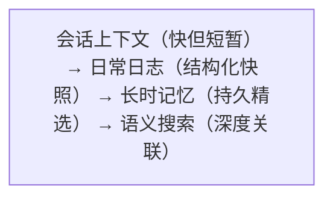
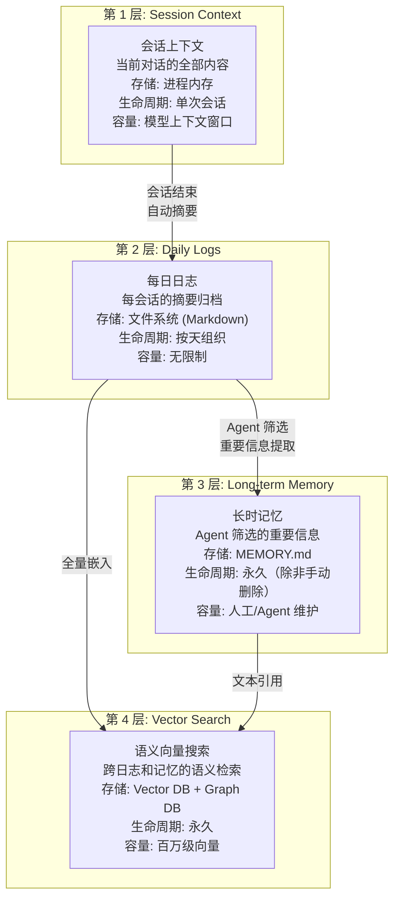
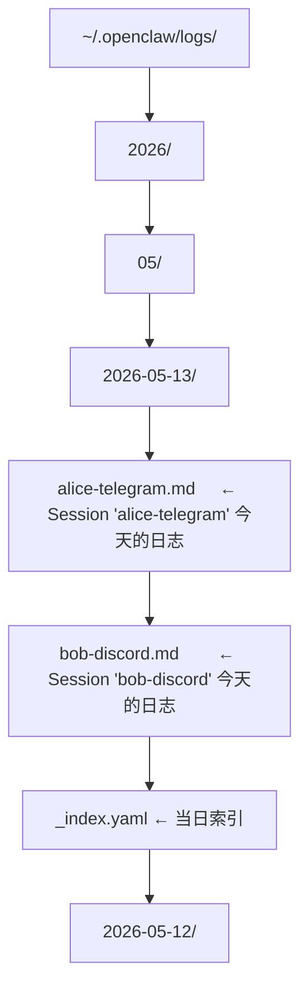

# 四层记忆栈

OpenClaw 的记忆系统采用**四层递进架构**，从短期的会话上下文到长期的语义检索，形成一个完整的记忆金字塔。

## 为什么需要多层记忆？

单一层级的记忆无法同时满足**速度**和**持久性**的需求：



## 四层架构



## 第 1 层：Session Context（会话上下文）

当前会话的完整上下文，位于 Agent 的活跃进程内存中。

**内容包含**：
- 当前会话的所有对话轮次
- 工具调用的参数和结果
- 已读文件的内容缓存
- System Prompt 和注入的技能元数据

**管理机制**：
- 当上下文接近模型限制时触发**上下文压缩**（见[阶段 6](../06-上下文管理/)）
- 会话空闲超时后，摘要写入 Daily Logs，进程内存释放
- 同一会话重新激活时，从 Daily Logs 恢复最近摘要

## 第 2 层：Daily Logs（每日日志）

每个会话每天的自动摘要归档。

**文件结构**：


**日志格式**：
```markdown
# Session Log: alice-telegram - 2026-05-13

## 14:30 - 代码审查请求
用户请求审查 ~/projects/myserver/src/auth.ts。
Agent 发现 3 个问题：JWT 过期未校验、SQL 注入风险、硬编码密钥。
已生成修复建议。

## 15:02 - 部署辅助
用户要求将修复部署到 staging。
Agent 通过 SSH 连接 staging 服务器，执行 git pull + restart。
部署成功，健康检查通过。
```

**自动生成**：Agent 在会话空闲/结束时自动生成摘要，无需用户干预。

## 第 3 层：Long-term Memory（长时记忆）

Agent 从 Daily Logs 中筛选真正重要的信息，写入结构化的 `MEMORY.md`。

```markdown
# MEMORY.md

## User Preferences
- 用户 Alice 偏好使用 TypeScript strict mode
- 代码审查时优先关注安全问题（[来源: 2026-05-13 对话]）
- 部署到 staging 前需要人工确认（[来源: 2026-05-12 对话]）

## Project Context
- myserver 项目的 staging 服务器地址: 10.0.1.50:3000
- 使用 PostgreSQL 14 + Prisma ORM
- CI/CD 基于 GitHub Actions，配置文件在 .github/workflows/

## Known Issues
- auth.ts 的 JWT 刷新逻辑已知在并发场景下有竞态条件
  （[相关讨论: 2026-05-10]）
```

**关键特性**：
- Agent 自主决定什么值得记住（不是所有对话都写入 MEMORY.md）
- 结构化 Markdown，方便 LLM 读取和人类查看
- 支持来源引用 `[来源: ...]`，可回溯原始对话
- 支持 `[[交叉引用]]` 关联其他记忆条目

## 第 4 层：Vector Search（语义向量搜索）

将 Daily Logs 和 MEMORY.md 的内容向量化，支持语义检索。

**存储后端选项**：
| 后端 | 适用场景 |
|------|---------|
| Qdrant (默认) | 本地单机部署，轻量 |
| PGVector | 已有 PostgreSQL 基础设施 |
| Chroma | 轻量嵌入式场景 |
| Pinecone | 云端大规模部署 |

**检索流程**：
```
Agent 需要回忆 "用户的部署偏好"
  1. 将查询文本向量化
  2. 在向量 DB 中搜索 top-10 相关片段
  3. 结合 Graph DB 中的关联关系做重排序
  4. 返回最相关的 3-5 条记忆片段
  5. 注入到当前会话的上下文中
```

## 与 Hermes 记忆系统对比

| 维度 | OpenClaw | Hermes |
|------|----------|--------|
| 第 1 层 | Session Context（进程内存） | 对话上下文（run_agent.py 循环内） |
| 第 2 层 | Daily Logs（Markdown 文件） | SQLite 会话持久化 |
| 第 3 层 | MEMORY.md（Agent 筛选写入） | FTS5 全文搜索 + LLM 摘要 |
| 第 4 层 | Vector DB 语义检索 | FTS5 keys 语义存储 |
| 存储技术 | Redis + Qdrant/PGVector + Graph DB | SQLite (WAL 模式) + FTS5 |
| 记忆筛选 | Agent 自主决定 + MEMORY.md 结构化 | 主动性记忆管理 + curator |
| 跨会话能力 | 四层全覆盖 | SQLite 持久 + 会话搜索 |

> OpenClaw 在记忆存储上更"重"（依赖外部服务 Redis + Vector DB），换来更强的语义检索能力。Hermes 用 SQLite + FTS5 实现了轻量但同样有效的方案。
