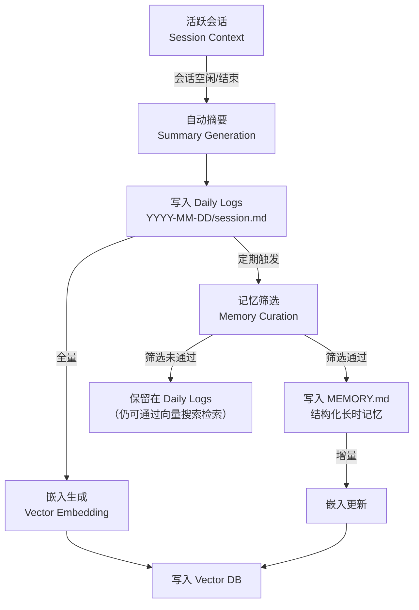
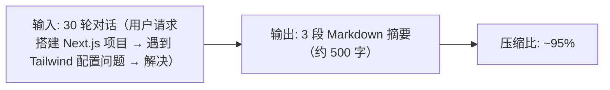
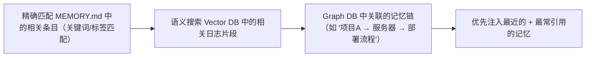

# 记忆固化机制

记忆固化（Memory Consolidation）是将短期的会话信息转化为长期结构化记忆的过程。这是 OpenClaw 实现"跨会话永不忘"的关键机制。

## 从会话到记忆的完整流程



## 阶段 1：自动摘要

当会话进入空闲状态（默认 30 分钟无交互）或被用户主动结束时触发。

**摘要 Prompt 模板**：
```
You are a memory consolidation agent. Summarize the following conversation
into a structured daily log entry. Focus on:

1. Important facts the user shared
2. Decisions made
3. Actions taken and their results
4. Preferences expressed by the user
5. Errors encountered and solutions

Output as Markdown with timestamped sections.
```

**摘要示例**：


## 阶段 2：记忆筛选

记忆筛选是 Agent 的**主动决策**——不是所有摘要内容都值得写入 MEMORY.md。

**筛选标准**：
| 标准 | 示例 |
|------|------|
| 可复用知识 | "用户的项目使用 pnpm 而非 npm" |
| 用户偏好 | "用户偏好函数式组件，不使用 Class Component" |
| 持久事实 | "生产环境的数据库连接字符串在 .env.prod 中" |
| 未解决问题 | "CDN 部署偶发 503 错误，根因未定位" |
| 可丢弃信息 | "今天天气不错"、"试了 A 方案但没成功转用 B" |

**筛选算法**：
1. 对新 Daily Logs 条目评分（LLM 打分 0-1）
2. 分数 > 阈值的条目进入候选列表
3. 去重：检查是否与已有 MEMORY.md 条目语义重复
4. 合并：相关的新旧条目合并更新
5. 写入 MEMORY.md（保留历史版本备份）

## 阶段 3：嵌入与索引

每一条 Daily Logs 和 MEMORY.md 条目都会被向量化并写入 Vector DB。

**嵌入模型选择**：
```yaml
memory:
  embedding:
    provider: openai          # openai | local | custom
    model: text-embedding-3-small  # 1536 维，性价比高
    batch_size: 100           # 批量嵌入大小
```

**索引结构**：
```
Vector Index:
  - 向量: 文本的嵌入表示（1536 维 float32）
  - 元数据:
    - source: "daily_log" | "memory_md"
    - date: "2026-05-13"
    - session: "alice-telegram"
    - tags: ["deployment", "staging", "ssh"]
```

## 阶段 4：检索与注入

当 Agent 开始处理新消息时，记忆系统按以下优先级检索并注入上下文：



**注入格式**：
```
[记忆注入 - 来自 2026-05-13 的对话]
用户 Alice 的 myserver 项目使用 TypeScript strict mode，
staging 服务器为 10.0.1.50:3000，通过 SSH 部署。
用户要求部署前需人工确认。

[记忆注入 - 来自 2026-05-10 的对话]
auth.ts 的 JWT 刷新逻辑已知有并发竞态条件，尚未修复。
```

## Heartbeat 机制

OpenClaw 不是完全被动的——它有心跳机制主动发起记忆维护：

```
每 30 分钟 Heartbeat 检查:
  1. 是否有空闲会话需要做摘要？
  2. 是否有未处理的 Daily Logs 需要做记忆筛选？
  3. MEMORY.md 中是否有过期/矛盾的条目需要清理？
  4. 是否有定时任务需要执行？
  5. 是否有待处理的通知/告警？
```

## 遗忘机制

记忆不是越多越好。OpenClaw 也支持主动遗忘：

- **基于时间的衰减**：超过 N 天未被引用的 Daily Logs 自动归档
- **基于矛盾的替换**：新信息与旧记忆矛盾时，标记旧记忆为 `[已过时]`
- **手动清理**：用户可以直接编辑 MEMORY.md 删除条目
- **容量管理**：Vector DB 中保留最近 90 天的嵌入，更早的降采样保留

## 配置示例

```yaml
memory:
  consolidation:
    idle_timeout: 1800          # 空闲 30 分钟后触发摘要
    curation_interval: 3600     # 每小时筛选一次
    curation_threshold: 0.6     # 筛选分数阈值

  embedding:
    provider: openai
    model: text-embedding-3-small

  vector_store:
    provider: qdrant
    path: "~/.openclaw/vectordb"
    retention_days: 90          # 向量保留天数

  heartbeats:
    interval: 1800              # 30 分钟心跳
    tasks:
      - summarize_idle_sessions
      - curate_memory
      - cleanup_expired
      - check_cron_jobs
```
