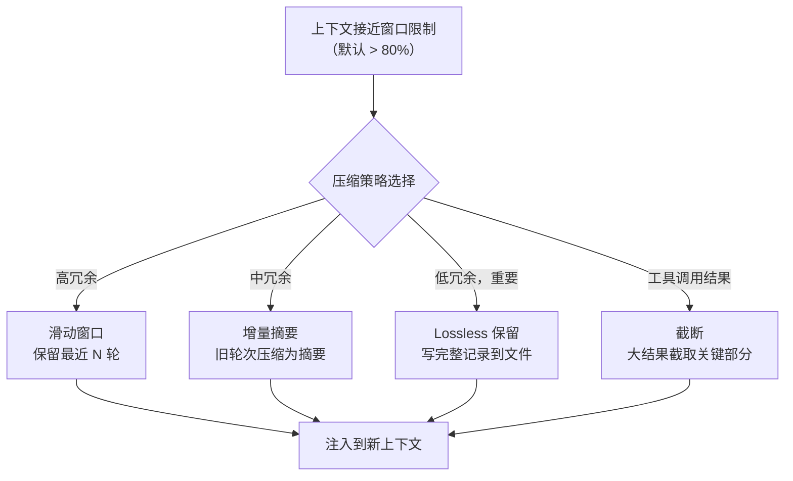

# 上下文压缩策略

当会话越来越长，上下文窗口终将被填满。OpenClaw 的上下文压缩策略决定了"什么该留、什么该丢"。

## 为什么需要上下文压缩？

```
模型上下文窗口: 200K tokens (以 Claude Sonnet 4.6 为例)

消耗分布:
  System Prompt:         ~8K  (AGENTS.md, IDENTITY.md, TOOLS.md 等)
  技能元数据:            ~5K  (200 个技能 × ~25 tokens/个)
  注入的记忆:            ~3K  (最近相关记忆)
  会话历史:              ~180K (剩余空间)

问题: 单次会话可能产生数十万 tokens 的对话历史，远超窗口限制
解决方案: 上下文压缩——保留精华，压缩或丢弃冗余
```

## 压缩策略总览



## 策略 1：滑动窗口

最简单的策略——只保留最近的 N 轮对话。

```
压缩前（20 轮）:
  [轮1] [轮2] [轮3] ... [轮17] [轮18] [轮19] [轮20]

压缩后（保留最近 10 轮）:
  [轮11] [轮12] [轮13] ... [轮18] [轮19] [轮20]

优点: 简单、快速
缺点: 丢失早前的关键信息（如用户最初的需求描述）
```

## 策略 2：增量摘要

将早前的对话轮次压缩为结构化摘要，而非直接删除。

```
压缩前:
  [轮1][轮2][轮3][轮4] [轮5][轮6][轮7][轮8] [轮9][轮10][轮11][轮12]

压缩后:
  [摘要: 轮1-4 用户请求搭建项目，遇到依赖冲突...]
  [摘要: 轮5-8 Agent 分析并解决冲突，重新安装成功]
  [轮9] [轮10] [轮11] [轮12]  ← 保留最近 4 轮完整
```

**摘要生成 Prompt**：
```
Summarize the following conversation segment. Preserve:
1. Key facts and decisions
2. Errors encountered and their solutions
3. Code patterns that were established
4. User preferences expressed

Be concise but complete. The summary will replace the original messages.
```

## 策略 3：Lossless 保留（lossless-claw 插件）

v3.7 引入的可插拔上下文引擎支持 **lossless-claw** 插件，实现"永不丢弃"的对话记忆。

**原理**：
1. 当上下文接近窗口限制时，被淘汰的轮次完整写入磁盘
2. 在 System Prompt 中保留这些记录的**索引**（标题 + 摘要 + 引用 ID）
3. Agent 需要查看历史细节时，通过 `read` 工具动态加载对应文件
4. 类似于 CPU 的虚拟内存：热数据在"内存"（上下文窗口），冷数据在"磁盘"（文件系统）

```
上下文窗口（"内存"）:
  [System Prompt + 索引]
  [最近 8 轮完整对话]
  [当前轮次]

文件系统（"磁盘"）:
  ~/.openclaw/workspaces/default/.claw/
    ├── context_001.md   ← 轮次 1-8 完整记录
    ├── context_002.md   ← 轮次 9-16 完整记录
    └── context_003.md   ← 轮次 17-24 完整记录
```

## 策略 4：大工具结果截断

工具调用的结果（如 web_fetch 抓取了 50K HTML）不能全量注入上下文。

**处理方式**：
1. 对文本结果：保留前 2000 字符 + 总长度提示
2. 对结构化数据：提取 schema + 前 10 行预览
3. 对错误输出：保留完整错误信息（因为错误通常是关键信息）
4. Agent 可以通过追加参数（如 `limit`、`offset`）获取被截断的部分

## 可插拔上下文引擎

v3.7 的核心创新——上下文压缩策略不再硬编码，而是可插拔的。

```typescript
interface ContextCompressor {
  name: string;
  compress(context: SessionContext, windowLimit: number): Promise<CompressedContext>;
}

// 内置实现
class SlidingWindowCompressor implements ContextCompressor { ... }
class IncrementalSummaryCompressor implements ContextCompressor { ... }
class LosslessClawCompressor implements ContextCompressor { ... }
```

配置方式：
```yaml
agent:
  context:
    engine: lossless-claw          # sliding-window | incremental-summary | lossless-claw
    compression_threshold: 0.8     # 窗口使用率达到 80% 时触发
    preserve_last_n: 8             # 始终保留最近 N 轮完整
```

## 与 Hermes 上下文压缩对比

| 维度 | OpenClaw | Hermes |
|------|----------|--------|
| 压缩触发 | 窗口使用率阈值（默认 80%） | 上下文管理策略 |
| 核心策略 | 滑动窗口 + 增量摘要 + Lossless | 自动摘要 + 对话修剪 |
| 可插拔性 | v3.7+ 可插拔引擎 | 内置 context_compressor.py |
| Lossless 方案 | lossless-claw 插件（索引+动态加载） | 文件归档 + 会话搜索 |
| 工具结果处理 | 截断 + 按需加载 | 类似截断处理 |

> 两者的核心思想一致（摘要 + 截断），OpenClaw 在 v3.7 的可插拔引擎和 lossless 方案上更激进。
