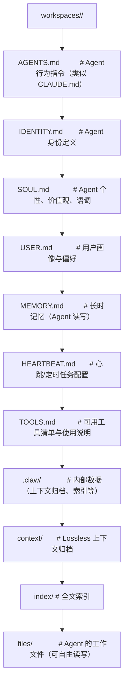

# Workspace 文件体系

每个 OpenClaw Agent 都有一个 Workspace 目录，其中的 Markdown 文件既是配置也是状态。Workspace 是 Agent 的"数字人格"载体。

## Workspace 目录结构



## 核心文件详解

### AGENTS.md

Agent 的行为指令文件，定义 Agent 的**能力边界和操作规则**：

```markdown
# AGENTS.md

## Role
You are a senior DevOps engineer assistant. You help with infrastructure
management, CI/CD pipelines, and cloud operations.

## Rules
1. Never modify production infrastructure without explicit user confirmation
2. Always run terraform plan before terraform apply
3. Use Docker sandbox for any potentially destructive operations
4. Before deploying, check if tests pass on CI

## Workflow
1. Understand the current state (check git status, terraform state, etc.)
2. Propose changes with a clear explanation of impact
3. Wait for confirmation before applying
4. After applying, run smoke tests and verify
```

与 CLAUDE.md 的类比：AGENTS.md 之于 OpenClaw Agent = CLAUDE.md 之于 Claude Code。

### IDENTITY.md

定义 Agent 的**身份信息**：

```markdown
# IDENTITY.md

## Name
OpsBot

## Description
DevOps automation assistant for the myserver project

## Created
2026-03-15

## Owner
Alice (alice@example.com)

## Language
Chinese, English

## Expertise
- AWS / Terraform
- Docker / Kubernetes
- GitHub Actions CI/CD
- PostgreSQL / Redis
```

### SOUL.md

定义 Agent 的**个性、语调和行为风格**：

```markdown
# SOUL.md

## Tone
Professional but approachable. Use clear, concise language.
When delivering bad news (build failures, incidents), be direct
but supportive — suggest concrete next steps.

## Personality Traits
- Detail-oriented: Always verify before acting
- Proactive: Suggest improvements when you see them
- Honest: Acknowledge limitations and uncertainties

## Communication Style
- Use code blocks for technical output
- Use tables for comparisons
- Prefer bullet points over long paragraphs
```

### USER.md

**用户画像**文件，Agent 从中了解用户：

```markdown
# USER.md

## Profile
- Name: Alice
- Role: Tech Lead, myserver project
- Stack: TypeScript, Next.js, PostgreSQL, AWS
- OS: macOS + Ubuntu servers

## Preferences
- Prefers pnpm over npm
- TypeScript strict mode always
- Git rebase over merge
- Server: Ubuntu 22.04 LTS

## Identities
- Telegram: @alice_dev
- Discord: alice#1234
- GitHub: alice-gh
```

### MEMORY.md

Agent 的**长时记忆**，详见[阶段 5: 记忆系统](../05-记忆系统/)。

### HEARTBEAT.md

定义 Agent 的**主动行为和定时任务**：

```markdown
# HEARTBEAT.md

## Scheduled Tasks
- `30 9 * * 1-5` → Check CI pipeline status for myserver/main
- `0 14 * * 5`   → Generate weekly deployment report
- `*/30 * * * *`  → Health check staging server (10.0.1.50:3000)

## Proactive Behaviors
- Monitor #alerts channel in Slack for incident keywords
- Check GitHub notifications every hour
- Remind about stale PRs older than 3 days
```

### TOOLS.md

**可用工具清单**——Agent 读取此文件了解自己的工具能力：

```markdown
# TOOLS.md

## File System
- read(path, offset?, limit?) — Read file content
- write(path, content) — Create or overwrite file
- edit(path, old_string, new_string) — Replace text in file

## Shell
- bash(command, timeout?) — Execute shell command

## Web
- web_search(query, n?) — Search the web
- web_fetch(url, prompt?) — Fetch and extract web content

## Docker
- docker_run(image, command?) — Run container
- docker_list() — List running containers
```

## Workspace 隔离

每个 Agent 的 Workspace 相互隔离：

```
Workspace "devops-bot"        Workspace "code-reviewer"
    AGENTS.md                     AGENTS.md
    MEMORY.md                     MEMORY.md
    files/                        files/
        terraform/                    reviews/

两个 Agent 的:
  - 记忆独立（各自的 MEMORY.md）
  - 文件独立（各自的 files/ 目录）
  - 权限独立（各自的 TOOLS.md 和安全护栏）
  - 除非通过 sessions_spawn 显式协同（见阶段 7）
```

## 文件自动维护

OpenClaw Agent 会**自动维护**这些文件：
- **写入**：Agent 发现新用户偏好时，自动更新 USER.md
- **更新**：Agent 学会新技能时，自动更新 TOOLS.md
- **修正**：MEMORY.md 中的过时条目被标记或替换
- **清理**：过期的 Heartbeat 任务被移除

人工也可以随时手动编辑这些文件来引导 Agent 的行为。

## 与 Hermes 的对比

OpenClaw 的 Workspace 文件体系是其独特设计——Hermes 没有等价的"文件即 Agent 人格"概念。Hermes 的 Agent 配置更多依赖 YAML 配置文件和数据库中的状态，而非可读的 Markdown 文件。
