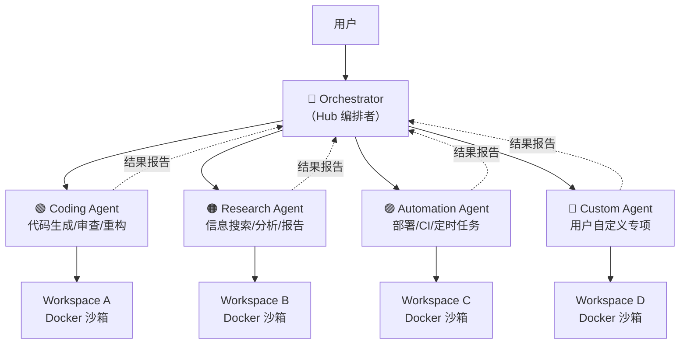
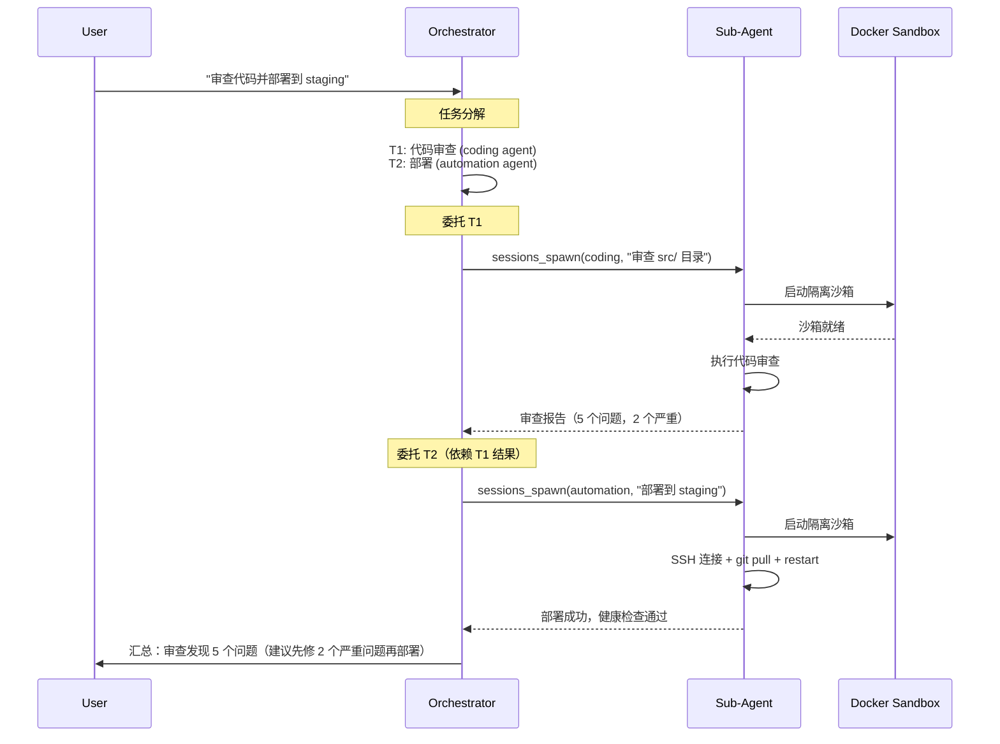

# Hub-Spoke 模式

OpenClaw 的多 Agent 架构采用 **Hub-Spoke（中心-辐条）** 模式，一个 Orchestrator（编排者）作为 Hub，管理多个专项子 Agent（Spoke）。

## 架构图



## 为什么用 Hub-Spoke？

```
单体 Agent（单一 Agent 做所有事）:
  问题:
  - System Prompt 臃肿（需要包含所有领域的指令）
  - 上下文污染（Coding 相关的记忆干扰 Research 任务）
  - 权限无法细粒度控制
  - 并发能力受限

Hub-Spoke（编排 + 专项子 Agent）:
  优势:
  - 每个子 Agent 的 System Prompt 精简且专业
  - 记忆隔离——Coding Agent 的项目知识不干扰 Research Agent
  - 不同子 Agent 可以有不同的安全策略和权限
  - 无依赖的子任务可并行执行
```

## Orchestrator 职责

Orchestrator 是唯一的**面向用户的 Agent**，负责：

| 职责 | 说明 |
|------|------|
| 意图理解 | 理解用户的复杂需求 |
| 任务分解 | 将需求拆解为可委托的子任务（PDDL 风格规划） |
| 子 Agent 选择 | 根据任务性质选择合适的专项 Agent |
| 任务分配 | 将子任务分发给子 Agent，设置时限和资源约束 |
| 结果汇总 | 收集子 Agent 返回的结果，合并为统一输出 |
| 异常处理 | 子 Agent 超时/失败时的重试或重分配 |

## 子 Agent 类型

### 内置类型

```yaml
sub_agents:
  coding:
    description: "Code generation, review, refactoring, testing"
    tools: [bash, read, write, edit, glob, grep]
    sandbox: docker
    workspace: "~/.openclaw/workspaces/coding-agent"
    model: claude-sonnet-4-6

  research:
    description: "Web research, data analysis, report generation"
    tools: [web_search, web_fetch, read, write]
    sandbox: docker
    workspace: "~/.openclaw/workspaces/research-agent"
    model: claude-sonnet-4-6

  automation:
    description: "Deployment, CI/CD, scheduled tasks"
    tools: [bash, ssh, read, write, cron_schedule]
    sandbox: docker
    workspace: "~/.openclaw/workspaces/automation-agent"
    model: claude-sonnet-4-6
```

### 自定义子 Agent

用户可以通过 Workspace 模板创建自定义子 Agent：

```bash
openclaw workspace create my-custom-agent --template agent
```

## 委托流程



## 子 Agent 的隔离与通信

### 隔离

| 维度 | 隔离方式 |
|------|---------|
| 文件系统 | 独立 Docker 容器，独立的 overlay 文件系统 |
| 网络 | 默认无外网访问，按需开放白名单域名 |
| 进程 | 容器内独立 PID namespace |
| 内存 | 独立 Memory cgroup 限制 |
| 配置 | 独立 Workspace（各自的 AGENTS.md, MEMORY.md） |

### 通信

子 Agent 间**不能直接通信**，所有信息通过 Orchestrator 中转：

```
Sub-Agent A  ──→ Orchestrator ──→ Sub-Agent B
                  (筛选/合并)      (只接收相关信息)
```

子 Agent 也可以通过文件系统交换数据（Orchestrator 授予权限后）：

```
Sub-Agent A → write("files/shared/analysis.json", data)
Orchestrator → grant_read(Sub-Agent B, "files/shared/analysis.json")
Sub-Agent B → read("files/shared/analysis.json")
```

## 配置示例

```yaml
multi_agent:
  orchestrator:
    name: "OpsBot"
    workspace: "~/.openclaw/workspaces/opsbot"
    model: claude-opus-4-7          # Orchestrator 用更强的模型

  sub_agents:
    coding:
      workspace: "~/.openclaw/workspaces/coding-agent"
      model: claude-sonnet-4-6
      sandbox: docker
      timeout: 300
      max_iterations: 30

    research:
      workspace: "~/.openclaw/workspaces/research-agent"
      model: claude-haiku-4-5       # 研究任务可用更快模型
      sandbox: docker
      timeout: 600

    automation:
      workspace: "~/.openclaw/workspaces/automation-agent"
      sandbox: docker
      allow_network: true            # 需要 SSH/API 网络访问
      guarded: strict                # 高危操作严格护栏
      require_approval_for:
        - ssh_exec
        - deploy
```
