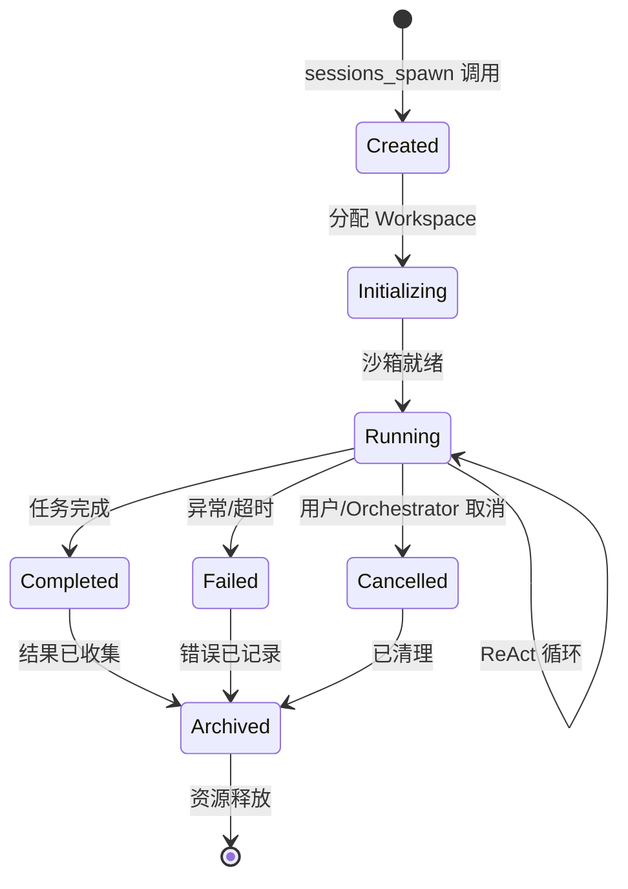
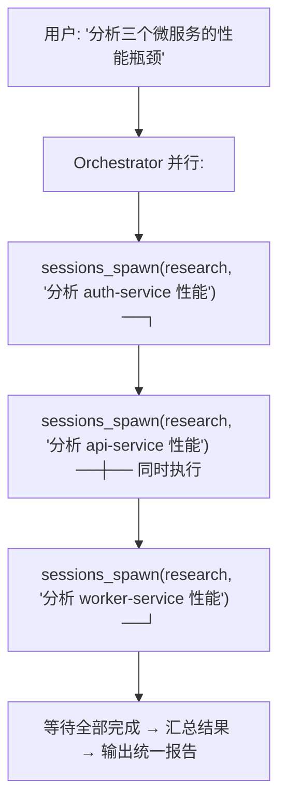
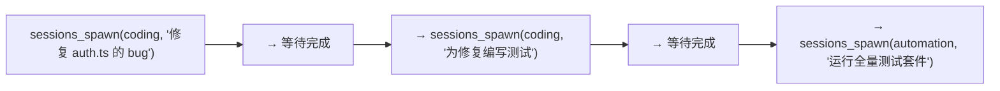

# sessions_spawn 机制

`sessions_spawn` 是 OpenClaw 多 Agent 系统的核心原语——Orchestrator 通过它创建和管理子 Agent。

## 什么是 sessions_spawn？

`sessions_spawn` 是一个**工具调用**，允许 Agent 动态创建隔离的子 Agent 会话来执行特定任务。

```typescript
// 工具定义（简化）
{
  name: "sessions_spawn",
  description: "Spawn a sub-agent session to handle a task",
  parameters: {
    agent_type: "coding" | "research" | "automation" | "custom",
    task: string,              // 任务描述
    context: {                 // 传递给子 Agent 的上下文
      files?: string[],        // 需要共享的文件路径
      memory?: string[],       // 需要注入的记忆条目
      instructions?: string,   // 专项指令
    },
    options: {
      timeout?: number,        // 超时（秒），默认 300
      max_iterations?: number, // 最大迭代次数
      model?: string,          // 覆盖默认模型
      sandbox?: "docker" | "none",
    }
  },
  returns: {
    session_id: string,
    result: string,            // 子 Agent 的最终输出
    logs: string[],            // 执行日志
    artifacts: string[],       // 产生的文件列表
  }
}
```

## 生命周期



### 调用示例

```
Orchestrator 调用:
sessions_spawn({
  agent_type: "coding",
  task: "审查 src/auth.ts 的安全问题，重点关注认证和授权逻辑",
  context: {
    files: ["src/auth.ts", "src/middleware/auth.ts"],
    instructions: "使用 OWASP Top 10 标准进行审查"
  },
  options: {
    timeout: 300,
    sandbox: "docker"
  }
})

返回:
{
  session_id: "sub-20260513-001",
  result: "发现 3 个问题:\n1. [严重] JWT 未校验 exp 字段\n2. [中] ...",
  artifacts: ["reports/auth-review-20260513.md"]
}
```

## 共享与隔离的平衡

### 文件共享

子 Agent 默认看不到父 Agent 的文件。需要显式共享：

```yaml
# 共享单个文件
sessions_spawn({
  context: {
    files: ["src/auth.ts"]          # 子 Agent 只读访问
  }
})

# 共享目录
sessions_spawn({
  context: {
    files: ["src/", "package.json"] # 子 Agent 只读访问
  }
})
```

### 记忆共享

同样需要显式指定要注入的记忆：

```yaml
sessions_spawn({
  context: {
    memory: [
      "用户偏好 TypeScript strict mode",
      "myserver 使用 PostgreSQL 14"
    ]
  }
})
```

### 权限继承

子 Agent **不继承**父 Agent 的权限，每个子 Agent 有独立的护栏配置：

```yaml
sub_agent_defaults:
  coding:
    guardrails:
      command_allowlist:
        - "^(ls|cat|git|npm test) .*"   # 只能运行安全命令
      network: deny                       # 默认无网络
  automation:
    guardrails:
      command_allowlist:
        - "^(git|ssh|docker|curl) .*"    # 需要更多权限
      network:
        allowed_domains:
          - "staging.internal:3000"
```

## 并发与编排

Orchestrator 可以并行启动多个子 Agent：



顺序依赖的任务则串行执行：



## 与 Hermes 多 Agent 对比

| 维度 | OpenClaw sessions_spawn | Hermes delegate_task |
|------|------------------------|---------------------|
| 原语 | 单一 sessions_spawn 工具 | delegate_task 多参数函数 |
| 隔离 | Docker 沙箱强隔离 | Docker/Modal/Daytona/SSH 多后端 |
| 并发 | 无依赖任务自动并行 | Kanban 看板 fan-out/fan-in |
| 生命周期 | 创建→运行→完成→归档 | 任务状态机（Kanban 列转换） |
| 持久化 | 归档到日志 + 向量检索 | SQLite 持久化任务状态 |
| Orchestrator | Hub-Spoke 中心编排 | Kanban Dispatcher + Worker 模式 |

> OpenClaw 的 sessions_spawn 更偏向"函数式"——调用并等待结果。Hermes 的 Kanban 系统引入了更完整的任务调度框架（状态机、优先级、fan-out/fan-in），适合长时间运行的复杂任务流。
