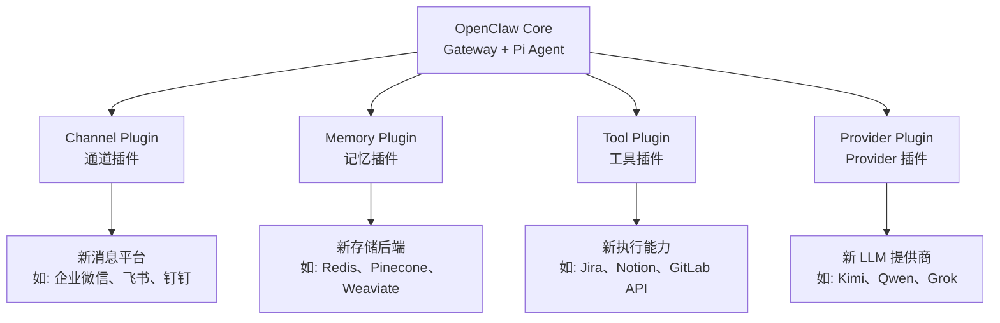

# 插件体系

OpenClaw 的插件系统允许扩展框架的四个关键维度：Channel（通道）、Memory（记忆）、Tool（工具）、Provider（提供商）。

## 四类插件



## Channel Plugin（通道插件）

接入新的消息平台。

```typescript
// 插件接口
interface ChannelPlugin {
  metadata: {
    name: string;              // 如 "wechat-work"
    version: string;
    description: string;
  };

  // 生命周期
  register(gateway: Gateway): void;
  start(): Promise<void>;
  stop(): Promise<void>;

  // 消息处理
  onMessage(handler: MessageHandler): void;
  sendMessage(target: ChannelTarget, msg: MessageContent): Promise<void>;

  // 平台能力声明
  capabilities: ChannelCapabilities;
}
```

**示例——企业微信插件**：

```typescript
const wechatWorkPlugin: ChannelPlugin = {
  metadata: {
    name: "wechat-work",
    version: "1.0.0",
    description: "企业微信通道适配器"
  },
  register(gateway) {
    // 注册到 Gateway 的消息路由
    gateway.registerChannel("wechat-work", this);
  },
  async start() {
    // 启动 Webhook 接收
    // 获取 access_token
    // 注册消息回调
  },
  async onMessage(handler) {
    // 将企业微信的 XML 消息格式转换为 NormalizedMessage
  },
  async sendMessage(target, msg) {
    // 将 MessageContent 转换为企业微信 API 格式
  },
  capabilities: {
    text: true,
    image: true,
    file: true,
    markdown: true,
    interactive: false    // 企业微信不支持交互组件
  }
};
```

## Memory Plugin（记忆插件）

替换记忆存储后端。

```typescript
interface MemoryPlugin {
  metadata: {
    name: string;              // 如 "redis-memory"
    version: string;
  };

  // Session 上下文
  getSessionContext(sessionId: string): Promise<SessionContext>;
  updateSessionContext(sessionId: string, ctx: SessionContext): Promise<void>;

  // Daily Logs
  writeDailyLog(date: string, sessionId: string, summary: string): Promise<void>;
  getDailyLogs(date: string): Promise<DailyLog[]>;

  // 长时记忆
  readMemory(workspace: string): Promise<string>;
  writeMemory(workspace: string, content: string): Promise<void>;

  // 向量操作
  embed(texts: string[]): Promise<number[][]>;
  search(query: string, topK: number): Promise<MemoryEntry[]>;
}
```

**示例——Redis Memory 插件**：

```typescript
// 使用 Redis 作为热数据缓存，Qdrant 做向量存储
const redisMemoryPlugin: MemoryPlugin = {
  name: "redis-memory",
  // Session Context → Redis (快但易失)
  // Daily Logs → Redis + 文件系统双写
  // 向量搜索 → Qdrant
  // 通过 Redis Pub/Sub 实现多 Gateway 实例间的记忆同步
};
```

## Tool Plugin（工具插件）

添加自定义工具。

```typescript
interface ToolPlugin {
  metadata: {
    name: string;
    version: string;
    tools: string[];           // 提供的工具名称列表
  };

  getToolDefs(): ToolDef[];    // 返回工具定义
  execute(toolName: string, params: any, ctx: ToolContext): Promise<ToolResult>;
}
```

**示例——Jira 工具插件**：

```typescript
const jiraPlugin: ToolPlugin = {
  metadata: {
    name: "jira-tools",
    version: "1.0.0",
    tools: ["jira_search", "jira_create_issue", "jira_get_issue", "jira_comment"]
  },
  getToolDefs() {
    return [
      {
        name: "jira_search",
        description: "Search Jira issues by JQL query",
        parameters: {
          type: "object",
          properties: {
            jql: { type: "string", description: "JQL query string" },
            maxResults: { type: "number", default: 10 }
          },
          required: ["jql"]
        }
      },
      // ... 更多工具定义
    ];
  },
  async execute(toolName, params, ctx) {
    const jira = new JiraClient(ctx.config.jira);
    switch (toolName) {
      case "jira_search": return jira.search(params.jql, params.maxResults);
      case "jira_create_issue": return jira.createIssue(params);
      // ...
    }
  }
};
```

## Provider Plugin（Provider 插件）

接入新的 LLM 提供商。

```typescript
interface ProviderPlugin {
  metadata: {
    name: string;              // 如 "qwen-provider"
    version: string;
    models: string[];          // 支持的模型列表
  };

  // 聊天补全
  chat(messages: Message[], options: ChatOptions): Promise<ChatResponse>;

  // 流式聊天补全
  chatStream(messages: Message[], options: ChatOptions): AsyncIterator<ChatChunk>;

  // 嵌入
  embed?(texts: string[]): Promise<number[][]>;
}
```

**示例——Kimi Provider 插件**：

```typescript
const kimiProvider: ProviderPlugin = {
  metadata: {
    name: "kimi-provider",
    version: "1.0.0",
    models: ["kimi-k2.5", "kimi-k2.5-thinking"]
  },
  async chat(messages, options) {
    // 适配 Kimi API 格式
    const response = await fetch("https://api.moonshot.cn/v1/chat/completions", {
      headers: { Authorization: `Bearer ${options.apiKey}` },
      body: JSON.stringify({
        model: options.model,
        messages: convertMessages(messages),
        tools: convertTools(options.tools),
        max_tokens: options.maxTokens
      })
    });
    return normalizeResponse(await response.json());
  },
  async *chatStream(messages, options) {
    // SSE 流式处理
    const stream = await fetch("...", { body: JSON.stringify({..., stream: true}) });
    for await (const chunk of parseSSE(stream)) {
      yield normalizeChunk(chunk);
    }
  }
};
```

## 插件安装与管理

### 安装

```bash
# 从 ClawHub 安装
openclaw plugin install jira-tools

# 从本地目录安装
openclaw plugin install ./my-custom-plugin

# 从 Git 仓库安装
openclaw plugin install github:user/my-plugin
```

### 配置文件

```yaml
# ~/.openclaw/plugins.yaml
plugins:
  channels:
    wechat-work:
      enabled: true
      config:
        corp_id: ${WECHAT_CORP_ID}
        secret: ${WECHAT_SECRET}

  memory:
    redis-memory:
      enabled: true
      config:
        url: redis://localhost:6379

  tools:
    jira-tools:
      enabled: true
      config:
        base_url: https://company.atlassian.net
        api_token: ${JIRA_API_TOKEN}
        email: alice@company.com

  providers:
    kimi-provider:
      enabled: true
      config:
        api_key: ${KIMI_API_KEY}
```

### 插件沙箱

所有插件默认在沙箱环境中运行：
- **Channel/Tool/Provider Plugin**：受限进程（无法访问 Agent 核心配置）
- **Memory Plugin**：更高信任级别（需要访问记忆数据）
- 插件的 npm 依赖安装在隔离的 `node_modules` 中
- 插件的网络访问需显式声明权限
