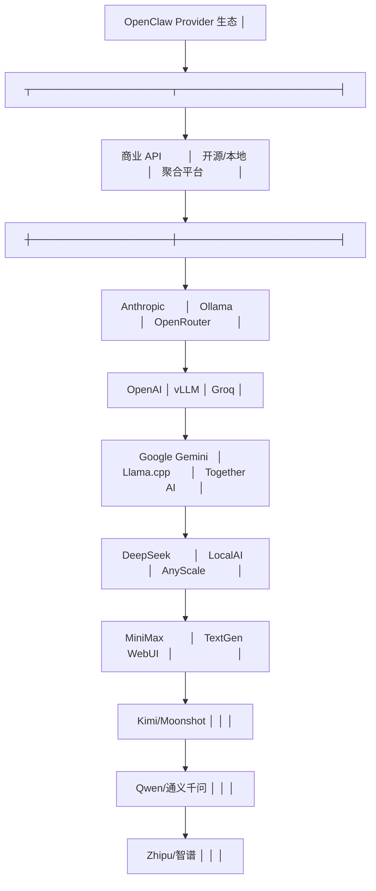
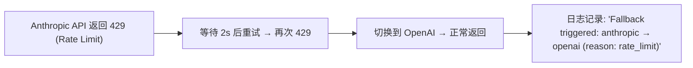

# 多 Provider 接入

OpenClaw 不绑定单一 LLM 提供商。通过 Provider 插件体系，它可以接入任何兼容的 LLM API，并支持在运行时动态切换。

## 支持的 Provider



## 配置方式

### 基本配置

```yaml
agent:
  default_provider: anthropic    # 默认提供商

  providers:
    anthropic:
      api_key: ${ANTHROPIC_API_KEY}
      models:
        - claude-opus-4-7        # 最强推理（Orchestrator）
        - claude-sonnet-4-6      # 平衡（默认 Agent）
        - claude-haiku-4-5       # 快速响应（简单任务）

    openai:
      api_key: ${OPENAI_API_KEY}
      models:
        - gpt-5
        - gpt-4o

    deepseek:
      api_key: ${DEEPSEEK_API_KEY}
      base_url: https://api.deepseek.com/v1
      models:
        - deepseek-v3

    ollama:
      base_url: http://localhost:11434
      models:
        - qwen3:72b
        - llama4:70b
```

### 模型路由

OpenClaw 支持按任务类型自动选择模型：

```yaml
agent:
  model_routing:
    # 复杂推理任务 → Opus
    reasoning:
      provider: anthropic
      model: claude-opus-4-7

    # 日常对话 → Sonnet
    default:
      provider: anthropic
      model: claude-sonnet-4-6

    # 简单/高速任务 → Haiku
    fast:
      provider: anthropic
      model: claude-haiku-4-5

    # 代码生成 → DeepSeek（性价比高）
    coding:
      provider: deepseek
      model: deepseek-v3

    # 敏感数据 → 本地 Ollama
    private:
      provider: ollama
      model: qwen3:72b
```

触发自动路由的规则：

| 触发条件 | 使用的路由 |
|---------|-----------|
| 任务含"分析/设计/架构/规划"关键词 | reasoning |
| 任务含"代码/编程/实现/重构" | coding |
| 文件含 `#private` 标签 | private |
| 默认 | default |

## 故障转移

当一个 Provider 不可用或返回错误时，自动切换到备用：

```yaml
agent:
  fallback:
    enabled: true
    chain:
      - provider: anthropic
        retry: 2                 # 重试次数
      - provider: openai
        retry: 1
      - provider: deepseek       # 最后的备用
        retry: 1

    errors_that_trigger_fallback:
      - rate_limit
      - server_error
      - timeout
      # 不包括: invalid_api_key, content_filter
```

故障转移流程：



## Provider 适配器标准化

OpenClaw 内部使用统一的 Provider 抽象层，屏蔽不同 API 的差异：

```typescript
// 所有 Provider 实现此接口
interface LLMProvider {
  // 聊天补全（非流式）
  chat(params: {
    model: string;
    messages: UniversalMessage[];
    tools?: UniversalToolDef[];
    maxTokens?: number;
    temperature?: number;
    thinking?: boolean;        // 扩展思考（Claude 特性）
  }): Promise<{
    content: string;
    toolCalls?: UniversalToolCall[];
    usage: { input: number; output: number; };
    finishReason: string;
  }>;

  // 流式聊天
  chatStream(params: ...): AsyncIterator<ChatChunk>;

  // 嵌入（可选）
  embed?(texts: string[]): Promise<number[][]>;

  // 能力声明
  capabilities: {
    maxContextWindow: number;     // 最大上下文窗口（tokens）
    supportsVision: boolean;      // 是否支持图片输入
    supportsStreaming: boolean;   // 是否支持流式输出
    supportsThinking: boolean;    // 是否支持扩展思考
  };
}
```

各 Provider 适配的差异映射：

| 差异点 | Anthropic | OpenAI | DeepSeek | Ollama |
|--------|-----------|--------|----------|--------|
| 消息格式 | content blocks | content array | OpenAI 兼容 | OpenAI 兼容 |
| 工具调用 | tool_use blocks | tool_calls array | tool_calls array | tool_calls array |
| 流式格式 | SSE (自定义) | SSE (自定义) | SSE (OpenAI 兼容) | SSE (OpenAI 兼容) |
| 扩展思考 | thinking param | N/A | N/A | N/A |
| 系统消息 | system param | role: system | role: system | role: system |
| 图片支持 | base64 content block | image_url content | ❌ (文字模型) | ✅ (多模态模型) |

## 使用 OpenRouter 接入多模型

OpenRouter 是 OpenClaw 用户最常用的聚合 Provider——一个 API Key 接入 200+ 模型：

```yaml
providers:
  openrouter:
    api_key: ${OPENROUTER_API_KEY}
    base_url: https://openrouter.ai/api/v1
    models:
      - anthropic/claude-sonnet-4-6
      - google/gemini-2.5-pro
      - deepseek/deepseek-v3
      - minimax/m2.5
      - kimi/k2.5
```

## 实践练习

1. 配置两个 Provider（如 Anthropic + DeepSeek），测试模型路由
2. 故意断开一个 Provider 的网络，观察故障转移行为
3. 设置 Ollama + 本地模型，测试完全离线的 Agent 运行
4. 对比同一任务在不同模型下的执行质量（通过 Dashboard 的追踪对比）
