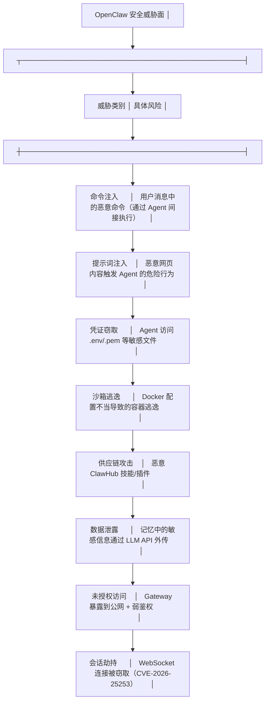
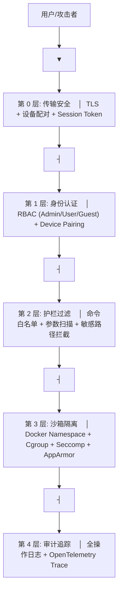
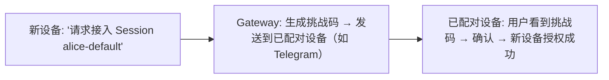
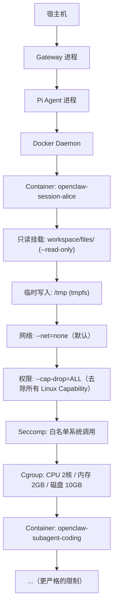

# 安全模型

OpenClaw 作为能执行 Shell 命令、访问文件系统和网络的 Agent 框架，安全性是核心关切。本章梳理其多层安全模型。

## 安全威胁全景



## 防护层架构



## 第 0-1 层：传输与认证

### TLS 加密

生产部署必须启用 TLS：

```yaml
gateway:
  tls:
    enabled: true
    cert: "/etc/openclaw/certs/fullchain.pem"
    key: "/etc/openclaw/certs/privkey.pem"
```

### 设备配对

新设备接入需要已有设备的挑战-应答验证：



### RBAC

详见[阶段 3: Gateway 架构](../03-多通道网关/01-Gateway架构.md)中的 RBAC 章节。

## 第 2 层：护栏过滤

详见[阶段 4: 工具安全护栏](../04-工具与技能系统/03-工具安全护栏.md)。

## 第 3 层：沙箱隔离

### Docker 沙箱架构

Agent 的所有执行操作在 Docker 容器内完成：



### 安全配置

```yaml
sandbox:
  docker:
    enabled: true
    image: "openclaw/sandbox:latest"

    # 文件系统
    read_only_root: true          # 根文件系统只读
    writable_paths:               # 可写路径白名单
      - "/tmp"
      - "/workspace/files"
    max_file_size: 104857600      # 单文件最大 100MB

    # 网络
    default_network: "none"       # 默认无网络
    allowed_domains:              # 按需开放
      - "registry.npmjs.org"
      - "api.github.com"

    # 资源限制
    cpu_limit: "2.0"
    memory_limit: "2048m"
    disk_limit: "10g"

    # 安全
    cap_drop: ["ALL"]
    seccomp_profile: "default"
    apparmor_profile: "openclaw-sandbox"
    no_new_privileges: true

    # 超时
    max_runtime: 600              # 单容器最长 10 分钟
```

## 沙箱逃逸防护

| 机制 | 作用 |
|------|------|
| `--cap-drop=ALL` | 去除所有 Linux Capability（包括 CAP_SYS_ADMIN） |
| `no_new_privileges: true` | 禁止 setuid 等提权操作 |
| Seccomp 白名单 | 仅允许 ~300 个安全系统调用（vs 正常的 400+） |
| AppArmor | 文件路径级访问控制 |
| `--net=none` | 阻止 Docker Socket 挂载攻击 |
| `--read-only` rootfs | 阻止修改系统文件 |

## CVE-2026-25253 案例

2026 年 1 月披露的高危漏洞（CVSS 8.8）：

```
漏洞类型: WebSocket 劫持导致的远程代码执行
影响范围: OpenClaw < v2026.1.29
利用条件: Gateway 暴露到公网 + 未启用 TLS + 弱 Session Token
攻击方式:
  1. 攻击者获取 WebSocket 连接 URL
  2. 伪造 Session Token 加入活跃会话
  3. 通过 pi_agent_exec 消息触发 Shell 命令执行
修复措施:
  - v2026.1.29: 强制 Session Token 签名验证
  - v2026.1.29: WebSocket 连接源 IP 绑定
  - 建议: 始终启用 TLS + 设备配对
```

## 安全最佳实践

1. **永远不要将 Gateway 直接暴露到公网**——使用 VPN/Tailscale/Cloudflare Tunnel
2. **始终启用 Docker 沙箱**——不要为了方便而禁用
3. **启用 TLS**——即使是内网部署
4. **定期审计 ClawHub 插件**——优先使用 Verified 标识的
5. **最小权限原则**——只给 Agent 完成工作所需的最小权限
6. **监控告警**——对异常工具调用率、频繁权限审批拒绝设置告警
7. **定期更新**——OpenClaw 的 CVE 补丁窗口很短，保持更新

## 与 Hermes 安全模型对比

| 维度 | OpenClaw | Hermes |
|------|----------|--------|
| 沙箱 | Docker（推荐默认） | Docker / Modal / Daytona / SSH / Singularity 多种 |
| 命令控制 | 白名单 + 参数扫描 | tool_guardrails.py 安全护栏 |
| 网络隔离 | --net=none 默认 | 类似的网络控制 |
| 认证 | RBAC + 设备配对 | Gateway 鉴权模块 |
| CVE 历史 | CVE-2026-25253 (8.8) 等 512+ 漏洞 | 较小的攻击面 |
| 社区安全 | 12% ClawHub 技能发现恶意代码 | 内置技能，供应链风险较小 |
| 安全团队 | 无专门团队（截至 2026 初） | 待确认 |
