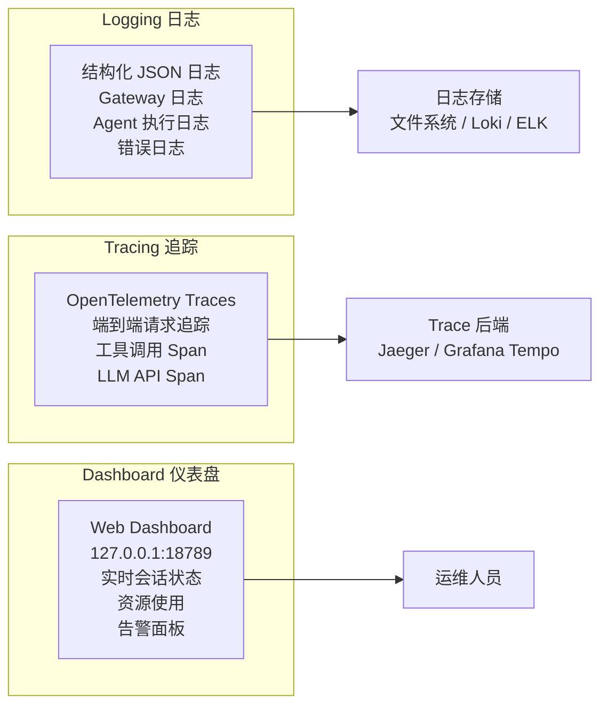
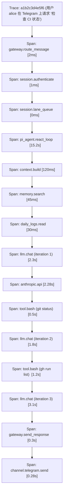

# 可观测性

OpenClaw 通过 OpenTelemetry + Web Dashboard + 结构化日志提供三合一的可观测性方案。

## 三大支柱



## 结构化日志

OpenClaw 输出 JSON 格式的结构化日志：

```json
{
  "timestamp": "2026-05-13T14:30:22.456Z",
  "level": "info",
  "component": "pi_agent",
  "session_id": "alice-telegram",
  "event": "tool_execution",
  "tool": "bash",
  "params": {
    "command": "git log --oneline -5"
  },
  "duration_ms": 234,
  "result": "success",
  "trace_id": "a1b2c3d4e5f6"
}
```

日志级别：

| 级别 | 用途 |
|------|------|
| `debug` | 详细的 ReAct 循环步骤、Prompt 内容 |
| `info` | 工具调用、会话创建/销毁、记忆操作 |
| `warn` | 安全护栏拒绝、故障转移、重试 |
| `error` | 执行失败、超时、Provider 错误 |

### 日志配置

```yaml
logging:
  level: info
  format: json                   # json | text
  output:
    - stdout                     # 控制台
    - file: "~/.openclaw/logs/gateway.log"
  rotation:
    max_size: "100m"             # 单个日志文件上限
    max_files: 30                # 保留最近 30 个文件
```

## OpenTelemetry 追踪

每条请求从进入 Gateway 到返回结果都有完整的 Trace：



### 导出配置

```yaml
observability:
  tracing:
    enabled: true
    exporter: otlp               # otlp | jaeger | zipkin | none
    endpoint: "http://localhost:4318/v1/traces"
    sample_rate: 1.0             # 采样率（1.0 = 全部）

  metrics:
    enabled: true
    exporter: prometheus
    endpoint: "/metrics"          # Gateway 暴露的 Prometheus 端点
```

## Web Dashboard

Dashboard 运行在 `http://127.0.0.1:18789/`，提供：

### 会话面板

| Session | Status | Last Active | Messages |
|---------|--------|-------------|----------|
| alice-telegram | Active | now | 42 |
| bob-discord | Active | 2 min ago | 15 |
| carol-whatsapp | Idle | 32 min ago | 8 |

### 工具执行统计

| 工具 | 占比示意 |
|------|----------|
| bash | ████████████████ 45% |
| read | ██████████ 28% |
| write | ████ 12% |
| web_fetch | ███ 8% |
| other | ██ 7% |

### Provider 指标

| Provider | Calls | Avg Lat | Errors | Cost |
|----------|-------|---------|--------|------|
| anthropic | 89 | 2.1s | 0 | $0.42 |
| openai | 12 | 1.8s | 0 | $0.08 |
| deepseek | 34 | 3.2s | 2（重试） | $0.03 |

### 告警规则

```yaml
observability:
  alerts:
    - name: high_error_rate
      condition: "error_rate > 5% over 5m"
      channel: telegram
    - name: sandbox_escape_attempt
      condition: "security.deny_count > 0"
      channel: telegram
      severity: critical
    - name: provider_degraded
      condition: "provider.latency_p95 > 10s over 5m"
      channel: dashboard
```

## 与 Hermes 可观测性对比

| 维度 | OpenClaw | Hermes |
|------|----------|--------|
| 追踪标准 | OpenTelemetry + Micrometer | JSONL 轨迹记录 |
| 日志 | 结构化 JSON + 文件轮转 | 结构化 logging |
| Dashboard | Web UI (127.0.0.1:18789) | CLI/TUI (prompt_toolkit + rich) |
| 指标导出 | Prometheus + OTLP | 文件 + 自定义格式 |
| 告警 | Dashboard 内置告警 | 待确认 |

> OpenClaw 在可观测性上更接近现代云原生标准（OTel + Prometheus），Hermes 更偏向开发者调试体验（JSONL + TUI）。
