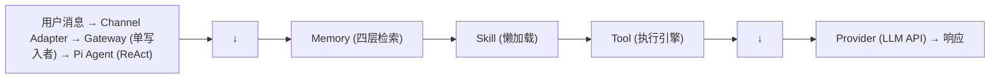
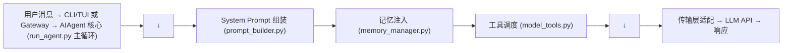

# 架构对比

本章从语言栈、模块划分、数据流、设计哲学四个维度对 OpenClaw 和 Hermes Agent 进行逐层对比。

## 语言栈与运行时

| 维度 | OpenClaw | Hermes Agent |
|------|----------|--------------|
| 语言 | TypeScript (Node.js 18+) | Python 3.11+ |
| 包管理 | npm (全局安装) | uv / setuptools |
| 运行时 | Node.js 单进程 + Docker 沙箱 | Python 单进程 + 多沙箱后端 |
| 并发模型 | Event Loop + Lane Queue | asyncio + 线程池 |
| 代码规模 | ~数万行（核心） | ~30 万行（不含测试） |
| 开源协议 | MIT | 待确认 |

**分析**：
- Node.js 的选择让 OpenClaw 在前端/全栈开发者中更具亲和力，npm 全局安装也比 Python 的虚拟环境管理更简单
- Hermes 的 30 万行代码反映了更长的迭代周期和更丰富的内置功能
- 两者都采用单进程 + 沙箱的架构，但在并发处理上有本质差异

## 模块划分

```
OpenClaw (六层模块化)              Hermes Agent (管道式模块)
─────────────────────────        ─────────────────────────
Channel Adapters (独立插件)       gateway/ 目录（内置适配器）
Gateway (独立进程)                  cli.py + run_agent.py（CLI + 核心耦合）
Pi Agent Runtime (嵌入式/RPC)      run_agent.py (15075行单文件核心)
Skill System (懒加载 + ClawHub)    skills/（27分类内置 + 自进化）
Memory (四层栈 + Vector DB)        hermes_state.py (SQLite + FTS5)
Plugin System (4类插件)            plugins/（插件目录）
Context Engine (可插拔)            context_compressor.py（内置模块）
沙箱 (Docker 主推)                 agent/（Docker/Modal/Daytona/SSH/Singularity）
```

**关键差异**：
- OpenClaw 的 Gateway 是独立的进程（可独立扩展），Hermes 的 Gateway 是模块内的组件
- Hermes 的核心文件 `run_agent.py` 高达 15075 行，是典型的"单文件核心"模式；OpenClaw 将同样的职责拆分到多个模块
- OpenClaw 的技能系统依赖社区市场（ClawHub），Hermes 的技能系统强调"自进化"（Agent 自己创建和改进技能）

## 数据流对比

### OpenClaw 数据流



### Hermes 数据流



**分析**：两者都是管道式处理，核心差异在：
1. OpenClaw 的 Channel Adapter 是独立插件，Hermes 内置于 gateway/ 目录
2. OpenClaw 的 Gateway 是独立的中央控制面（单写入者 + Lane Queue），Hermes 的 Gateway 更轻量
3. Hermes 有专门的 System Prompt 构建引擎（prompt_builder.py），OpenClaw 的 Prompt 组装分散在 Workspace 文件读取中

## 设计哲学对比

| 维度 | OpenClaw | Hermes Agent |
|------|----------|--------------|
| 核心理念 | 从 Chat 到 Action | 自进化 Agent |
| 配置方式 | YAML + Markdown（Workspace 文件即 Agent） | YAML + SQLite 数据库 |
| 扩展方式 | 插件市场（ClawHub）+ 四类 Plugin | 内置 + 自进化技能 + Plugin |
| 部署方式 | npm install -g + openclaw setup | pip install + 配置文件 |
| 目标用户 | 个人开发者 + 全栈工程师 | AI 研究者 + Agent 开发者 |
| 生态策略 | 开源社区 + 5700+ 技能市场 | 自包含 + 27 分类内置库 |
| 安全重心 | 沙箱 + 白名单 + 设备配对 | 工具护栏 + 多沙箱后端 |
| 可观测性 | OpenTelemetry + Dashboard | JSONL 轨迹 + CLI TUI |

## 核心文件类比

| OpenClaw | Hermes | 功能 |
|----------|--------|------|
| Pi Agent Runtime | run_agent.py | Agent 主循环 |
| Gateway | gateway/ + cli.py | 用户接入 + 消息路由 |
| TOOLS.md + Skill Loader | model_tools.py + toolsets.py | 工具定义与调度 |
| MEMORY.md + Vector DB | hermes_state.py + memory_manager.py | 状态持久化与记忆 |
| Context Compressor | context_compressor.py | 上下文压缩 |
| Guardrails | tool_guardrails.py | 安全护栏 |
| AGENTS.md / SOUL.md | prompt_builder.py | System Prompt 构建 |
| Workspace 文件体系 | 无直接等价物 | Agent 人格定义 |
| 无直接等价物 | curator.py | 技能维护管家（Hermes 独有） |
| 无直接等价物 | error_classifier.py | 错误分类与故障转移（Hermes 独有） |
| OpenTelemetry | trajectory.py (JSONL) | 执行追踪 |
