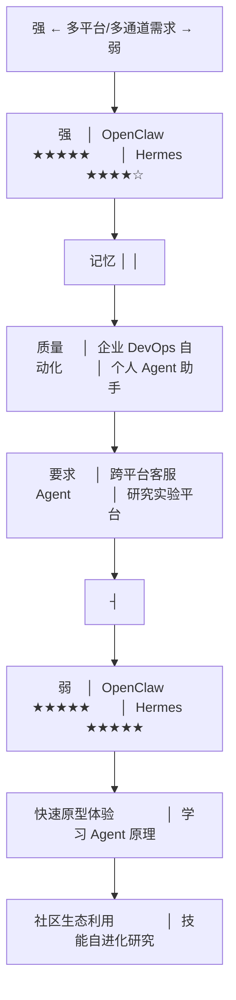

# 选型建议

根据不同的使用场景和需求，给出 OpenClaw 与 Hermes Agent 的选型推荐。

## 场景矩阵

## 按场景推荐

### 场景 1：想快速体验 Agent 框架

**推荐：OpenClaw**

- `npm install -g openclaw` → `openclaw setup` 两命令即可运行
- 丰富的 ClawHub 技能市场，开箱即用
- Web Dashboard 直观查看 Agent 运行状态

### 场景 2：学习 Agent 框架原理和源码

**推荐：Hermes Agent**

- Python 代码更易阅读（教学场景下 Python > TypeScript）
- `run_agent.py` 单文件核心循环，完整追踪 Agent 的所有决策
- 管道式架构清晰展示每个处理环节
- 学习 Hermes 后再看 OpenClaw，能更好理解不同设计选择的 trade-off

### 场景 3：构建个人全天候助手（多平台接入）

**推荐：OpenClaw**

- 原生支持 10-20+ 消息平台，统一会话状态
- 跨平台记忆持久（Telegram 上说的 Discord 上记得）
- Heartbeat 机制可主动发起任务
- 社区技能覆盖日常场景（邮件/日历/提醒/信息聚合）

### 场景 4：研究 Agent 自进化和技能自动改进

**推荐：Hermes Agent**

- curator.py + 自进化技能系统是 Hermes 的独有特色
- Agent 完成任务后自动总结为技能，执行中发现的问题自动修补
- 适合 AI Agent 研究者探索自主学习机制

### 场景 5：企业 DevOps/运维自动化

**推荐：OpenClaw**

- Docker 沙箱隔离 + RBAC 细粒度权限控制
- 企业级可观测性（OpenTelemetry + Prometheus + Dashboard）
- 多 Provider 支持和故障转移
- 已有腾讯/阿里/华为企业部署案例

### 场景 6：构建多 Agent 协作系统

**推荐：视复杂度而定**

| 复杂度 | 推荐 | 原因 |
|--------|------|------|
| 简单（2-3 Agent） | OpenClaw | Hub-Spoke 模式简洁够用 |
| 中等（3-5 Agent） | 两者均可 | 根据语言偏好选择 |
| 复杂（5+ Agent，长时间任务） | Hermes | Kanban 调度系统更完整，支持 fan-out/fan-in 和优先级 |

### 场景 7：数据隐私敏感的本地部署

**推荐：两者均可，各有优势**

| 维度 | OpenClaw | Hermes |
|------|----------|--------|
| 本地模型 | Ollama 一键接入 | Ollama/vLLM 等多后端 |
| 离线运行 | 支持（需本地模型） | 支持（需本地模型） |
| 外部依赖 | Redis + Vector DB（可替换） | 仅 SQLite（更少依赖） |
| 数据外传控制 | 本地优先但 Provider 可选云端 | 类似控制 |

### 场景 8：教学和课程设计

**推荐：先 Hermes 后 OpenClaw**

学习路径：
1. [LLM 理论基础](../../llm-learning-path/)（必修前置）
2. [Agent 学习路径](../../agent-learning-path/)（LangChain/LangGraph 基础）
3. Hermes Agent 源码学习（理解 Agent 核心循环、工具调用、记忆管理）
4. OpenClaw 源码学习（对比不同语言栈和架构选择，理解社区生态驱动模式）

## 核心取舍总结

```mermaid
flowchart LR
  n0["如果你最看重:"]
  n1["- 开箱即用的体验          → 选 OpenClaw"]
  n2["- 社区生态和技能丰富度     → 选 OpenClaw"]
  n3["- 企业级可观测性和安全     → 选 OpenClaw"]
  n4["- 学习 Agent 原理和源码    → 选 Hermes"]
  n5["- 自进化/自主学习研究      → 选 Hermes（独有优势）"]
  n6["- 最小外部依赖             → 选 Hermes（只需 SQLite）"]
  n7["- 复杂任务调度（Kanban）   → 选 Hermes"]
  n8["- 跨平台全天候助手         → 选 OpenClaw"]
  n9["如果你:"]
  n10["- 熟悉 Python → Hermes 的代码更易上手"]
  n11["- 熟悉 Node.js/TypeScript → OpenClaw 的代码更易上手"]
  n12["- 想做学术研究 → Hermes 的自进化机制值得深入研究"]
  n13["- 想做产品/创业 → OpenClaw 的生态和社区是更大的杠杆"]
  n0 --> n1
  n1 --> n2
  n2 --> n3
  n3 --> n4
  n4 --> n5
  n5 --> n6
  n6 --> n7
  n7 --> n8
  n8 --> n9
  n9 --> n10
  n10 --> n11
  n11 --> n12
  n12 --> n13
```

## 两者互补

OpenClaw 和 Hermes 并非非此即彼的关系：

- **Hermes 的自进化理念**可以启发 OpenClaw 的技能系统改进
- **OpenClaw 的 Workspace 文件体系和 Lane Queue**可以为 Hermes 提供架构参考
- **OpenClaw 的 ClawHub 生态**展示了社区驱动的巨大能量
- **Hermes 的 Kanban 调度**为复杂多 Agent 协作提供了更完整的方案

学习两者的最佳方式是按本仓库的学习路径顺序——先掌握 Agent 基础理论，再学习 Hermes 理解核心机制，最后通过 OpenClaw 理解工程化和生态化的差异。
