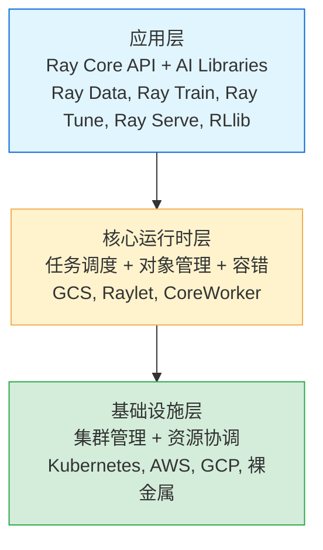

# Ray 是什么

## 提出问题

假设你要处理 1TB 的图像数据，用 PyTorch 训练一个模型，还要同时跑 100 组超参数实验。单机跑不动，分布式方案里 Spark 不适合 GPU 和训练循环，Horovod 只做训练不管别的。你需要一个**统一的分布式框架**——既能处理数据，又能训练，能调参，能部署服务。这就是 Ray。

## 核心定位

Ray 是一个**开源的统一分布式计算框架**，从 UC Berkeley RISELab 诞生，2024 年正式加入 PyTorch Foundation。你可以把它理解成：

> **Ray 是「分布式计算的 Python 标准库」——就像 `multiprocessing` 能让你用多核，Ray 让你用多机；而且不止多进程，它提供了函数(Task)、类(Actor)、变量(Object) 三个原语，将单机 Python 程序变成分布式程序只需加几行装饰器。**

## 类比理解 Ray 的定位

把计算任务比作**搬家**：

| 场景 | 工具 | 痛点 |
|------|------|------|
| 普通 Python | 一个人搬 | GIL 限制，只能用一只手 |
| multiprocessing | 多个人在一套房子里搬 | 出不了这套房子（单机） |
| Spark | 搬家公司，但只搬固定规格的箱子 | 批量处理强，但搬不规则物品（GPU训练、在线服务）很别扭 |
| **Ray** | 通用的搬家平台 | 不管你要搬什么、搬多久、有没有状态，都能调度 |

## Ray 解决的核心问题

1. **Python 的 GIL 困境**：单进程只能用一个 CPU，Ray 把函数变成远程 Task，绕过 GIL 实现真正的并行
2. **有状态计算**：Spark 的任务都是无状态的，但模型训练、参数服务器、在线服务都需要状态，Ray 的 Actor 原生支持
3. **异构计算**：一个集群里可能有 CPU 节点、GPU 节点、TPU 节点，Ray 支持显式声明和调度各种资源
4. **端到端工作流**：从数据加载 → 训练 → 调参 → 服务，一套框架搞定，不用拼装多个工具

## 三层架构

Ray 的架构像一栋三层楼：



- **应用层**：你写 `@ray.remote` 装饰器，Ray 自动把代码分布到集群
- **运行时层**：Ray 自动决定任务跑在哪台机器、数据放哪里、挂了怎么恢复
- **基础设施层**：Ray 可以跑在笔记本上，也可以跑在上千台机器的 K8s 集群上，代码不变

## 与其他框架的对比

| 框架 | 核心模型 | 适合场景 | 不适合场景 |
|------|----------|----------|------------|
| **Ray** | Task + Actor + Object | 端到端 ML 工作流、在线推理、强化学习 | 纯 SQL 分析 |
| **Spark** | RDD/DataFrame | 批量 ETL、SQL 分析 | GPU 训练、在线服务、有状态计算 |
| **Dask** | Task Graph | Python 原生并行计算 | 缺少 Actor 模型和 ML 专用库 |
| **Horovod** | AllReduce | 分布式深度学习训练 | 不适合训练之外的任务 |
| **Celery** | 任务队列 | 异步任务处理 | 无对象存储、无 GPU 支持、延迟高 |

## 谁在用 Ray

- **OpenAI**：用 Ray 协调 ChatGPT 的分布式训练
- **Uber**：用 Ray 做大规模强化学习
- **Shopify**：用 Ray Serve 部署推荐模型
- **蚂蚁集团**：用 Ray 做风控模型训练和推理

## 核心工作流

一个典型的 Ray 程序从 `ray.init()` 开始，然后你可以：

```python
import ray
ray.init()  # 启动本地 Ray 集群（或连接到远程集群）

# 1. 把数据放进分布式共享内存
data_ref = ray.put(large_array)

# 2. 远程执行无状态函数（Task）
@ray.remote
def process(chunk):
    return transform(chunk)

futures = [process.remote(data_ref) for _ in range(100)]  # 100 个并行任务
results = ray.get(futures)  # 收集结果

# 3. 创建有状态的分布式对象（Actor）
@ray.remote
class Counter:
    def __init__(self):
        self.count = 0
    def increment(self):
        self.count += 1
        return self.count

counter = Counter.remote()
ray.get(counter.increment.remote())  # => 1
```

## 小结

Ray 是分布式计算的"瑞士军刀"——不像 Spark 只擅长批处理，不像 Horovod 只做训练。它用三个简单原语（Task、Actor、Object）覆盖了从数据处理到模型服务的全流程，并且 API 设计对 Python 开发者极其友好，从单机到千节点集群几乎零代码改动。
