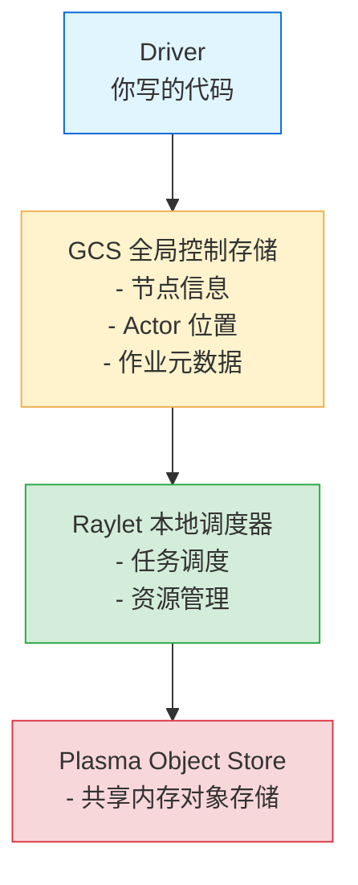

# 环境搭建与第一个 Ray 程序

## 安装 Ray

```bash
pip install ray
```

安装后验证：

```bash
python -c "import ray; print(ray.__version__)"
```

如果想装全套 AI 库（推荐用于 ML 场景）：

```bash
pip install "ray[data,train,tune,serve]"
```

## 启动本地 Ray 集群

Ray 的设计哲学是**从笔记本到集群零改动**。在单机上，一行代码启动：

```python
import ray
ray.init()
```

这会在后台启动所有 Ray 核心组件：



> **类比**：`ray.init()` 像是在你的电脑里瞬间建好了一整套"办公基础设施"——前台的 GCS 知道谁在哪、做什么；调度经理 Raylet 负责派活；共享文件柜 Plasma 存放大家需要的数据。而在单机模式下，这些都默默地运行在你的本机进程里，不需要额外配置。

### 常用 init 参数

```python
ray.init(
    num_cpus=8,                    # 限制 Ray 使用的 CPU 数
    num_gpus=1,                    # 限制 GPU 数
    object_store_memory=4*1024**3, # 对象存储内存上限 (4GB)
    dashboard_port=8265,           # Dashboard 端口（默认 8265）
    ignore_reinit_error=True,      # 重复 init 不报错
)
```

## 访问 Ray Dashboard

启动后访问 `http://127.0.0.1:8265`，可以看到：

- **集群状态**：节点数、CPU/GPU 使用率
- **运行的 Job**：当前活跃的作业
- **Actor 列表**：所有 Actor 的状态和日志
- **Task 时间线**：每个 Task 的执行时间
- **对象存储**：内存使用情况

Dashboard 是 Ray 的"驾驶舱"——程序跑起来之后，不用 print 也能看到全局状态。

## 第一个分布式程序：并行计算 π

### 单机版本（串行）

```python
import random
import time

def sample(num_samples):
    """蒙特卡洛采样：统计落在1/4圆内的点数"""
    inside = 0
    for _ in range(num_samples):
        x, y = random.random(), random.random()
        if x**2 + y**2 <= 1:
            inside += 1
    return inside

start = time.time()
NUM_SAMPLES = 100_000_000
NUM_WORKERS = 4

# 串行：全部跑在一个进程里
total_inside = sample(NUM_SAMPLES)
pi = 4 * total_inside / NUM_SAMPLES
print(f"串行计算 π ≈ {pi}, 耗时 {time.time() - start:.2f}s")
```

### Ray 分布式版本

```python
import ray
import random
import time

ray.init()

@ray.remote
def sample_ray(num_samples):
    """远程版本：每个 Worker 独立采样"""
    inside = 0
    for _ in range(num_samples):
        x, y = random.random(), random.random()
        if x**2 + y**2 <= 1:
            inside += 1
    return inside

start = time.time()
NUM_SAMPLES = 100_000_000
NUM_WORKERS = 4

# 4 个 Worker 并行采样
futures = [sample_ray.remote(NUM_SAMPLES // NUM_WORKERS) for _ in range(NUM_WORKERS)]
results = ray.get(futures)  # 等待所有完成，收集结果

pi = 4 * sum(results) / NUM_SAMPLES
print(f"Ray 分布式 π ≈ {pi}, 耗时 {time.time() - start:.2f}s")

ray.shutdown()
```

### 代码变化

从单机到并行，只改了三处：

| 单机 | Ray 分布式 |
|------|-----------|
| `def sample(n)` | `@ray.remote` + `def sample_ray(n)` |
| `sample(n)` | `sample_ray.remote(n)` |
| 直接拿到返回值 | `ray.get(future_ref)` 获取结果 |

> **类比**：这就像你从"亲自干活"变成"把任务写在纸条上，交给 Ray 分发"。`@ray.remote` 是告诉 Ray"这个活可以外包"，`.remote()` 是"把纸条投进分发箱"，`ray.get()` 是"去收件箱取结果"。你不需要关心哪些工人在哪、怎么协作——Ray 帮你搞定。

## 连接到远程集群

如果你的团队已经有 Ray 集群，只需改一行：

```python
# 本地开发
ray.init()

# 连接到远程集群（其他代码完全不变！）
ray.init(address="ray://192.168.1.100:6379")
```

这就是 Ray 的核心承诺：**Write locally, scale globally**。

## 关闭 Ray

```python
ray.shutdown()  # 释放所有 Ray 相关资源
```

通常在脚本末尾调用。如果在 `ray.init()` 中设置 `ignore_reinit_error=True`，Jupyter Notebook 中就不需要反复 init。

## 常见问题

### Q: ray.init() 报错 "Address already in use"?
通常有另一个 Ray 进程在运行。用 `ray stop` 关闭，或使用 `ignore_reinit_error=True`。

### Q: 对象存储内存不够？
调大 `object_store_memory` 参数，或减小数据分块大小。

### Q: 在 Jupyter 里用 Ray？
Jupyter 中 `ray.init()` 后，正常使用即可。注意每个 cell 都可以提交远程任务，但 `ray.get()` 会阻塞当前 cell。

## 小结

- `pip install ray` 一条命令安装
- `ray.init()` 启动本地或连接远程集群
- `@ray.remote` + `.remote()` + `ray.get()` 是最核心的三个 API
- 从笔记本到千节点集群，代码基本不需要改动
- Dashboard 是你观测分布式系统的窗口
