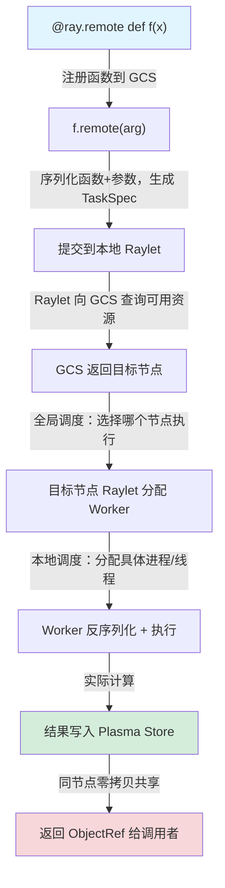

# Task 远程任务

## 提出问题

你有 100 张图片要处理，处理函数 `process_image` 是纯计算、无状态的。单机串行要 100 秒。`multiprocessing` 能用满 8 核，但还是出不了这台机器。怎么把它变成一个**可以在任意机器上并行执行**的分布式任务？

## 核心原理

Ray Task 是最简单的分布式原语——把普通 Python 函数变成一个可以远程执行的**无状态任务**。你只需加一个装饰器，Ray 就会自动：

1. 把函数和参数序列化
2. 发到集群中找到合适资源的节点
3. 在那个节点上执行
4. 返回一个 **ObjectRef**（类似取餐号）
5. 你随时用 `ray.get(ref)` 取结果

> **类比**：Task 像是**外包临时工**——你把活（函数）和材料（参数）交给他，他做完把结果交回来。你不关心他在哪个工位干活，做完就行。而且你可以同时派 100 个临时工出去，他们各干各的，互不干扰。

## 基本用法

### 最简单的 Task

```python
import ray
ray.init()

@ray.remote
def add(a, b):
    return a + b

# 提交任务，立即返回 ObjectRef（取餐号）
ref = add.remote(3, 5)
print(type(ref))  # <class 'ray._raylet.ObjectRef'>

# 取结果
result = ray.get(ref)
print(result)     # 8
```

### 并行执行多个 Task

```python
@ray.remote
def process_image(path):
    # 模拟图像处理
    import time
    time.sleep(1)
    return f"processed: {path}"

# 一次性提交所有任务（异步、非阻塞）
futures = [process_image.remote(f"img_{i}.jpg") for i in range(100)]

# 等所有完成再取结果
results = ray.get(futures)
# 100 个任务并行执行，总耗时 ≈ 单任务耗时，而不是 100 倍
```

### Task 之间的依赖

Ray 会自动解析 Task 之间的依赖关系。当一个 Task 的返回值（ObjectRef）作为另一个 Task 的参数时，Ray 会**自动等待**前一个 Task 完成：

```python
@ray.remote
def load_data(path):
    return read_file(path)

@ray.remote
def preprocess(data):
    return normalize(data)

@ray.remote
def train(processed_data):
    return model.fit(processed_data)

# Ray 自动构建 DAG：load_data → preprocess → train
raw_ref = load_data.remote("data.csv")
clean_ref = preprocess.remote(raw_ref)       # 等 raw_ref 完成
model_ref = train.remote(clean_ref)           # 等 clean_ref 完成

# 此时三个 Task 可能已经在不同节点上流水线执行了
result = ray.get(model_ref)
```

> **类比**：这就像流水线，拧螺丝的在等焊接的，焊接的在等切割的。你把工件（ObjectRef）传过去就行，不用自己等上一道工序完成——工头 Ray 会帮你协调。

## 深入机制：Task 的实现原理

### 从装饰器到执行的全过程



### Task 是无状态的

每个 Task 执行完，其局部变量就释放了。如果你需要跨调用保留状态，需要 Actor（下一节）。

### 细粒度与粗粒度

```python
# 细粒度：拆分成独立 Task
@ray.remote
def classify_one(item):
    return model(item)

refs = [classify_one.remote(item) for item in batch]
results = ray.get(refs)

# 粗粒度：整个 batch 一个 Task
@ray.remote
def classify_batch(items):
    return [model(item) for item in items]

ref = classify_batch.remote(batch)
result = ray.get(ref)
```

**原则**：Task 太小 → 调度开销占比大；Task 太大 → 并行度不够。一般让每个 Task 执行至少 0.1 秒，`num_cpus` 合理配置。

## 资源指定

```python
@ray.remote(num_cpus=4)          # 需要 4 个 CPU
def cpu_intensive(): ...

@ray.remote(num_gpus=1)          # 需要 1 个 GPU
def gpu_task(): ...

@ray.remote(num_gpus=0.5)        # 可以用分数 GPU（多任务共享一张 GPU）
def inference(): ...

@ray.remote(resources={"TPU": 1})  # 自定义资源
def tpu_task(): ...
```

## 返回值策略

```python
# 1. 普通返回：大对象通过 Plasma Store 共享
@ray.remote
def big_output():
    return large_array  # 自动放到 Plasma Store

# 2. 流式返回：适合不定长的迭代
@ray.remote
def streaming():
    for i in range(1000):
        yield i  # 边产边消费

# 3. 不关心返回值
task.remote()  # 不接收 ObjectRef，Fire and forget
```

## 常见陷阱

### 1. 不要在 Task 里直接操作全局变量

```python
# ❌ 错误
MODEL = None

@ray.remote
def predict(x):
    return MODEL(x)  # Task 可能执行在不同节点，MODEL 未初始化

# ✅ 正确：把模型传进去或放到 Actor 里
@ray.remote
def predict(model_ref, x):
    model = ray.get(model_ref)
    return model(x)
```

### 2. ObjectRef 不能直接参与计算

```python
ref = add.remote(1, 2)
# print(ref + 3)  # ❌ 报错！ObjectRef 不能直接运算
print(ray.get(ref) + 3)  # ✅ 先取结果再计算
```

### 3. 留意序列化开销

Task 的参数会被序列化。如果参数很大（比如几 GB 的矩阵），应该先用 `ray.put()` 放到对象存储，再传 ObjectRef 进去：

```python
data_ref = ray.put(huge_matrix)  # 只序列化一次
futures = [process.remote(data_ref) for _ in range(10)]  # 传引用，不拷贝
```

## 小结

- `@ray.remote` + `.remote()` + `ray.get()` 是 Task 的三板斧
- Task 是无状态的，适合独立、可并行的计算
- Task 之间的依赖通过 ObjectRef 自动传递，Ray 构建 DAG 并流水线执行
- 合理控制 Task 粒度：太小有调度开销，太大并行度不够
- 大参数先 `ray.put()`，避免重复序列化
