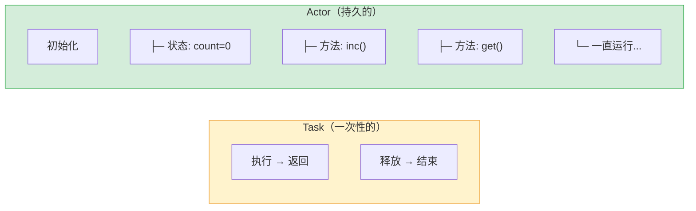
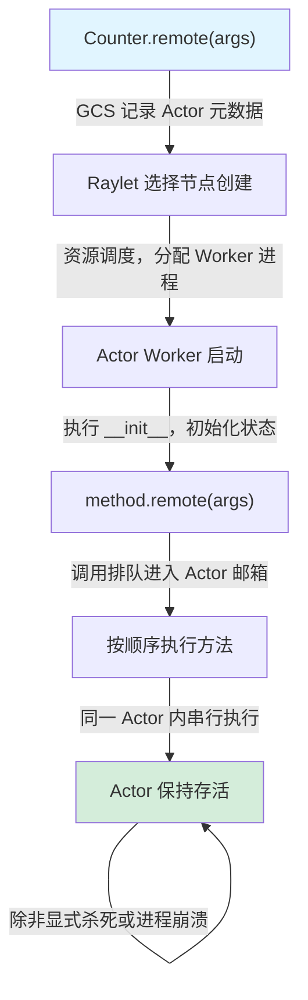

# Actor 分布式有状态对象

## 提出问题

Task 是无状态的——每次调用都"失忆"。但很多场景需要**状态**：

- 模型服务器需要在内存里保留加载好的模型权重
- 参数服务器需要在多轮训练中累积梯度
- 计数器需要记住当前的计数值

这时候，你需要一个"有记忆"的分布式对象。Actor 就是答案。

## 核心原理

Actor 是把 Python 类变成一个**有状态的分布式对象**。Actor 的方法调用也会分布执行，但**所有方法都在同一个 Actor 进程内串行执行**，共享该 Actor 的内部状态。

> **类比**：如果 Task 是**外包临时工**（干完活就走，下次来啥也不记得），Actor 就是**雇佣的长期员工**——他有自己的工位（进程），桌面上放着工作资料（状态），你可以不断给他派活（方法调用），他记得之前干过什么。


    全新的环境            └─────────────────┘
                             有记忆、可复用
```

## 基本用法

### 创建和使用 Actor

```python
import ray
ray.init()

@ray.remote
class Counter:
    def __init__(self, start=0):
        self.count = start       # Actor 的内部状态

    def increment(self):
        self.count += 1
        return self.count

    def get_count(self):
        return self.count

# 创建一个 Counter Actor
counter = Counter.remote(start=10)

# 调用方法 — 返回 ObjectRef
ref1 = counter.increment.remote()  # count → 11
ref2 = counter.increment.remote()  # count → 12
ref3 = counter.get_count.remote()  # count = 12

# 方法调用在 Actor 内部是串行执行的
print(ray.get(ref1))  # 11
print(ray.get(ref2))  # 12
print(ray.get(ref3))  # 12
```

### Actor 的资源指定

```python
@ray.remote(num_gpus=1)
class ModelServer:
    def __init__(self, model_path):
        # 模型加载到 GPU 上，一直驻留
        self.model = load_model(model_path).cuda()

    def predict(self, batch):
        return self.model(batch)

server = ModelServer.remote("model.pt")
result = ray.get(server.predict.remote(data))
```

Actor 在创建时获得资源，**在生命周期内一直持有**，不会被释放。这意味着你的模型只需要加载一次。

## 深入机制：Actor 的实现原理

### Actor 生命周期



### Actor 内的并发模型

一个 Actor 内部**所有方法调用是串行的**——这保证了状态一致性，你不需要加锁：

```python
@ray.remote
class BankAccount:
    def __init__(self):
        self.balance = 0

    def deposit(self, amount):
        self.balance += amount    # 不需要加锁！
        return self.balance

    def withdraw(self, amount):
        if self.balance >= amount:
            self.balance -= amount
            return True
        return False
```

如果多个调用方同时调用 `deposit` 和 `withdraw`，Ray 会将它们**排队**，按到达顺序串行执行。这保证了 `balance` 不会因为并发而出错。

> **类比**：Actor 像一个**单人办公室**——每次只能进一个人办事，外面的人排队等候。你不用担心两个人同时改同一份文件。

### 多个 Actor 之间是并发的

如果需要更高吞吐，创建多个 Actor 实例：

```python
# 创建 4 个 BankAccount Actor，各自独立
accounts = [BankAccount.remote() for _ in range(4)]

# 4 个 Actor 并发执行，总共 4 个并行单元
refs = [accounts[i % 4].deposit.remote(100) for i in range(1000)]
ray.get(refs)
```

### Actor Handle 的传递

Actor 的 Handle（句柄）可以像普通 Python 对象一样传递——你可以把它作为参数传给另一个 Task 或 Actor：

```python
@ray.remote
def use_actor(actor_handle, data):
    return ray.get(actor_handle.process.remote(data))

# Actor handle 作为参数传递
result = ray.get(use_actor.remote(my_actor, some_data))
```

Ray 内部会把 Actor Handle 传递为网络地址（IP:Port + Actor ID）的引用。

## 高级用法

### `__ray_kill__` 和 `__ray_terminate__`

```python
# 方式1：优雅关闭（推荐）
ray.kill(counter)  # 发送 KeyboardInterrupt，Actor 可以做清理

# 方式2：强制终止
ray.kill(counter, no_restart=True)
```

### 并发方法调用（async Actor）

默认 Actor 是同步的，但你可以让它支持异步并发：

```python
import asyncio

@ray.remote
class AsyncActor:
    async def run(self):
        await asyncio.sleep(1)
        return "done"

actor = AsyncActor.remote()
# 多个 async 方法可以并发执行
refs = [actor.run.remote() for _ in range(10)]
results = ray.get(refs)  # 总耗时约 1s，而不是 10s 串行
```

使用 `max_concurrency` 控制并发上限：

```python
@ray.remote(max_concurrency=5)
class RateLimitedServer:
    async def handle(self, request):
        return process(request)
```

### Actor 定时任务

```python
@ray.remote
class PeriodicWorker:
    async def run_forever(self, interval=5):
        while True:
            await self.do_work()
            await asyncio.sleep(interval)
```

## 常见陷阱

### 1. Actor 方法调用不是免费的

每个 `.remote()` 调用都有调度开销（约 1ms）。如果需要高频调用，考虑**批量处理**：

```python
# ❌ 低效：1000 次 remote 调用
for i in range(1000):
    counter.increment.remote()

# ✅ 高效：一次调用处理全量
counter.add_bulk.remote(1000)
```

### 2. Actor 状态丢了怎么办？

Actor 默认**挂了就没了**。如果状态重要，需要手动做 checkpoint：

```python
@ray.remote
class ReliableActor:
    def __init__(self):
        self.state = self.load_checkpoint() or {}

    def save(self):
        write_to_storage(self.state)   # 持久化到外部存储
```

### 3. 避免 Actor 方法长时间阻塞

如果 Actor 的一个方法执行很久不返回，所有后续调用都会被阻塞在队列中。异步方法和 `ray.get()` 配合可以缓解。

## Task vs Actor 选择指南

| 场景 | 用 Task | 用 Actor |
|------|---------|----------|
| 无状态纯计算 | ✅ | ❌ |
| 需要加载模型权重 | ❌ | ✅ |
| Map 操作（独立并行） | ✅ | ❌ |
| 参数服务器（累积状态） | ❌ | ✅ |
| ETL 数据处理 | ✅ | ❌ |
| 模型在线服务 | ❌ | ✅ |
| 简单计数器/聚合器 | ❌ | ✅ |

## 小结

- Actor 是**有状态的分布式对象**，类如长期员工，Task 是临时工
- Actor 内部方法**串行执行**，天然线程安全，不需加锁
- Actor 持有资源（GPU 显存等）直到销毁，适合模型常驻
- 多个 Actor 实例可以并行处理，提升吞吐
- `.remote()` 调用有开销，高频场景考虑批量操作
- 重要状态需手动持久化，Actor 默认没有自动恢复
